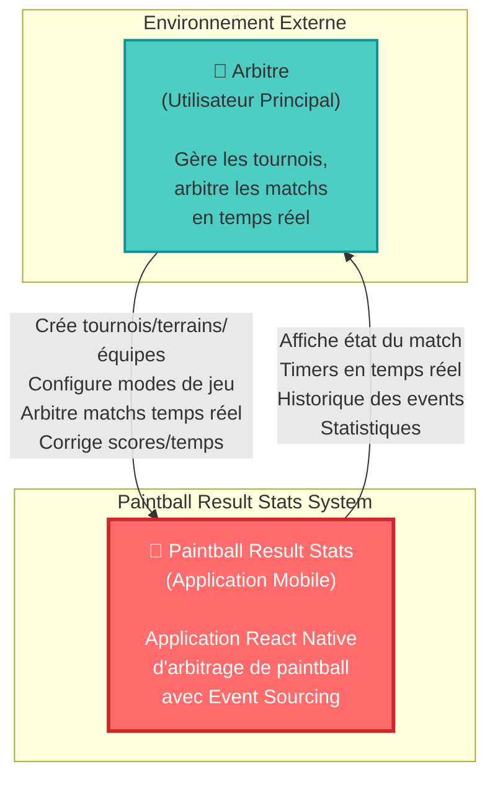
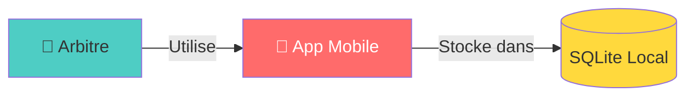

# C4 Model - Level 1: System Context

## Vue d'ensemble

Le diagramme de contexte système (C1) montre la vue d'ensemble de l'application Paintball Result Stats et ses interactions avec les utilisateurs et systèmes externes.

**Niveau:** C1 - System Context  
**Audience:** Tous (technique et non-technique)  
**Focus:** Qui utilise le système et avec quoi il interagit

---

## Diagramme de Contexte



---

## Acteurs du Système

### 👤 Arbitre (Utilisateur Principal)

**Rôle:** Organisateur et arbitre de matchs de paintball

**Responsabilités:**
- **Organisation:**
  - Créer et gérer des tournois
  - Créer et configurer des terrains
  - Enregistrer des équipes (régulières et invitées)
  - Définir des modes de jeu personnalisés
  - Organiser des matchups (duels entre équipes)

- **Arbitrage Temps Réel:**
  - Démarrer/arrêter les matchs
  - Gérer le chronomètre (pause, reprise, ajustement)
  - Marquer les points (rounds gagnés)
  - Gérer les breaks entre rounds
  - Déclencher l'overtime en cas d'égalité
  - Corriger les erreurs (score, temps)
  - Valider la fin des matchs

**Autorité:** Absolue - L'arbitre a le pouvoir de corriger toute donnée via ArbitratorCommand

**Appareil:** Smartphone ou tablette (iOS/Android via Expo)

---

## Système: Paintball Result Stats

### Description

Application mobile standalone d'arbitrage de paintball construite avec React Native (Expo). Elle permet de gérer l'organisation complète de tournois et l'arbitrage temps réel de matchs avec Event Sourcing.

### Caractéristiques Principales

**Architecture:**
- Domain-Driven Design (DDD)
- Event Sourcing complet
- Clean Architecture (Hexagonal)
- 5 Bounded Contexts

**Technologies:**
- React Native (Expo)
- TypeScript (strict mode)
- SQLite (base de données locale)
- Zustand (state management)

**Fonctionnalités Clés:**
1. **Gestion de Tournois** - Organisation multi-terrains
2. **Gestion d'Équipes** - Teams régulières et invitées
3. **Configuration de Modes** - Règles de jeu personnalisables
4. **Arbitrage Temps Réel** - Moteur de match avec 6 états
5. **Event Sourcing** - Audit trail complet et reconstruction d'état

**Mode de Déploiement:** Application mobile standalone (pas de backend cloud)

---

## Interactions Principales

### 1. Organisation de Tournoi

```
Arbitre → App: Créer Tournament
App → Arbitre: Tournament créé

Arbitre → App: Créer Field(s)
App → Arbitre: Field(s) créé(s)

Arbitre → App: Créer/Sélectionner Teams
App → Arbitre: Teams disponibles

Arbitre → App: Créer/Sélectionner GameMode
App → Arbitre: GameMode disponible

Arbitre → App: Créer Matchups (teamA vs teamB)
App → Arbitre: Matchups organisés
```

---

### 2. Arbitrage de Match

```
Arbitre → App: Démarrer Match
App → Arbitre: Match démarré, timer actif

Arbitre → App: Marquer Point (teamA/teamB)
App → Arbitre: Score mis à jour

Arbitre → App: Démarrer Break
App → Arbitre: Break actif, timer break

Arbitre → App: Arrêter Timer
App → Arbitre: Timer en pause

Arbitre → App: Corriger Score/Temps
App → Arbitre: Validation requise

Arbitre → App: Valider Correction
App → Arbitre: Correction appliquée

Arbitre → App: Terminer Match
App → Arbitre: Match terminé, vainqueur affiché
```

---

### 3. Consultation et Historique

```
Arbitre → App: Consulter historique match
App → Arbitre: Timeline complète (events)

Arbitre → App: Voir statistiques
App → Arbitre: Stats par équipe/tournoi

Arbitre → App: Exporter données
App → Arbitre: Export JSON/CSV
```

---

## Frontières du Système

### Ce qui est DANS le système:

✅ **Inclus:**
- Gestion complète des tournois
- Gestion des terrains et matchups
- Gestion des équipes (régulières et invitées)
- Configuration des modes de jeu
- Arbitrage temps réel avec Event Sourcing
- Stockage local (SQLite)
- Interface utilisateur (React Native)
- State management (Zustand)
- Event Store local

---

### Ce qui est HORS du système:

❌ **Exclus:**
- Backend cloud / API externe
- Synchronisation multi-devices
- Authentification utilisateur
- Gestion des joueurs individuels (uniquement équipes)
- Statistiques avancées (ML/AI)
- Streaming vidéo
- Capteurs IoT (temps de possession, etc.)
- Paiements / Billetterie
- Réseaux sociaux / Partage
- Notifications push externes

---

## Contraintes et Décisions Architecturales

### Contrainte 1: Application Standalone

**Décision:** Pas de backend cloud, tout en local.

**Raison:**
- Fonctionnement offline garanti (terrains sans réseau)
- Pas de dépendance externe
- Simplicité de déploiement
- Pas de coûts d'infrastructure

**Implication:**
- Données stockées localement (SQLite)
- Pas de synchronisation multi-devices
- Export manuel pour partage de données

---

### Contrainte 2: Single User

**Décision:** Un seul arbitre par appareil, pas de multi-utilisateurs.

**Raison:**
- Simplicité du modèle
- Pas d'authentification nécessaire
- Pas de gestion de permissions

**Implication:**
- Pas de login/logout
- Toutes les données accessibles
- Arbitre = autorité absolue

---

### Contrainte 3: Mobile-First

**Décision:** Application mobile uniquement (iOS/Android).

**Raison:**
- Mobilité de l'arbitre sur le terrain
- Écran tactile pour interactions rapides
- Portabilité

**Implication:**
- UI optimisée pour mobile
- Gestes tactiles (swipe, drag-and-drop)
- Pas de version web/desktop

---

## Cas d'Usage Principaux

### UC1: Organiser un Tournoi

**Acteur:** Arbitre

**Préconditions:** Aucune

**Flux:**
1. Créer un Tournament (nom, lieu, dates)
2. Créer un ou plusieurs Fields
3. Créer ou sélectionner des Teams
4. Créer ou sélectionner un GameMode
5. Créer des Matchups (teamA vs teamB, gameMode)

**Postconditions:** Tournoi prêt, matchs organisés

---

### UC2: Arbitrer un Match

**Acteur:** Arbitre

**Préconditions:** Matchup créé

**Flux:**
1. Sélectionner Field et Matchup
2. Créer Game
3. Démarrer le match (timer démarre)
4. Pour chaque round:
   - Marquer le point (teamA ou teamB)
   - Démarrer break (optionnel)
   - Attendre fin du break
5. Si égalité à la fin du temps:
   - Démarrer overtime
   - Jouer round d'overtime
6. Terminer le match (validation)

**Postconditions:** Match terminé, vainqueur déterminé, events persistés

---

### UC3: Corriger une Erreur

**Acteur:** Arbitre

**Préconditions:** Match en cours ou terminé

**Flux:**
1. Arrêter le timer (si en cours)
2. Initier une correction (ADJUST_SCORE ou ADJUST_TIME)
3. Saisir les nouvelles valeurs et raison
4. Valider la correction
5. Reprendre le timer (si match en cours)

**Postconditions:** Correction appliquée, event ScoreCorrected ou TimerAdjusted émis

---

## Volumétrie et Performance

### Données Typiques

**Par Tournoi:**
- 1-10 Fields
- 10-50 Teams
- 5-20 GameModes
- 50-500 Matchups
- 50-500 Games

**Par Match:**
- 5-20 Rounds (PointScored events)
- 5-20 Breaks (BreakStarted/Ended events)
- 0-5 Corrections (ScoreCorrected/TimerAdjusted events)
- 10-50 Events au total

**Base de données:**
- Taille typique: 10-100 MB par tournoi
- Event Store: 1000-10000 events par tournoi

---

### Performance Requise

**Temps de réponse:**
- Marquer un point: < 100ms
- Démarrer/arrêter timer: < 50ms
- Charger un match: < 500ms
- Charger liste de matchs: < 1s

**Timer:**
- Précision: ±1 seconde
- Pas de drift (utilisation de endTimestamp)

---

## Évolutions Futures Possibles

### Phase 2 (Potentielle)

**Backend Cloud:**
- Synchronisation multi-devices
- Backup automatique
- Partage de données entre arbitres

**Statistiques Avancées:**
- Analyse de performance des équipes
- Prédictions ML
- Heatmaps

**Gestion de Joueurs:**
- Joueurs individuels (pas seulement équipes)
- Statistiques par joueur
- Historique personnel

**Intégrations:**
- Capteurs IoT (temps de possession)
- Caméras (replay automatique)
- Réseaux sociaux (partage résultats)

---

## Diagramme Simplifié (Vue Alternative)



---

## Résumé

### Points Clés

- **Système:** Application mobile standalone d'arbitrage paintball
- **Utilisateur:** Arbitre unique avec autorité absolue
- **Architecture:** DDD + Event Sourcing + Clean Architecture
- **Déploiement:** Mobile-only (iOS/Android via Expo)
- **Données:** Stockage local SQLite, pas de cloud

### Valeur Métier

**Pour l'Arbitre:**
- ✅ Organisation simplifiée des tournois
- ✅ Arbitrage temps réel précis et fiable
- ✅ Corrections faciles et tracées
- ✅ Historique complet (audit trail)
- ✅ Fonctionne offline

**Pour l'Organisation:**
- ✅ Professionnalisation de l'arbitrage
- ✅ Transparence totale (Event Sourcing)
- ✅ Pas de coûts d'infrastructure
- ✅ Déploiement simple

---

## Références

- **Niveau suivant:** [C2 - Container Diagram](c2-container.md)
- **Architecture DDD:** [Context Map](../ddd/context-map.md)
- **Code source:** `src/`, `app/`, `hooks/`, `contexts/`
