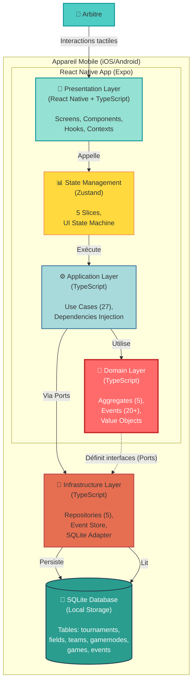
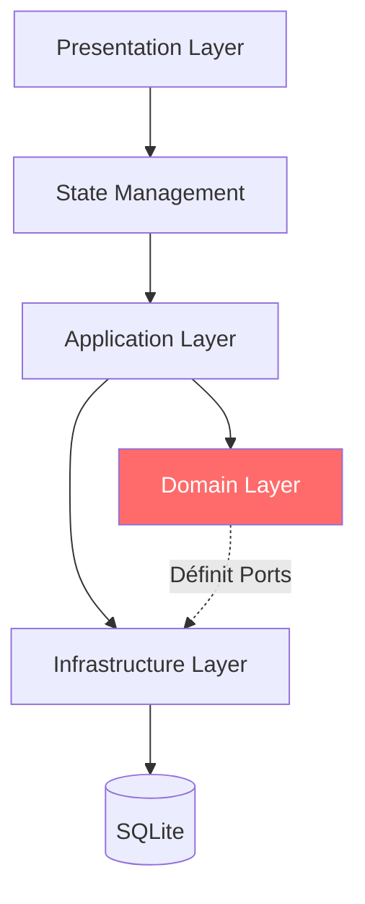

# C4 Model - Level 2: Container Diagram

## Vue d'ensemble

Le diagramme de containers (C2) décompose l'application Paintball Result Stats en ses principaux containers techniques et montre comment ils interagissent.

**Niveau:** C2 - Container  
**Audience:** Développeurs, architectes  
**Focus:** Containers applicatifs et leurs technologies

---

## Diagramme de Containers



---

## Containers Détaillés

### 1. 📱 Presentation Layer (React Native)

**Technologie:** React Native (Expo) + TypeScript

**Responsabilité:** Interface utilisateur et interactions

**Composants:**
- **Screens** (`app/`)
  - Tournament screens (4)
  - Field screens (5)
  - Team screens (4)
  - GameMode screens (4)
  - Game Session screens (2)
  
- **Components** (`components/`)
  - Composants réutilisables (26)
  - UI primitives
  - Formulaires
  
- **Hooks** (`hooks/`)
  - `useGameStateMachine` - Machine à états UI
  - `useGameTimer` - Gestion timer précis
  - `useArbitratorCommand` - Pattern Command
  - `useSearch`, `useTeamSelection`, etc.
  
- **Contexts** (`contexts/`)
  - `MatchupCreationContext` - État création matchup

**Dépendances:**
- React Native (Expo SDK)
- React Navigation / Expo Router
- TypeScript
- Zustand (via State Management)

**Communication:**
- Appelle State Management pour actions
- Reçoit updates via subscriptions Zustand
- Affiche données et gère interactions tactiles

---

### 2. 📊 State Management (Zustand)

**Technologie:** Zustand

**Responsabilité:** Gestion d'état global de l'UI

**Slices:**
1. `createTournamentSlice` - État tournois
2. `createFieldSlice` - État terrains
3. `createTeamSlice` - État équipes
4. `createGameModeSlice` - État modes de jeu
5. `createGameSlice` - État matchs
6. `createSharedSlice` - État partagé

**Patterns:**
- **GameStateMachine** - State Pattern pour UI du match
  - 6 états: NotStarted, Running, OvertimRunning, Stopped, Break, Finished
  - Actions contextuelles par état

**Store Structure:**
```typescript
{
  tournaments: Tournament[];
  fields: Field[];
  teams: Team[];
  gameModes: GameMode[];
  games: Game[];
  currentGame: Game | null;
  isLoading: boolean;
  error: string | null;
}
```

**Actions:**
- CRUD pour chaque entité
- Actions spécifiques Game Session (start, stop, score, etc.)
- Gestion du loading et erreurs

**Communication:**
- Reçoit actions de Presentation Layer
- Exécute Use Cases via Application Layer
- Notifie Presentation Layer des changements

---

### 3. ⚙️ Application Layer (Use Cases)

**Technologie:** TypeScript (pur)

**Responsabilité:** Orchestration de la logique métier

**Use Cases (27):**

**Tournament (4):**
- CreateTournament
- UpdateTournament
- DeleteTournament
- (FindTournament - implicite)

**Field (4):**
- CreateField
- UpdateField
- DeleteField
- ReorderMatchups

**Team (3):**
- CreateTeam
- UpdateTeam
- DeleteTeam

**GameMode (3):**
- CreateGameMode
- UpdateGameMode
- DeleteGameMode

**Game Session (10):**
- CreateGame
- StartGame
- StopGameTime
- ResumeGame
- ScorePoint
- AdjustScore
- StartBreak
- EndBreak
- StartOvertime
- AdjustTime
- FinishGame

**Pattern:**
```typescript
class CreateGameUseCase {
  constructor(
    private gameRepository: IGameRepository,
    private fieldRepository: IFieldRepository,
    private eventStore: IEventStore
  ) {}
  
  async execute(input: CreateGameInput): Promise<void> {
    // 1. Récupérer dépendances
    // 2. Créer aggregate via Domain
    // 3. Persister via Repository
    // 4. Émettre event via EventStore
  }
}
```

**Dépendances:**
- Domain Layer (Aggregates, Value Objects)
- Infrastructure Layer (via Ports/Interfaces)

**Communication:**
- Appelé par State Management
- Utilise Domain Layer pour logique métier
- Persiste via Infrastructure Layer

---

### 4. 🧠 Domain Layer (Core)

**Technologie:** TypeScript (pur, sans dépendances externes)

**Responsabilité:** Logique métier pure (cœur de l'application)

**Aggregates (5):**
1. **Tournament** - Gestion tournois
2. **Field** - Gestion terrains + Matchups
3. **Team** - Gestion équipes
4. **GameMode** - Configuration règles
5. **Game** - Moteur de match (Core Domain)

**Value Objects:**
- Score, GameTimer (Game)
- GameDuration, BreakDuration, OvertimeDuration, ScoreLimit (GameMode)

**Entities:**
- Matchup (dans Field)
- GameState (dans Game)

**Enums:**
- GameStatus (6 états)
- CommandType (3 types)

**Domain Events (20+):**
- GameEvents (9)
- FieldEvents (5)
- TeamEvents (3)
- GameModeEvents (3)
- TournamentEvents (0 - manquants)

**Patterns:**
- Command Pattern (ArbitratorCommand)
- State Pattern (GameState)
- Value Object Pattern
- Aggregate Pattern
- Factory Method Pattern

**Caractéristiques:**
- **Immuable** - Toutes les méthodes retournent nouvelles instances
- **Pur** - Pas de dépendances externes
- **Testable** - Logique isolée
- **Invariants** - Validation stricte

**Communication:**
- Utilisé par Application Layer
- Définit Ports (interfaces) pour Infrastructure
- Émet Domain Events

---

### 5. 🔌 Infrastructure Layer

**Technologie:** TypeScript + SQLite

**Responsabilité:** Implémentation technique (persistance, I/O)

**Repositories (5):**
1. `TournamentRepository` - Implémente ITournamentRepository
2. `FieldRepository` - Implémente IFieldRepository
3. `TeamRepository` - Implémente ITeamRepository
4. `GameModeRepository` - Implémente IGameModeRepository
5. `GameRepository` - Implémente IGameRepository

**Event Store:**
- `EventStore` - Implémente IEventStore
- Persistance des Domain Events
- Reconstruction d'état via replay

**SQLite Adapter:**
- `initDb.ts` - Initialisation schéma
- Migrations
- Queries SQL

**Pattern:** Hexagonal Architecture (Ports & Adapters)

```typescript
// Port (Domain Layer)
interface IGameRepository {
  save(game: Game): Promise<void>;
  findById(id: GameId): Promise<Game | null>;
  findAll(): Promise<Game[]>;
  delete(id: GameId): Promise<void>;
}

// Adapter (Infrastructure Layer)
class GameRepository implements IGameRepository {
  async save(game: Game): Promise<void> {
    // Implémentation SQLite
  }
}
```

**Communication:**
- Implémente les Ports définis par Domain Layer
- Appelé par Application Layer
- Persiste dans SQLite Database

---

### 6. 💾 SQLite Database

**Technologie:** SQLite (local)

**Responsabilité:** Stockage persistant des données

**Tables Principales:**

1. **tournaments**
   - id, name, location, startDate, endDate

2. **fields**
   - id, tournamentId, name

3. **matchups**
   - id, fieldId, teamA, teamB, order, gameModeId

4. **teams**
   - id, name, isGuest

5. **game_modes**
   - id, name, gameTimeMinutes, breakTimeSeconds, overtimeMinutes, raceTo

6. **games**
   - id, fieldId, matchupId, gameModeId, scoreTeamA, scoreTeamB, status, currentRound, isTimeStopped, remainingTime, etc.

7. **events** (Event Store)
   - id, aggregateId, type, timestamp, payload (JSON)

**Indexes:**
- Index sur aggregateId (events)
- Index sur tournamentId (fields)
- Index sur fieldId (matchups, games)

**Taille:**
- Typique: 10-100 MB par tournoi
- Event Store: Majorité du volume

**Backup:**
- Fichier SQLite copiable
- Export JSON possible

---

## Flux de Données

### Flux Lecture (Query)

```
1. Arbitre → UI: Demande liste des matchs
2. UI → State Management: loadGames()
3. State Management → App Layer: (via dependencies)
4. App Layer → Infrastructure: gameRepository.findAll()
5. Infrastructure → SQLite: SELECT * FROM games
6. SQLite → Infrastructure: Résultats
7. Infrastructure → App Layer: Game[]
8. App Layer → State Management: Game[]
9. State Management → UI: Update state
10. UI → Arbitre: Affiche liste
```

---

### Flux Écriture (Command)

```
1. Arbitre → UI: Marquer point pour teamA
2. UI → State Management: scorePoint(gameId, 'teamA')
3. State Management → App Layer: ScorePoint.execute()
4. App Layer → Domain: game.score.incrementTeamA()
5. Domain → App Layer: Nouveau Game (immuable)
6. App Layer → Infrastructure: gameRepository.save(game)
7. Infrastructure → SQLite: UPDATE games SET ...
8. App Layer → Infrastructure: eventStore.append(PointScoredEvent)
9. Infrastructure → SQLite: INSERT INTO events ...
10. SQLite → Infrastructure: Success
11. Infrastructure → App Layer: Success
12. App Layer → State Management: Success
13. State Management → UI: Update state
14. UI → Arbitre: Score mis à jour affiché
```

---

### Flux Event Sourcing (Reconstruction)

```
1. App Layer → Infrastructure: eventStore.getEvents(gameId)
2. Infrastructure → SQLite: SELECT * FROM events WHERE aggregateId = ?
3. SQLite → Infrastructure: Event[]
4. Infrastructure → App Layer: Event[]
5. App Layer → Domain: Game.replayEvents(events)
6. Domain → Domain: Applique chaque event
7. Domain → App Layer: Game reconstruit
```

---

## Technologies et Dépendances

### Stack Technique

**Frontend:**
- React Native 0.74+
- Expo SDK 51+
- TypeScript 5.3+
- React Navigation / Expo Router

**State Management:**
- Zustand 4.x

**Base de données:**
- expo-sqlite
- SQLite 3.x

**Utilitaires:**
- date-fns (manipulation dates)
- uuid (génération IDs)

**Dev Tools:**
- ESLint
- Prettier
- Jest (tests)

---

### Dépendances entre Containers



**Règle de Dépendance (Clean Architecture):**
- ✅ Presentation → State Management → Application → Domain
- ✅ Application → Infrastructure (via Ports)
- ✅ Domain définit Ports, Infrastructure implémente
- ❌ Domain ne dépend JAMAIS de Infrastructure
- ❌ Pas de dépendances circulaires

---

## Patterns Architecturaux

### 1. Clean Architecture (Hexagonal)

**Principe:** Dépendances pointent vers le Domain (centre)

**Bénéfices:**
- Domain indépendant de la technologie
- Testabilité maximale
- Changement de DB/UI facile

---

### 2. CQRS (Léger)

**Command:** Use Cases modifient l'état
**Query:** Repositories lisent l'état

**Séparation:**
- Commands → Event Store (write)
- Queries → Tables SQL (read)

---

### 3. Event Sourcing

**Principe:** Tous les changements = Events persistés

**Implémentation:**
- Events stockés dans table `events`
- État actuel dans tables métier (optimisation)
- Reconstruction possible via replay

---

### 4. Repository Pattern

**Principe:** Abstraction de la persistance

**Implémentation:**
- Ports (interfaces) dans Domain
- Adapters (implémentations) dans Infrastructure

---

## Déploiement

### Build Process

```
1. TypeScript Compilation
   ↓
2. Expo Build (iOS/Android)
   ↓
3. Bundle JavaScript
   ↓
4. Package Assets
   ↓
5. Generate APK/IPA
```

### Distribution

**Android:**
- APK via Expo Build
- Google Play Store (optionnel)

**iOS:**
- IPA via Expo Build
- TestFlight / App Store (optionnel)

---

## Performance et Optimisation

### Optimisations Implémentées

**Timer Précision:**
- Utilisation de `endTimestamp` (pas de drift)
- Calcul basé sur `Date.now()`

**State Management:**
- Zustand (léger, performant)
- Slices séparés (re-render minimal)

**Database:**
- Indexes sur clés étrangères
- Queries optimisées

**UI:**
- React.memo pour composants
- useMemo/useCallback pour optimisations

---

### Métriques

**Temps de réponse:**
- Marquer point: < 100ms
- Charger match: < 500ms
- Timer update: 16ms (60 FPS)

**Mémoire:**
- App size: ~50 MB
- Runtime memory: ~100-200 MB

---

## Sécurité

### Données Locales

**Protection:**
- SQLite chiffré (optionnel via expo-sqlite)
- Pas de données sensibles (pas de paiements, etc.)

**Backup:**
- Responsabilité de l'utilisateur
- Export manuel possible

---

### Validation

**Côté Client:**
- Validation dans Domain Layer (invariants)
- Validation dans UI (formulaires)

**Pas de Backend:**
- Pas de validation serveur nécessaire
- Arbitre = autorité absolue

---

## Évolutions Futures

### Phase 2: Backend Cloud

**Nouveau Container:**
- API Backend (Node.js/NestJS)
- PostgreSQL (cloud)
- Sync Service

**Modifications:**
- Infrastructure Layer: Ajouter HTTP Client
- Sync bidirectionnel (local ↔ cloud)

---

### Phase 3: Analytics

**Nouveau Container:**
- Analytics Service
- Data Warehouse
- ML Models

---

## Résumé

### Containers Principaux

| Container | Technologie | Responsabilité | Lignes de Code |
|-----------|-------------|----------------|----------------|
| Presentation | React Native | UI/UX | ~5000 |
| State Management | Zustand | État global | ~1000 |
| Application | TypeScript | Use Cases | ~2000 |
| Domain | TypeScript | Logique métier | ~1500 |
| Infrastructure | TypeScript + SQLite | Persistance | ~2000 |
| Database | SQLite | Stockage | - |

**Total:** ~11500 lignes de code (hors node_modules)

---

### Points Clés

- ✅ Clean Architecture stricte
- ✅ Event Sourcing complet
- ✅ Séparation claire des responsabilités
- ✅ Domain indépendant de la technologie
- ✅ Testabilité maximale

---

## Références

- **Niveau précédent:** [C1 - System Context](c1-context.md)
- **Niveau suivant:** [C3 - Component Diagram](c3-component.md)
- **Code source:** `src/`, `app/`, `hooks/`, `contexts/`
