# C4 Model - Level 3: Component Diagram

## Vue d'ensemble

Le diagramme de composants (C3) décompose chaque container en ses composants internes et montre leurs interactions détaillées.

**Niveau:** C3 - Component  
**Audience:** Développeurs  
**Focus:** Composants logiciels et leurs responsabilités

---

## Architecture Globale par Couches

```mermaid
graph TB
    subgraph "Presentation Layer"
        Screens[Screens<br/>Tournament, Field, Team,<br/>GameMode, GameSession]
        Components[Components<br/>UI Réutilisables]
        Hooks[Hooks<br/>useGameStateMachine,<br/>useGameTimer, etc.]
        Contexts[Contexts<br/>MatchupCreationContext]
    end
    
    subgraph "State Management"
        TournamentSlice[Tournament Slice]
        FieldSlice[Field Slice]
        TeamSlice[Team Slice]
        GameModeSlice[GameMode Slice]
        GameSlice[Game Slice]
        SharedSlice[Shared Slice]
        GameStateMachine[Game State Machine]
    end
    
    subgraph "Application Layer"
        TournamentUC[Tournament Use Cases<br/>Create, Update, Delete]
        FieldUC[Field Use Cases<br/>Create, Update, Delete, Reorder]
        TeamUC[Team Use Cases<br/>Create, Update, Delete]
        GameModeUC[GameMode Use Cases<br/>Create, Update, Delete]
        GameUC[Game Use Cases<br/>Create, Start, Stop, Score,<br/>Break, Overtime, Finish]
        Dependencies[Dependencies Injection]
    end
    
    subgraph "Domain Layer"
        TournamentAgg[Tournament Aggregate]
        FieldAgg[Field Aggregate<br/>+ Matchup Entity]
        TeamAgg[Team Aggregate]
        GameModeAgg[GameMode Aggregate<br/>+ Value Objects]
        GameAgg[Game Aggregate<br/>+ Score, Timer, State]
        Events[Domain Events<br/>20+ Events]
        Commands[Arbitrator Commands<br/>ADJUST_SCORE, etc.]
    end
    
    subgraph "Infrastructure Layer"
        TournamentRepo[Tournament Repository]
        FieldRepo[Field Repository]
        TeamRepo[Team Repository]
        GameModeRepo[GameMode Repository]
        GameRepo[Game Repository]
        EventStore[Event Store]
        SQLiteAdapter[SQLite Adapter]
    end
    
    Screens --> Hooks
    Screens --> Contexts
    Screens --> TournamentSlice
    Screens --> FieldSlice
    Screens --> TeamSlice
    Screens --> GameModeSlice
    Screens --> GameSlice
    
    GameSlice --> GameStateMachine
    
    TournamentSlice --> TournamentUC
    FieldSlice --> FieldUC
    TeamSlice --> TeamUC
    GameModeSlice --> GameModeUC
    GameSlice --> GameUC
    
    TournamentUC --> TournamentAgg
    FieldUC --> FieldAgg
    TeamUC --> TeamAgg
    GameModeUC --> GameModeAgg
    GameUC --> GameAgg
    GameUC --> Commands
    
    GameAgg --> Events
    FieldAgg --> Events
    TeamAgg --> Events
    GameModeAgg --> Events
    TournamentAgg --> Events
    
    TournamentUC --> Dependencies
    FieldUC --> Dependencies
    TeamUC --> Dependencies
    GameModeUC --> Dependencies
    GameUC --> Dependencies
    
    Dependencies --> TournamentRepo
    Dependencies --> FieldRepo
    Dependencies --> TeamRepo
    Dependencies --> GameModeRepo
    Dependencies --> GameRepo
    Dependencies --> EventStore
    
    TournamentRepo --> SQLiteAdapter
    FieldRepo --> SQLiteAdapter
    TeamRepo --> SQLiteAdapter
    GameModeRepo --> SQLiteAdapter
    GameRepo --> SQLiteAdapter
    EventStore --> SQLiteAdapter
    
    style GameAgg fill:#ff6b6b,color:#fff
    style GameUC fill:#ff6b6b,color:#fff
    style GameSlice fill:#ff6b6b,color:#fff
```



---

## Presentation Layer - Composants Détaillés

### Screens (app/)

**Organisation par Bounded Context:**

```
app/
├── tournament/
│   ├── tournaments-list.tsx        # Liste tournois
│   ├── create-tournament.tsx       # Création
│   ├── edit-tournament.tsx         # Modification
│   └── [id].tsx                    # Détails + Fields
│
├── field/
│   ├── create-field.tsx            # Création terrain
│   ├── edit-field.tsx              # Modification
│   ├── [id].tsx                    # Détails + Matchups
│   └── matchup/
│       ├── create-matchup.tsx      # Création matchup
│       └── edit-matchup.tsx        # Modification
│
├── team/
│   ├── teams-list.tsx              # Liste équipes
│   ├── create-team.tsx             # Création
│   ├── edit-team.tsx               # Modification
│   └── select-team.tsx             # Sélection (pour matchup)
│
├── gamemode/
│   ├── game-modes-list.tsx         # Liste modes
│   ├── create-game-mode.tsx        # Création
│   ├── edit-game-mode.tsx          # Modification
│   └── select-game-mode.tsx        # Sélection (pour matchup)
│
├── game-session/
│   ├── start-match.tsx             # Setup match
│   └── [gameId].tsx                # Arbitrage temps réel (19KB!)
│
├── index.tsx                        # Home
└── menu.tsx                         # Menu principal
```

**Responsabilités:**
- Affichage des données
- Gestion des interactions utilisateur
- Navigation
- Formulaires et validation UI

---

### Hooks Spécialisés (hooks/)

**Hooks Métier:**

1. **useGameStateMachine.ts**
   - Gère la machine à états UI du match
   - Synchronise 3 timers (game, break, overtime)
   - Retourne view (badge, actions) et activeTimer
   
2. **useGameTimer.ts**
   - Timer précis avec endTimestamp
   - Méthodes: start, stop, resume, setTime, syncWithDB
   - Évite le drift du timer
   
3. **useArbitratorCommand.ts**
   - Gestion des commandes arbitre
   - Pattern Command avec validation explicite
   - Méthodes: initiateCommand, validateCommand, cancelCommand

**Hooks Utilitaires:**

4. **useSearch.ts** - Recherche/filtrage
5. **useTeamSelection.ts** - Sélection équipes (validation teamA ≠ teamB)
6. **useConfirmDialog.ts** - Dialogues de confirmation
7. **use-color-scheme.ts** - Thème clair/sombre
8. **use-theme-color.ts** - Couleurs thématiques

---

### Contexts React (contexts/)

**MatchupCreationContext.tsx**

**Responsabilité:** État partagé pour création/modification de matchup

**State:**
```typescript
{
  teamA: Team | null;
  teamB: Team | null;
  gameMode: GameMode | null;
  isValid: boolean;
}
```

**Méthodes:**
- `selectTeamA(team)`
- `selectTeamB(team)`
- `selectGameMode(mode)`
- `validate()` - Vérifie teamA ≠ teamB

**Utilisation:** Partagé entre screens de sélection et création matchup

---

### Components Réutilisables (components/)

**26 composants UI:**

**Formulaires:**
- FormInput, FormSelect, FormDatePicker
- ValidationMessage

**Listes:**
- TournamentCard, FieldCard, TeamCard, GameModeCard
- MatchupItem, GameItem

**Boutons:**
- PrimaryButton, SecondaryButton, DangerButton
- IconButton

**Layout:**
- Container, Card, Section
- Header, Footer

**Match:**
- ScoreBoard, TimerDisplay, StatusBadge
- ActionButtons, BreakTimer

**Autres:**
- LoadingSpinner, ErrorMessage
- EmptyState, SearchBar

---

## State Management - Composants Détaillés

### Zustand Slices

**Architecture:**

```typescript
// src/presentation/state/useCoreStore.ts
const useCoreStore = create<CoreStore>()(
  (...args) => ({
    ...createTournamentSlice(...args),
    ...createFieldSlice(...args),
    ...createTeamSlice(...args),
    ...createGameModeSlice(...args),
    ...createGameSlice(...args),
    ...createSharedSlice(...args),
  })
);
```

---

### 1. Tournament Slice

**Fichier:** `createTournamentSlice.ts`

**State:**
```typescript
{
  tournaments: Tournament[];
  selectedTournament: Tournament | null;
  isLoading: boolean;
  error: string | null;
}
```

**Actions:**
- `loadTournaments()`
- `createTournament(data)`
- `updateTournament(id, data)`
- `deleteTournament(id)`
- `selectTournament(id)`

---

### 2. Field Slice

**Fichier:** `createFieldSlice.ts`

**State:**
```typescript
{
  fields: Field[];
  selectedField: Field | null;
  isLoading: boolean;
  error: string | null;
}
```

**Actions:**
- `loadFields()`
- `loadFieldsByTournament(tournamentId)`
- `createField(data)`
- `updateField(id, data)`
- `deleteField(id)`
- `addMatchup(fieldId, matchup)`
- `removeMatchup(fieldId, matchupId)`
- `reorderMatchups(fieldId, matchupIds)`

---

### 3. Team Slice

**Fichier:** `createTeamSlice.ts`

**State:**
```typescript
{
  teams: Team[];
  selectedTeam: Team | null;
  isLoading: boolean;
  error: string | null;
}
```

**Actions:**
- `loadTeams()`
- `createTeam(data)`
- `updateTeam(id, data)`
- `deleteTeam(id)`
- `filterTeams(isGuest?)`

---

### 4. GameMode Slice

**Fichier:** `createGameModeSlice.ts`

**State:**
```typescript
{
  gameModes: GameMode[];
  selectedGameMode: GameMode | null;
  isLoading: boolean;
  error: string | null;
}
```

**Actions:**
- `loadGameModes()`
- `createGameMode(data)`
- `updateGameMode(id, data)`
- `deleteGameMode(id)`

---

### 5. Game Slice (Le plus complexe)

**Fichier:** `createGameSlice.ts`

**State:**
```typescript
{
  games: Game[];
  currentGame: Game | null;
  isLoading: boolean;
  error: string | null;
}
```

**Actions (11):**
- `loadGames()`
- `loadGame(id)`
- `createGame(data)`
- `startGame(id)`
- `stopGameTime(id)`
- `resumeGame(id)`
- `scorePoint(id, teamId)`
- `adjustScore(id, scoreA, scoreB, reason)`
- `startBreak(id, duration?)`
- `endBreak(id)`
- `startOvertime(id)`
- `adjustTime(id, seconds, reason)`
- `finishGame(id, note?)`

---

### 6. GameStateMachine

**Fichier:** `GameStateMachine.ts`

**Responsabilité:** Mapper GameStatus → UI State

**Pattern:** State Pattern

**États (6):**
1. **NotStartedState** - Badge rouge, actions: Break 30s, Break 5s
2. **RunningState** - Badge vert, actions: Stop
3. **OvertimeRunningState** - Badge vert "OVERTIME", actions: Stop
4. **StoppedState** - Badge orange, actions: Break 30s, Break 5s
5. **BreakState** - Badge orange "BREAK", actions: Stop
6. **FinishedState** - Badge rouge, actions: []

**Interface:**
```typescript
interface GameStateView {
  badgeLabel: string;
  badgeColor: string;
  showDot: boolean;
  actions: ActionButton[];
  activeTimerType: 'game' | 'break' | 'overtime';
}
```

**Méthode principale:**
```typescript
static getUIState(game: Game): GameUIState | null
```

---

## Application Layer - Composants Détaillés

### Use Cases par Bounded Context

**Pattern Use Case:**
```typescript
export class CreateGameUseCase {
  constructor(
    private gameRepository: IGameRepository,
    private fieldRepository: IFieldRepository,
    private eventStore: IEventStore
  ) {}
  
  async execute(input: CreateGameInput): Promise<void> {
    // 1. Validation input
    // 2. Récupération dépendances
    // 3. Logique métier (via Domain)
    // 4. Persistance (via Repository)
    // 5. Émission event (via EventStore)
  }
}
```

---

### Tournament Use Cases (4)

1. **CreateTournament** - Création tournoi
2. **UpdateTournament** - Modification tournoi
3. **DeleteTournament** - Suppression tournoi
4. (FindTournament - implicite via Repository)

**Fichiers:** `src/core/useCases/CreateTournament.ts`, etc.

---

### Field Use Cases (4)

1. **CreateField** - Création terrain
2. **UpdateField** - Modification terrain
3. **DeleteField** - Suppression terrain
4. **ReorderMatchups** - Réorganisation matchups

**Fichiers:** `src/core/useCases/CreateField.ts`, etc.

---

### Team Use Cases (3)

1. **CreateTeam** - Création équipe
2. **UpdateTeam** - Modification équipe
3. **DeleteTeam** - Suppression équipe

**Fichiers:** `src/core/useCases/CreateTeam.ts`, etc.

---

### GameMode Use Cases (3)

1. **CreateGameMode** - Création mode
2. **UpdateGameMode** - Modification mode
3. **DeleteGameMode** - Suppression mode

**Fichiers:** `src/core/useCases/CreateGameMode.ts`, etc.

---

### Game Use Cases (10)

**Lifecycle:**
1. **CreateGame** - Création match
2. **StartGame** - Démarrage
3. **FinishGame** - Fin (validation arbitre)

**Timer Control:**
4. **StopGameTime** - Pause timer
5. **ResumeGame** - Reprise timer

**Scoring:**
6. **ScorePoint** - Marquer point
7. **AdjustScore** - Corriger score (ArbitratorCommand)

**Breaks:**
8. **StartBreak** - Démarrer break
9. **EndBreak** - Terminer break

**Overtime:**
10. **StartOvertime** - Démarrer overtime

**Adjustments:**
11. **AdjustTime** - Ajuster temps (ArbitratorCommand)

**Fichiers:** `src/core/useCases/*.ts`

---

### Dependencies Injection

**Fichier:** `src/presentation/state/dependencies.ts`

**Responsabilité:** Instancier et injecter dépendances

**Pattern:** Dependency Injection (simple)

```typescript
// Repositories
const tournamentRepository = new TournamentRepository(db);
const fieldRepository = new FieldRepository(db);
const teamRepository = new TeamRepository(db);
const gameModeRepository = new GameModeRepository(db);
const gameRepository = new GameRepository(db);
const eventStore = new EventStore(db);

// Use Cases
const createGameUseCase = new CreateGameUseCase(
  gameRepository,
  fieldRepository,
  eventStore
);

export const dependencies = {
  repositories: { ... },
  useCases: { ... }
};
```

---

## Domain Layer - Composants Détaillés

### Aggregates (5)

**1. Tournament**
- **Fichier:** `Tournament.ts`
- **Properties:** id, name, location, startDate, endDate
- **Méthodes:** create()
- **Invariants:** endDate >= startDate, nom non vide

**2. Field**
- **Fichier:** `Field.ts`
- **Properties:** id, tournamentId, name, matchups[]
- **Entity:** Matchup (id, teamA, teamB, order, gameModeId)
- **Méthodes:** create(), addMatchup(), removeMatchup(), updateMatchup()
- **Invariants:** tournamentId requis, matchups ordonnés

**3. Team**
- **Fichier:** `Team.ts`
- **Properties:** id, name, isGuest
- **Méthodes:** create()
- **Invariants:** nom non vide

**4. GameMode**
- **Fichier:** `GameMode.ts`
- **Properties:** id, name, gameTime, breakTime, overTime?, raceTo
- **Value Objects:** GameDuration, BreakDuration, OvertimeDuration, ScoreLimit
- **Méthodes:** create()
- **Invariants:** Durées >= 0

**5. Game (Core Domain)**
- **Fichier:** `Game.ts`
- **Properties:** id, fieldId, matchup, gameMode, score, timer, status, currentRound, isTimeStopped, gameStateStatus
- **Value Objects:** Score, GameTimer
- **Entity:** GameState
- **Méthodes:** start(), stopTime(), resume(), startBreak(), endBreak(), startOvertime(), finish(), updateScore(), updateTimer()
- **Invariants:** Score >= 0, Timer >= 0, Modifications interdites si timer actif

---

### Domain Events (20+)

**GameEvents (9):**
- GameCreated, GameStarted, GameTimeStopped, GameResumed
- PointScored, ScoreCorrected, TimerAdjusted
- OvertimeStarted, GameFinished

**FieldEvents (5):**
- FieldCreated, FieldUpdated, MatchupAdded, MatchupRemoved, FieldDeleted

**TeamEvents (3):**
- TeamCreated, TeamUpdated, TeamDeleted

**GameModeEvents (3):**
- GameModeCreated, GameModeUpdated, GameModeDeleted

**TournamentEvents (0):**
- ⚠️ Manquants (gap identifié)

**Fichiers:** `src/core/domain/events/*.ts`

---

### ArbitratorCommand

**Fichier:** `ArbitratorCommand.ts`

**Pattern:** Command Pattern avec validation explicite

**CommandType Enum:**
- ADJUST_SCORE
- ADJUST_TIME
- UNDO_LAST_POINT (non implémenté)

**Interfaces:**
- AdjustScoreCommand
- AdjustTimeCommand
- UndoLastPointCommand

**PendingCommand:**
- Encapsule une commande en attente de validation
- Méthode: isExpired(timeout)

---

## Infrastructure Layer - Composants Détaillés

### Repositories (5)

**Pattern:** Port & Adapter

**Ports (Interfaces):**
- `ITournamentRepository`
- `IFieldRepository`
- `ITeamRepository`
- `IGameModeRepository`
- `IGameRepository`

**Adapters (Implémentations):**
- `TournamentRepository`
- `FieldRepository`
- `TeamRepository`
- `GameModeRepository`
- `GameRepository`

**Méthodes communes:**
```typescript
interface IRepository<T, ID> {
  save(entity: T): Promise<void>;
  findById(id: ID): Promise<T | null>;
  findAll(): Promise<T[]>;
  delete(id: ID): Promise<void>;
}
```

**Fichiers:** `src/infrastructure/database/*.ts`

---

### Event Store

**Fichier:** `EventStore.ts`

**Responsabilité:** Persistance et récupération des Domain Events

**Interface:**
```typescript
interface IEventStore {
  append(event: DomainEvent): Promise<void>;
  getEvents(aggregateId: string): Promise<DomainEvent[]>;
  getAllEvents(): Promise<DomainEvent[]>;
}
```

**Implémentation:**
- Table `events` (id, aggregateId, type, timestamp, payload)
- Payload stocké en JSON
- Index sur aggregateId

**Méthodes:**
- `append(event)` - Ajoute un event
- `getEvents(aggregateId)` - Récupère events d'un aggregate
- `getAllEvents()` - Récupère tous les events (pour stats)

---

### SQLite Adapter

**Fichier:** `initDb.ts`

**Responsabilité:** Initialisation et gestion du schéma SQLite

**Tables créées:**
1. tournaments
2. fields
3. matchups
4. teams
5. game_modes
6. games
7. events

**Migrations:**
- Versioning du schéma
- Migrations automatiques au démarrage

**Méthodes:**
- `initDatabase()` - Initialise le schéma
- `runMigrations()` - Exécute migrations
- `getDb()` - Retourne instance SQLite

---

## Flux de Données Détaillés

### Exemple: Marquer un Point

```
1. UI (GameSession Screen)
   ↓ onClick "Team A"
2. Hook (useGameStateMachine)
   ↓ scorePoint(gameId, 'teamA')
3. Zustand (Game Slice)
   ↓ dispatch action
4. Use Case (ScorePoint)
   ↓ execute({ gameId, teamId })
5. Repository (GameRepository)
   ↓ findById(gameId)
6. SQLite
   ↓ SELECT * FROM games WHERE id = ?
7. Repository → Use Case
   ↓ Game instance
8. Domain (Game Aggregate)
   ↓ score.incrementTeamA()
9. Domain → Use Case
   ↓ New Game (immuable)
10. Use Case → Repository
    ↓ save(game)
11. Repository → SQLite
    ↓ UPDATE games SET ...
12. Use Case → EventStore
    ↓ append(PointScoredEvent)
13. EventStore → SQLite
    ↓ INSERT INTO events ...
14. Use Case → Zustand
    ↓ Success
15. Zustand → UI
    ↓ Update state
16. UI
    ↓ Re-render avec nouveau score
```

---

## Patterns de Communication

### 1. Presentation → State Management

**Pattern:** Observer (Zustand subscriptions)

```typescript
// UI subscribe aux changements
const currentGame = useCoreStore(state => state.currentGame);

// UI dispatch actions
const { scorePoint } = useCoreStore();
scorePoint(gameId, 'teamA');
```

---

### 2. State Management → Application

**Pattern:** Direct call (via dependencies)

```typescript
// Dans Zustand action
scorePoint: async (gameId, teamId) => {
  set({ isLoading: true });
  await dependencies.useCases.scorePoint.execute({ gameId, teamId });
  const game = await dependencies.repositories.game.findById(gameId);
  set({ currentGame: game, isLoading: false });
}
```

---

### 3. Application → Domain

**Pattern:** Factory + Methods

```typescript
// Use Case utilise Domain
const game = await this.gameRepository.findById(gameId);
const updatedGame = game.score.incrementTeamA(); // Immuable
await this.gameRepository.save(updatedGame);
```

---

### 4. Application → Infrastructure

**Pattern:** Dependency Injection (via Ports)

```typescript
// Use Case dépend de l'interface (Port)
constructor(private gameRepository: IGameRepository) {}

// Infrastructure implémente l'interface (Adapter)
class GameRepository implements IGameRepository { ... }
```

---

## Tests

### Stratégie de Test

**Unit Tests (Domain Layer):**
- Aggregates (Game, Field, etc.)
- Value Objects (Score, GameTimer, etc.)
- Business Rules

**Integration Tests (Application Layer):**
- Use Cases avec mocks de Repository
- Event emission

**E2E Tests (Presentation Layer):**
- Flows complets (créer tournoi → arbitrer match)
- UI interactions

**Fichiers:** `src/tests/`

---

## Métriques

### Complexité par Couche

| Couche | Composants | Lignes de Code | Complexité |
|--------|-----------|----------------|------------|
| Presentation | 50+ | ~5000 | Moyenne |
| State Management | 7 | ~1000 | Faible |
| Application | 27 | ~2000 | Faible |
| Domain | 15 | ~1500 | Haute |
| Infrastructure | 7 | ~2000 | Moyenne |

---

### Dépendances

**Externes:**
- React Native: 26 composants
- Zustand: 6 slices
- SQLite: 7 tables

**Internes:**
- Domain → 0 (pur)
- Application → Domain + Ports
- Infrastructure → Ports
- State Management → Application
- Presentation → State Management

---

## Résumé

### Points Clés

- ✅ **Séparation stricte des responsabilités** (5 couches)
- ✅ **Clean Architecture** (dépendances vers Domain)
- ✅ **27 Use Cases** bien organisés par contexte
- ✅ **5 Aggregates** avec logique métier riche
- ✅ **Event Sourcing** avec 20+ events
- ✅ **State Management** modulaire (6 slices)
- ✅ **Hooks spécialisés** pour logique complexe

### Complexité

**La plus haute:** Domain Layer (Game Aggregate)  
**La plus basse:** State Management (Zustand slices)

---

## Références

- **Niveau précédent:** [C2 - Container Diagram](c2-container.md)
- **Niveau suivant:** [C4 - Code Diagram](c4-code.md)
- **Code source:** `src/`, `app/`, `hooks/`, `contexts/`
