# C4 Model - Level 4: Code Diagram

## Vue d'ensemble

Le diagramme de code (C4) montre les classes et interfaces principales avec leurs relations et méthodes clés.

**Niveau:** C4 - Code  
**Audience:** Développeurs  
**Focus:** Implémentation détaillée des composants critiques

---

## Game Aggregate (Core Domain)

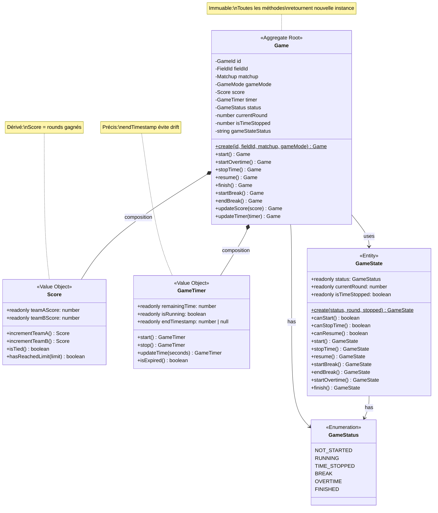

---

## GameStateMachine (UI State Pattern)

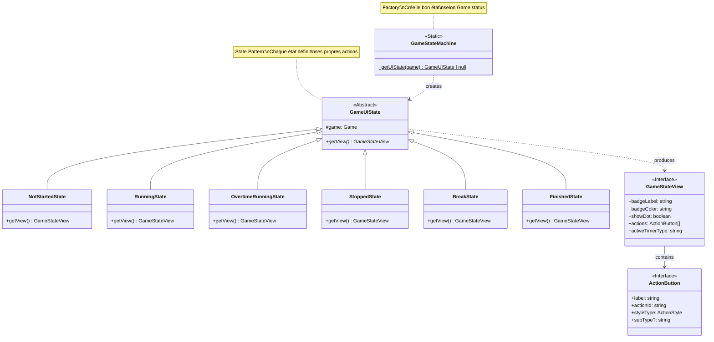

---

## ArbitratorCommand Pattern

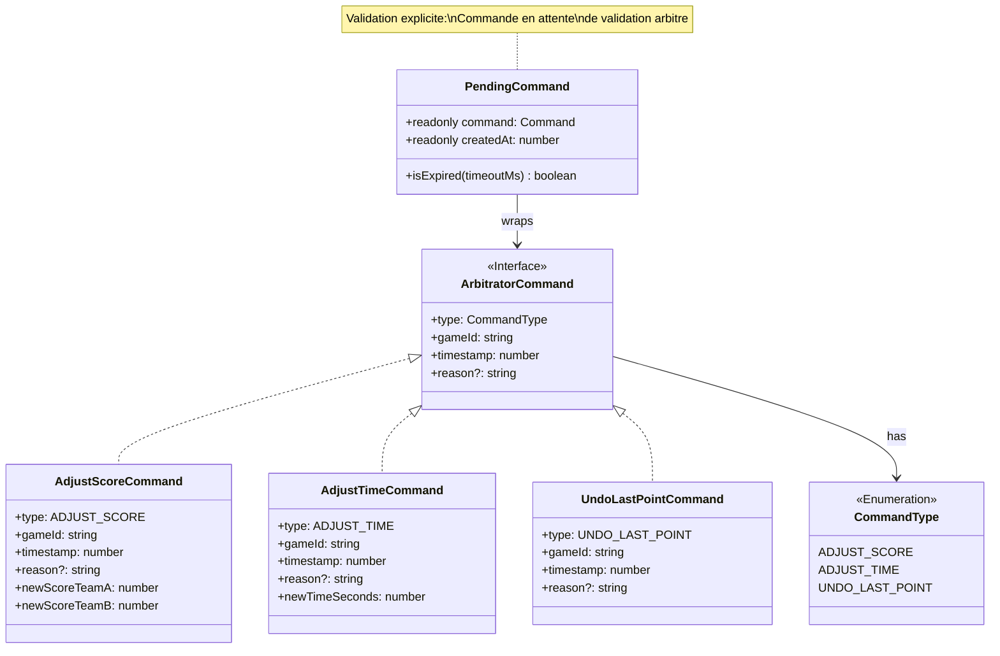

---

## Repository Pattern (Ports & Adapters)

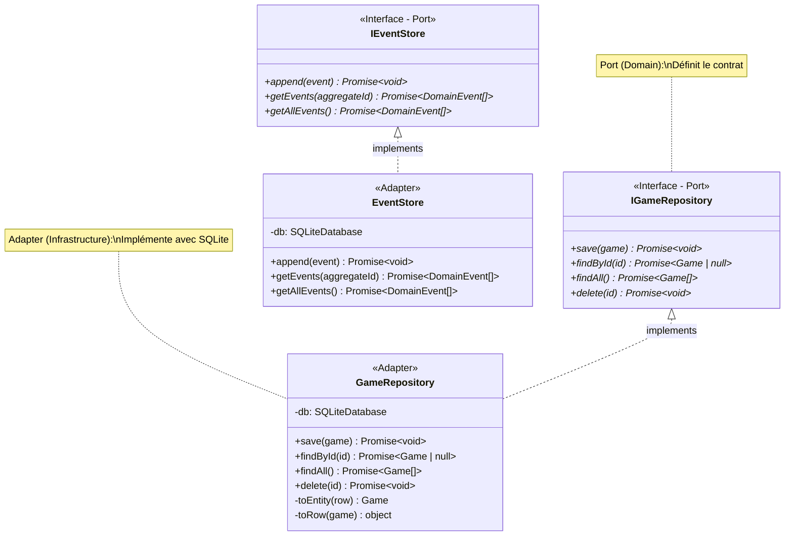

---

## Use Case Pattern

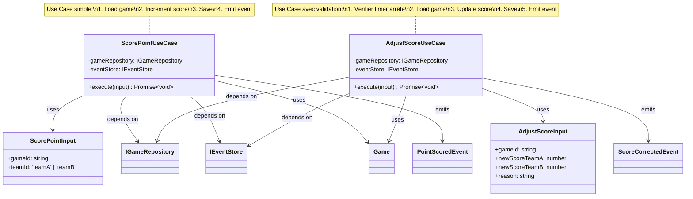

---

## Domain Events

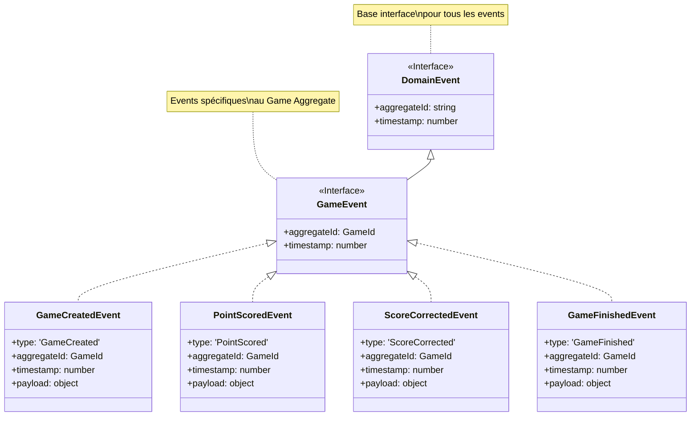

---

## Zustand Store Structure

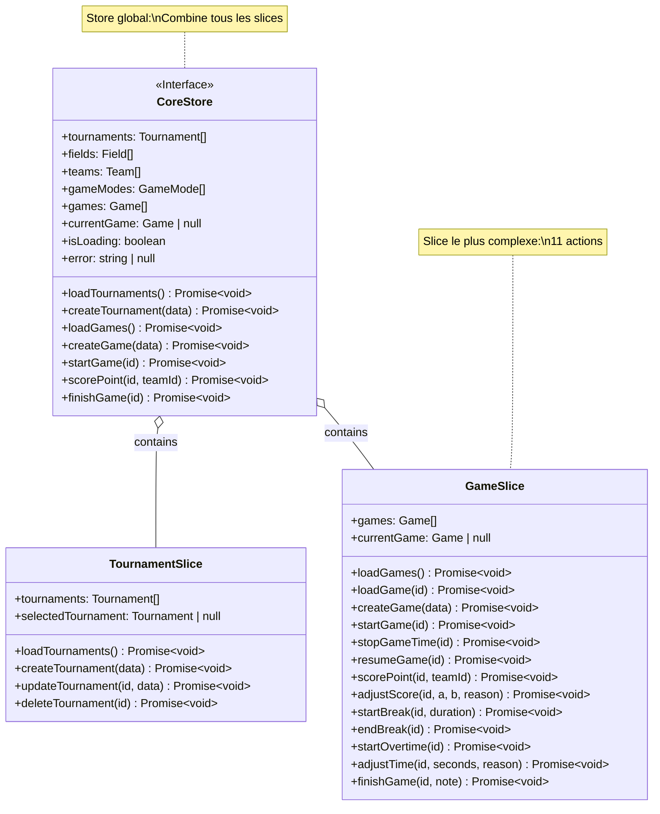

---

## Hooks Spécialisés

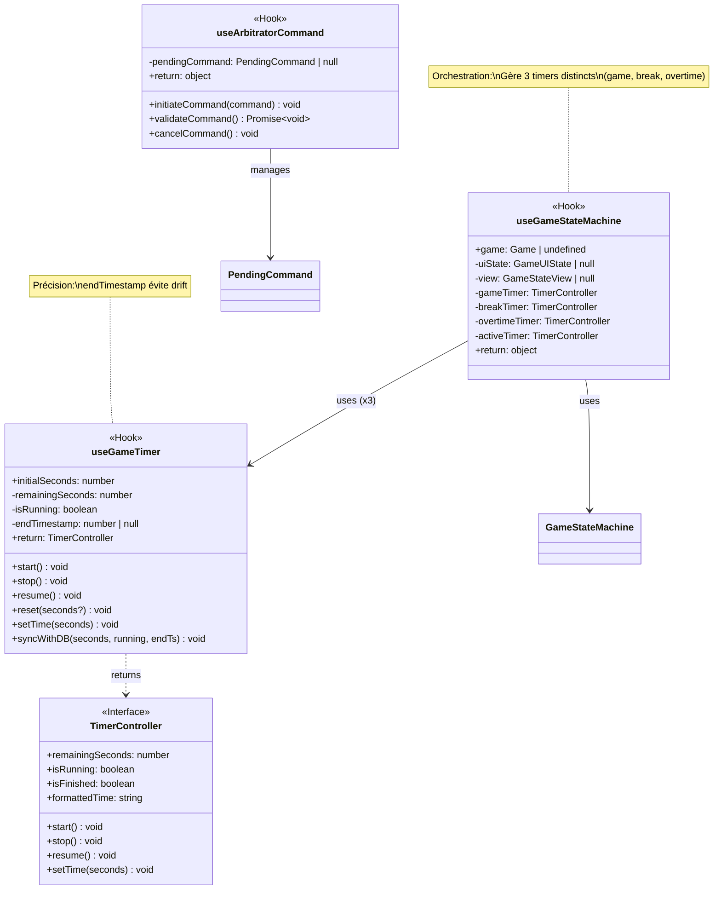

---

## Field Aggregate avec Matchup

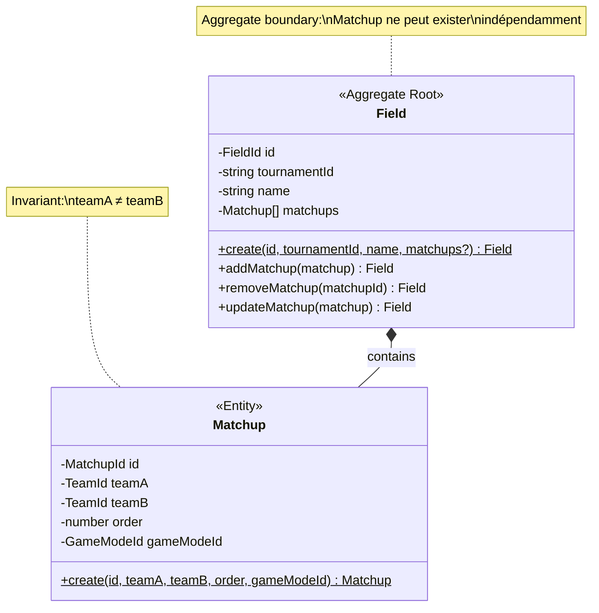

---

## GameMode avec Value Objects

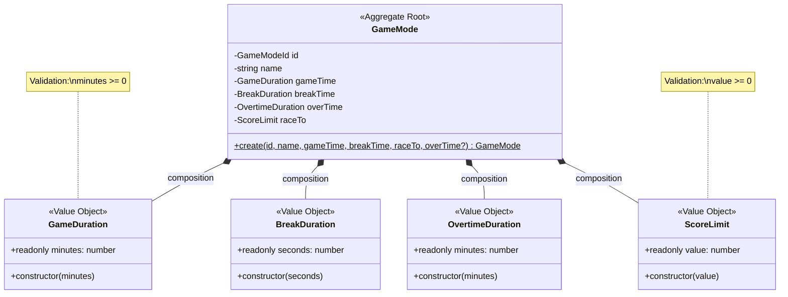

---

## Dependency Injection

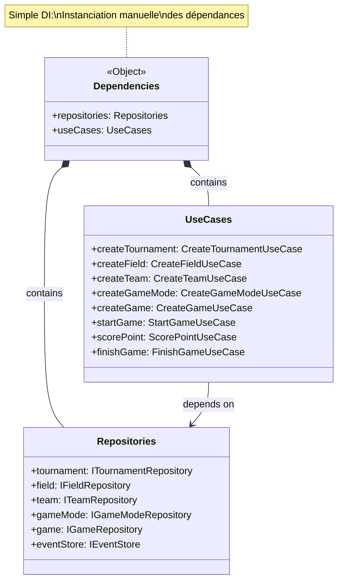

---

## Patterns Implémentés

### 1. Aggregate Pattern

**Exemple: Game**

```typescript
class Game {
  private constructor(...) {}  // Constructeur privé
  
  static create(...): Game {   // Factory method
    // Validation
    return new Game(...);
  }
  
  start(): Game {              // Méthode métier
    // Business logic
    return new Game(...);      // Nouvelle instance (immuable)
  }
}
```

**Bénéfices:**
- Encapsulation
- Invariants garantis
- Immuabilité

---

### 2. Value Object Pattern

**Exemple: Score**

```typescript
class Score {
  constructor(
    public readonly teamAScore: number,
    public readonly teamBScore: number
  ) {
    if (teamAScore < 0 || teamBScore < 0) {
      throw new Error("Score cannot be negative");
    }
  }
  
  incrementTeamA(): Score {
    return new Score(this.teamAScore + 1, this.teamBScore);
  }
}
```

**Caractéristiques:**
- Immuable (readonly)
- Validation dans constructeur
- Méthodes retournent nouvelles instances

---

### 3. State Pattern

**Exemple: GameStateMachine**

```typescript
abstract class GameUIState {
  constructor(protected game: Game) {}
  abstract getView(): GameStateView;
}

class RunningState extends GameUIState {
  getView(): GameStateView {
    return {
      badgeLabel: "RUNNING",
      badgeColor: "#34C759",
      actions: [{ label: "Stop", actionId: "STOP_MATCH" }]
    };
  }
}
```

**Bénéfices:**
- Comportement spécifique par état
- Transitions explicites
- Facilite l'ajout de nouveaux états

---

### 4. Command Pattern

**Exemple: ArbitratorCommand**

```typescript
interface ArbitratorCommand {
  type: CommandType;
  gameId: string;
  timestamp: number;
  reason?: string;
}

class PendingCommand {
  constructor(public readonly command: Command) {}
}

// Utilisation
const command: AdjustScoreCommand = {
  type: CommandType.ADJUST_SCORE,
  gameId: "123",
  newScoreTeamA: 3,
  newScoreTeamB: 1,
  reason: "erreur arbitre"
};

const pending = new PendingCommand(command);
// UI affiche validation
// Si validé → execute
// Si annulé → discard
```

**Bénéfices:**
- Validation explicite
- Traçabilité
- Annulation possible

---

### 5. Repository Pattern

**Exemple: GameRepository**

```typescript
// Port (Domain)
interface IGameRepository {
  save(game: Game): Promise<void>;
  findById(id: GameId): Promise<Game | null>;
}

// Adapter (Infrastructure)
class GameRepository implements IGameRepository {
  constructor(private db: SQLiteDatabase) {}
  
  async save(game: Game): Promise<void> {
    const row = this.toRow(game);
    await this.db.run("UPDATE games SET ...", row);
  }
  
  async findById(id: GameId): Promise<Game | null> {
    const row = await this.db.get("SELECT * FROM games WHERE id = ?", id);
    return row ? this.toEntity(row) : null;
  }
}
```

**Bénéfices:**
- Abstraction de la persistance
- Domain indépendant de la DB
- Testabilité (mocks faciles)

---

### 6. Factory Method Pattern

**Exemple: Game.create()**

```typescript
class Game {
  private constructor(...) {}  // Empêche new Game()
  
  static create(
    id: GameId,
    fieldId: FieldId,
    matchup: Matchup,
    gameMode: GameMode
  ): Game {
    // Validation
    if (!id || id.trim() === "") {
      throw new Error("Game ID cannot be empty");
    }
    
    // Initialisation
    const initialScore = new Score(0, 0);
    const initialTimer = new GameTimer(gameMode.gameTime.minutes * 60);
    
    // Création
    return new Game(
      id, fieldId, matchup, gameMode,
      initialScore, initialTimer,
      GameStatus.NOT_STARTED, 1, 0, GameStatus.NOT_STARTED
    );
  }
}
```

**Bénéfices:**
- Encapsulation de la logique de création
- Validation centralisée
- Initialisation cohérente

---

## Conventions de Code

### Naming

**Classes:**
- PascalCase: `Game`, `GameMode`, `ScorePointUseCase`

**Interfaces (Ports):**
- Préfixe `I`: `IGameRepository`, `IEventStore`

**Value Objects:**
- Nom descriptif: `Score`, `GameTimer`, `GameDuration`

**Events:**
- Suffixe `Event`: `GameCreatedEvent`, `PointScoredEvent`

**Use Cases:**
- Verbe + Nom: `CreateGame`, `ScorePoint`, `AdjustScore`

---

### Immutabilité

**Règle:** Toutes les méthodes du Domain retournent de nouvelles instances.

```typescript
// ❌ Mauvais (mutation)
game.score.teamAScore++;

// ✅ Bon (immuable)
const newScore = game.score.incrementTeamA();
const newGame = game.updateScore(newScore);
```

---

### Validation

**Règle:** Validation dans les constructeurs et factory methods.

```typescript
class GameTimer {
  constructor(public readonly remainingTime: number) {
    if (remainingTime < 0) {
      throw new Error("Remaining time cannot be negative");
    }
  }
}
```

---

### Async/Await

**Règle:** Toutes les opérations I/O sont async.

```typescript
async execute(input: ScorePointInput): Promise<void> {
  const game = await this.gameRepository.findById(input.gameId);
  const updatedGame = /* ... */;
  await this.gameRepository.save(updatedGame);
  await this.eventStore.append(event);
}
```

---

## Métriques de Code

### Complexité Cyclomatique

| Classe | Méthodes | Complexité Moyenne | Max |
|--------|----------|-------------------|-----|
| Game | 10 | 3 | 8 |
| GameState | 12 | 2 | 4 |
| GameStateMachine | 1 | 6 | 6 |
| ScorePointUseCase | 1 | 2 | 2 |
| GameRepository | 4 | 3 | 5 |

---

### Lignes de Code par Classe

| Classe | LOC | Commentaires | Ratio |
|--------|-----|--------------|-------|
| Game | 299 | 50 | 17% |
| GameState | 126 | 20 | 16% |
| GameStateMachine | 142 | 30 | 21% |
| useGameStateMachine | 63 | 15 | 24% |
| useGameTimer | 125 | 25 | 20% |

---

## Tests

### Exemple: Game Aggregate Test

```typescript
describe('Game', () => {
  it('should create a game with initial state', () => {
    const game = Game.create(id, fieldId, matchup, gameMode);
    
    expect(game.status).toBe(GameStatus.NOT_STARTED);
    expect(game.score.teamAScore).toBe(0);
    expect(game.score.teamBScore).toBe(0);
  });
  
  it('should increment score when point is scored', () => {
    const game = Game.create(...);
    const newScore = game.score.incrementTeamA();
    const updatedGame = game.updateScore(newScore);
    
    expect(updatedGame.score.teamAScore).toBe(1);
    expect(game.score.teamAScore).toBe(0); // Immuabilité
  });
  
  it('should throw error when modifying score while timer is running', () => {
    const game = Game.create(...).start();
    const newScore = new Score(5, 0);
    
    expect(() => game.updateScore(newScore)).toThrow();
  });
});
```

---

## Résumé

### Classes Principales

**Domain Layer (15):**
- 5 Aggregates: Tournament, Field, Team, GameMode, Game
- 3 Entities: Matchup, GameState
- 7 Value Objects: Score, GameTimer, GameDuration, BreakDuration, OvertimeDuration, ScoreLimit
- 2 Enums: GameStatus, CommandType

**Application Layer (27):**
- 27 Use Cases (4 + 4 + 3 + 3 + 13)

**Infrastructure Layer (7):**
- 5 Repositories
- 1 EventStore
- 1 SQLite Adapter

**Presentation Layer (50+):**
- 20+ Screens
- 26+ Components
- 9 Hooks
- 1 Context

---

### Patterns Utilisés

1. ✅ Aggregate Pattern
2. ✅ Value Object Pattern
3. ✅ State Pattern
4. ✅ Command Pattern
5. ✅ Repository Pattern (Ports & Adapters)
6. ✅ Factory Method Pattern
7. ✅ Dependency Injection (simple)
8. ✅ Event Sourcing

---

### Points Clés

- **Immuabilité stricte** dans Domain Layer
- **Clean Architecture** (dépendances vers Domain)
- **Type-safety** avec TypeScript strict
- **Validation** dans constructeurs
- **Testabilité** maximale (Domain pur)

---

## Références

- **Niveau précédent:** [C3 - Component Diagram](c3-component.md)
- **Architecture DDD:** [Context Map](../ddd/context-map.md)
- **Code source:** `src/core/domain/`, `src/core/useCases/`, `src/infrastructure/`
