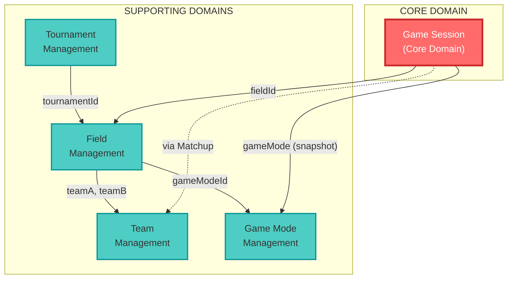
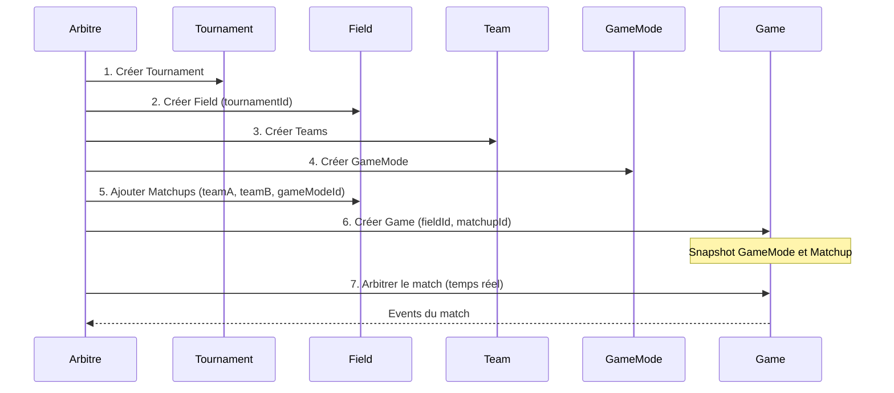

# Context Map - Vue d'ensemble des Bounded Contexts

## Vue d'ensemble

L'application Paintball Result Stats est organisée en **5 Bounded Contexts** suivant les principes du Domain-Driven Design.

## Les 5 Bounded Contexts

### 1. 🎯 Game Session (Core Domain)

**Responsabilité:** Gestion temps réel d'un match de paintball avec arbitrage.

**Aggregate Root:** Game

**Caractéristiques:**
- Moteur de jeu avec 6 états (NOT_STARTED, RUNNING, TIME_STOPPED, BREAK, OVERTIME, FINISHED)
- ArbitratorCommand pattern pour corrections et ajustements
- Event Sourcing complet
- Gestion précise du temps avec endTimestamp
- Système de breaks courts (5s) et longs (configurables)

**Complexité:** ⭐⭐⭐⭐⭐ (Très élevée - logique métier critique)

---

### 2. 🏆 Tournament Management (Supporting Domain)

**Responsabilité:** Organisation de tournois avec dates et localisation.

**Aggregate Root:** Tournament

**Caractéristiques:**
- Gestion des informations de tournoi (nom, lieu, dates)
- Relation 1-N avec Fields
- Validation des dates (startDate < endDate)

**Complexité:** ⭐ (Simple - CRUD basique)

**⚠️ Note:** Events manquants - Event Sourcing non implémenté pour ce contexte.

---

### 3. 🏟️ Field Management (Supporting Domain)

**Responsabilité:** Gestion des terrains et des matchups (duels entre équipes).

**Aggregate Root:** Field

**Entity:** Matchup

**Caractéristiques:**
- Un Field appartient à un Tournament (tournamentId)
- Contient une liste ordonnée de Matchups
- Chaque Matchup référence 2 Teams et 1 GameMode
- Méthodes: addMatchup(), removeMatchup(), updateMatchup()

**Complexité:** ⭐⭐⭐ (Moyenne - gestion de relations)

---

### 4. 👥 Team Management (Supporting Domain)

**Responsabilité:** Gestion des équipes régulières et invitées.

**Aggregate Root:** Team

**Caractéristiques:**
- Distinction Team régulière (isGuest=false) vs GuestTeam (isGuest=true)
- Entité simple avec nom et flag

**Complexité:** ⭐ (Simple - CRUD basique)

---

### 5. 🎮 Game Mode Management (Supporting Domain)

**Responsabilité:** Configuration des règles de jeu (temps, score, breaks).

**Aggregate Root:** GameMode

**Value Objects:** GameDuration, BreakDuration, OvertimeDuration, ScoreLimit

**Caractéristiques:**
- Définit les paramètres d'un match
- Snapshooté dans Game au démarrage (immutabilité)
- Value Objects avec validation

**Complexité:** ⭐⭐ (Faible à moyenne - configuration)

---

## Relations entre Contextes

### Relations Structurelles

| Source | Cible | Type | Description |
|--------|-------|------|-------------|
| Field | Tournament | Reference | Un Field appartient à un Tournament (tournamentId) |
| Matchup | Team | Reference | Un Matchup référence 2 Teams (teamA, teamB) |
| Matchup | GameMode | Reference | Un Matchup référence un GameMode (gameModeId) |
| Game | Field | Reference | Un Game se déroule sur un Field (fieldId) |
| Game | GameMode | Snapshot | Le GameMode est copié dans Game au démarrage |
| Game | Matchup | Snapshot | Le Matchup est copié dans Game (via Field) |

### Patterns de Relation DDD

- **Customer-Supplier:** Game Session (customer) ← Field, Team, GameMode (suppliers)
- **Conformist:** Game Session se conforme aux règles définies par GameMode
- **Shared Kernel:** Aucun - les contextes sont bien séparés
- **Anti-Corruption Layer:** Snapshots dans Game (GameMode, Matchup) pour éviter les modifications externes

---

## Flux de Données Typique

---

## Ubiquitous Language

### Vocabulaire Partagé

| Terme | Définition | Contexte(s) |
|-------|-----------|-------------|
| Tournament | Événement sportif avec dates et lieu | Tournament |
| Field | Terrain de jeu | Field, Game Session |
| Matchup | Duel entre 2 équipes sur un terrain | Field, Game Session |
| Team | Équipe (régulière ou invitée) | Team, Field, Game Session |
| GameMode | Configuration des règles de jeu | GameMode, Field, Game Session |
| Game | Instance d'un match en cours/terminé | Game Session |
| Round / Point | Manche d'un match (synonymes) | Game Session |
| Score | Nombre de rounds gagnés par équipe | Game Session |
| GameTimer | Chronomètre du match | Game Session |
| ArbitratorCommand | Commande de correction de l'arbitre | Game Session |
| RaceTo | Score limite pour gagner | GameMode, Game Session |

---

## Stratégie d'Implémentation

### Event Sourcing

| Contexte | Event Sourcing | Statut |
|----------|----------------|--------|
| Game Session | ✅ Complet | 9 events implémentés |
| Field Management | ✅ Complet | 5 events implémentés |
| Team Management | ✅ Complet | 3 events implémentés |
| GameMode Management | ✅ Complet | 3 events implémentés |
| Tournament Management | ❌ Manquant | 0 events (4 Use Cases sans events) |

### Repositories

Tous les contextes ont un Repository implémentant le pattern Port/Adapter:
- `ITournamentRepository` → `TournamentRepository`
- `IFieldRepository` → `FieldRepository`
- `ITeamRepository` → `TeamRepository`
- `IGameModeRepository` → `GameModeRepository`
- `IGameRepository` → `GameRepository`

### Infrastructure

- **Base de données:** SQLite locale
- **Event Store:** Implémentation custom avec EventStore.ts
- **State Management:** Zustand (5 slices correspondant aux 5 contextes)

---

## Décisions Architecturales

### 1. Pourquoi Tournament est un Bounded Context séparé ?

Bien que simple, Tournament a:
- Son propre cycle de vie (création, modification, suppression)
- Son propre Repository
- Sa propre UI (screens dédiés)
- Relation 1-N avec Field (agrégation)

### 2. Pourquoi GameMode est snapshooté dans Game ?

**Problème:** Si le GameMode est modifié pendant un match, les règles changent.

**Solution:** Au démarrage du match, le GameMode est copié (snapshot) dans Game. Le match devient immutable par rapport aux règles.

### 3. Pourquoi 6 états au lieu de 5 ?

L'état `TIME_STOPPED` a été ajouté pour distinguer:
- `RUNNING`: Timer actif
- `TIME_STOPPED`: Timer en pause (arbitre peut modifier)
- `BREAK`: Pause entre rounds (timer de break actif)

Cela permet un contrôle plus fin de l'arbitrage.

---

## Évolution Future

### Events Manquants à Implémenter

**Priorité Haute:**
- `BreakStarted`, `BreakEnded` (Game Session)
- `TournamentCreated`, `TournamentUpdated`, `TournamentDeleted` (Tournament)

**Bénéfice:** Cohérence Event Sourcing complète, audit trail complet.

### Améliorations Possibles

1. **Timeout Management:** Ajouter TimeoutCount dans GameMode (actuellement absent)
2. **Statistics Context:** Nouveau contexte pour statistiques et historique
3. **Player Management:** Gestion des joueurs individuels (actuellement uniquement Teams)

---

## Références

- Code source: `src/core/domain/`
- Use Cases: `src/core/useCases/`
- Events: `src/core/domain/events/`
- Repositories: `src/infrastructure/database/`
