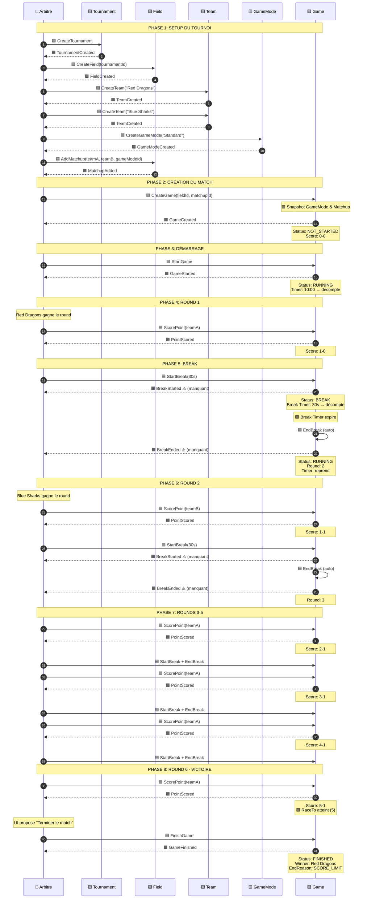
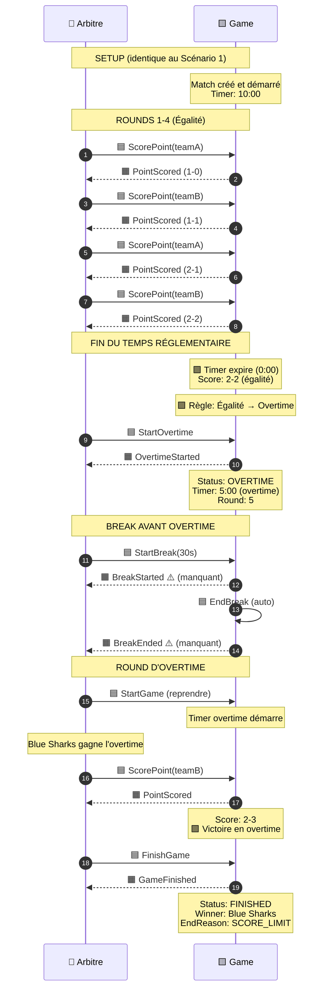
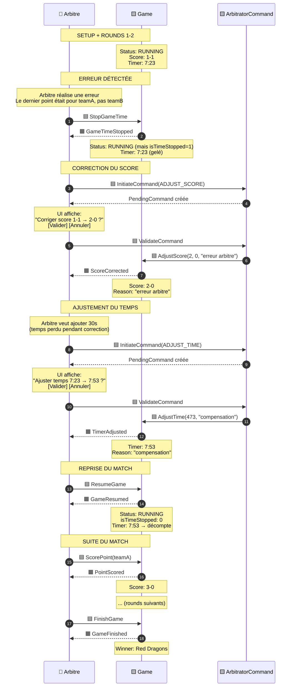

# Event Storming - Timeline d'un Match

## Vue d'ensemble

L'Event Storming est une technique de modélisation collaborative qui visualise le flux complet d'événements métier dans le temps. Ce document présente la timeline complète d'un match de paintball, du setup à la fin.

**Légende:**
- 🟦 **Commande** (Use Case déclenché par l'arbitre)
- 🟧 **Événement** (Domain Event émis)
- 🟪 **Politique/Règle** (Business Rule automatique)
- 🟨 **Aggregate** (Entité du domaine)
- 👤 **Acteur** (Arbitre)

---

## Scénario 1: Match Normal (Victoire par Score)

### Timeline Complète



---

## Scénario 2: Match avec Overtime

### Timeline Complète



---

## Scénario 3: Match avec Corrections Arbitre

### Timeline Complète



---

## Patterns et Règles Métier

### Pattern 1: Break Automatique

```
🟦 StartBreak(duration)
  ↓
🟧 BreakStarted ⚠️ (manquant)
  ↓
🟪 Break Timer décompte
  ↓
🟪 Timer expire → Trigger EndBreak
  ↓
🟦 EndBreak (automatique)
  ↓
🟧 BreakEnded ⚠️ (manquant)
  ↓
Status: RUNNING, Round: +1
```

**Règle:** Le break peut être arrêté manuellement ou automatiquement (timer expire).

---

### Pattern 2: Victoire par Score

```
🟦 ScorePoint(teamId)
  ↓
🟧 PointScored
  ↓
🟪 Vérifier: score >= raceTo ?
  ↓
  ├─ OUI → UI propose "Terminer le match"
  │         ↓
  │       🟦 FinishGame
  │         ↓
  │       🟧 GameFinished (endReason: SCORE_LIMIT)
  │
  └─ NON → Continuer le match
```

**Règle:** La victoire n'est pas automatique, l'arbitre doit valider.

---

### Pattern 3: Victoire par Temps

```
🟪 Timer expire (0:00)
  ↓
🟪 Vérifier: score égal ?
  ↓
  ├─ OUI → 🟦 StartOvertime
  │         ↓
  │       🟧 OvertimeStarted
  │         ↓
  │       (Round d'overtime)
  │
  └─ NON → UI propose "Terminer le match"
            ↓
          🟦 FinishGame
            ↓
          🟧 GameFinished (endReason: TIME_EXPIRED)
```

**Règle:** Égalité → Overtime obligatoire. Sinon, victoire de l'équipe avec le plus de points.

---

### Pattern 4: ArbitratorCommand (Validation Explicite)

```
🟦 InitiateCommand(type, data)
  ↓
PendingCommand créée
  ↓
UI affiche [Valider] [Annuler]
  ↓
  ├─ Valider → 🟦 ExecuteUseCase
  │             ↓
  │           🟧 Event émis
  │
  └─ Annuler → PendingCommand supprimée
```

**Règle:** Toute modification sensible (score, temps) nécessite validation explicite.

---

## Invariants Métier Visualisés

### Invariant 1: Score = Rounds Gagnés

```
Round 1: teamA gagne → 🟧 PointScored → Score: 1-0
Round 2: teamB gagne → 🟧 PointScored → Score: 1-1
Round 3: teamA gagne → 🟧 PointScored → Score: 2-1
```

**Règle:** Chaque `PointScored` incrémente le score de +1 exactement.

---

### Invariant 2: Modifications Interdites si Timer Actif

```
Status: RUNNING, isTimeStopped: 0
  ↓
🟦 AdjustScore → ❌ ERROR
🟦 AdjustTime → ❌ ERROR
  ↓
🟦 StopGameTime → isTimeStopped: 1
  ↓
🟦 AdjustScore → ✅ OK
🟦 AdjustTime → ✅ OK
```

**Règle:** Timer doit être arrêté pour toute modification sensible.

---

### Invariant 3: Snapshot GameMode

```
🟦 CreateGame(fieldId, matchupId)
  ↓
Récupérer GameMode via matchup.gameModeId
  ↓
🟪 COPIER GameMode dans Game (snapshot)
  ↓
🟧 GameCreated
  ↓
[Match en cours]
  ↓
🟦 UpdateGameMode (sur le GameMode original)
  ↓
🟧 GameModeUpdated
  ↓
Game NON AFFECTÉ (snapshot immuable)
```

**Règle:** Le GameMode est figé au démarrage du match.

---

## Événements Manquants Identifiés

### 1. BreakStarted

**Contexte:** Démarrage d'un break entre rounds

**Payload suggéré:**
```typescript
{
  type: 'BreakStarted',
  aggregateId: gameId,
  timestamp: Date.now(),
  payload: {
    breakDuration: 30, // secondes
    breakType: 'LONG', // ou 'SHORT' (5s)
    currentRound: 2
  }
}
```

**Utilité:**
- Tracer l'historique des breaks
- Calculer la durée moyenne des breaks
- Analyser les patterns de jeu

---

### 2. BreakEnded

**Contexte:** Fin d'un break (auto ou manuel)

**Payload suggéré:**
```typescript
{
  type: 'BreakEnded',
  aggregateId: gameId,
  timestamp: Date.now(),
  payload: {
    nextRound: 3,
    actualDuration: 28, // Durée réelle (peut différer si arrêt manuel)
    endReason: 'TIMER_EXPIRED' // ou 'MANUAL_STOP'
  }
}
```

**Utilité:**
- Vérifier si les breaks sont respectés
- Détecter les breaks anormalement courts/longs
- Audit trail complet

---

## Statistiques Dérivables

### Avec Events Actuels (9 events)

✅ **Possible:**
- Nombre de points par équipe
- Durée totale du match
- Nombre de corrections arbitre
- Victoires par score vs temps
- Fréquence des overtimes

❌ **Impossible:**
- Durée moyenne des breaks
- Nombre de breaks par match
- Durée réelle des rounds (sans breaks)

---

### Avec Events Complets (11 events)

✅ **Tout est possible:**
- Durée moyenne des breaks
- Nombre de breaks courts vs longs
- Durée réelle des rounds
- Temps de jeu effectif (sans breaks)
- Analyse fine du rythme de jeu

---

## Timeline Condensée (Vue d'Ensemble)

```
SETUP
  └─ CreateTournament → TournamentCreated
  └─ CreateField → FieldCreated
  └─ CreateTeam (x2) → TeamCreated (x2)
  └─ CreateGameMode → GameModeCreated
  └─ AddMatchup → MatchupAdded

MATCH
  └─ CreateGame → GameCreated
  └─ StartGame → GameStarted
  └─ LOOP:
      ├─ ScorePoint → PointScored
      ├─ StartBreak → BreakStarted ⚠️
      ├─ EndBreak → BreakEnded ⚠️
      └─ (Corrections optionnelles)
          ├─ StopGameTime → GameTimeStopped
          ├─ AdjustScore → ScoreCorrected
          ├─ AdjustTime → TimerAdjusted
          └─ ResumeGame → GameResumed
  └─ (Si égalité)
      └─ StartOvertime → OvertimeStarted
  └─ FinishGame → GameFinished
```

---

## Acteurs et Responsabilités

### 👤 Arbitre

**Responsabilités:**
- Démarrer/arrêter le match
- Marquer les points
- Gérer les breaks
- Corriger les erreurs
- Valider la fin du match

**Autorité:** Absolue - Peut tout corriger via ArbitratorCommand

---

### 🟪 Système (Règles Automatiques)

**Responsabilités:**
- Décompter les timers
- Détecter les conditions de victoire
- Proposer les actions appropriées
- Valider les invariants

**Autorité:** Suggère, mais l'arbitre décide

---

## Cas Limites et Edge Cases

### Cas 1: Break Interrompu Manuellement

```
StartBreak(30s) → Timer: 30s
  ↓ (après 10s)
Arbitre clique "Stop Break"
  ↓
EndBreak → actualDuration: 10s (au lieu de 30s)
```

**Gestion:** `BreakEnded` doit inclure `actualDuration` et `endReason`.

---

### Cas 2: Multiple Corrections

```
Score: 2-1
  ↓
AdjustScore(3, 1) → ScoreCorrected
  ↓
AdjustScore(2, 2) → ScoreCorrected (re-correction)
  ↓
AdjustScore(3, 1) → ScoreCorrected (re-re-correction)
```

**Gestion:** Chaque correction émet un event avec `previousScore` et `newScore`.

---

### Cas 3: Overtime Multiple (Théorique)

```
Temps réglementaire: 2-2
  ↓
Overtime 1: 3-3 (égalité)
  ↓
Overtime 2: 4-3 (victoire)
```

**Gestion actuelle:** Overtime est un round unique (sudden death).

**Alternative possible:** Overtime avec timer, peut se terminer en égalité → Overtime 2.

---

## Conclusion

### Points Clés

1. **Event Sourcing quasi-complet** - 9/11 events implémentés (82%)
2. **ArbitratorCommand** - Pattern robuste pour corrections
3. **Validation manuelle** - Évite fins accidentelles
4. **Snapshot GameMode** - Immutabilité des règles

### Gaps Identifiés

1. ⚠️ **BreakStarted** - Manquant (priorité haute)
2. ⚠️ **BreakEnded** - Manquant (priorité haute)
3. ⚠️ **Tournament Events** - Tous manquants (3 events)

### Bénéfices de l'Event Storming

- ✅ Visualisation claire du flux métier
- ✅ Identification des gaps d'events
- ✅ Validation des règles métier
- ✅ Communication facilitée (équipe + stakeholders)

---

## Références

- **Domain Events:** `src/core/domain/events/GameEvents.ts`
- **Use Cases:** `src/core/useCases/*.ts`
- **Aggregate:** `src/core/domain/Game.ts`
- **ArbitratorCommand:** `src/core/domain/ArbitratorCommand.ts`
- **Event Analysis:** `docs/architecture/ddd/event-analysis.md`
