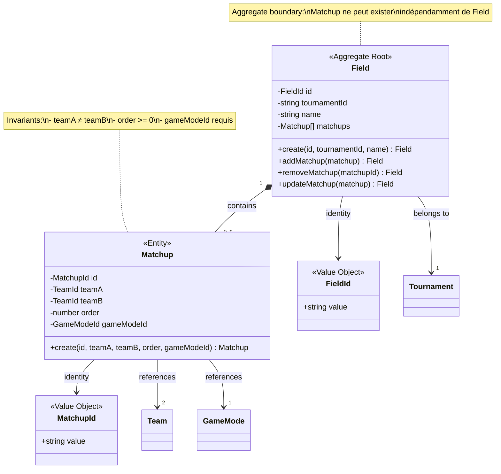
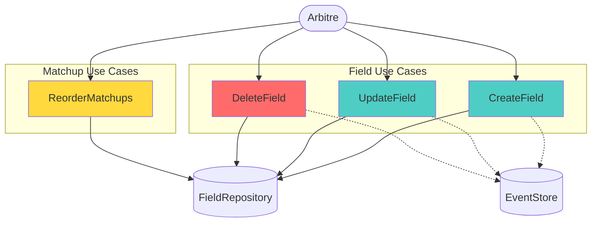
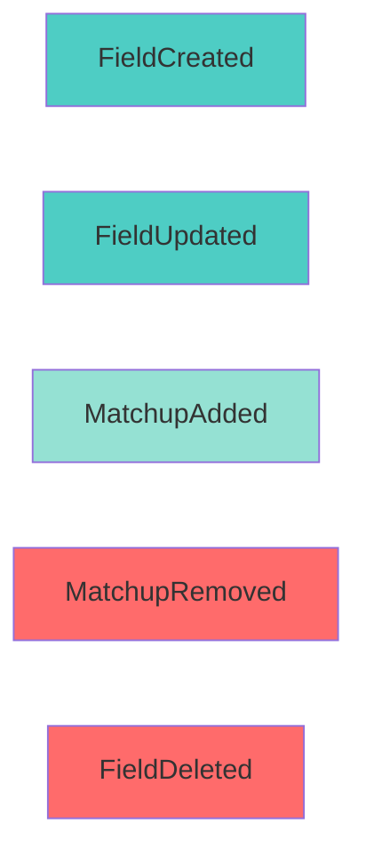
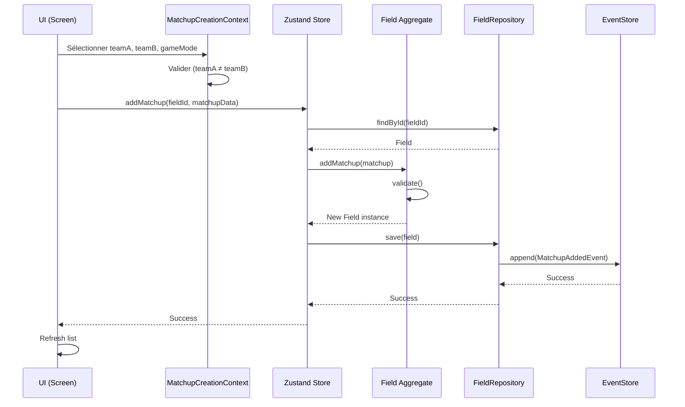

# Field Management Context

## Vue d'ensemble

Le contexte **Field Management** gère les terrains de jeu et les matchups (duels entre équipes). C'est le contexte qui organise la structure des matchs à jouer.

**Type:** Supporting Domain  
**Complexité:** ⭐⭐⭐ Moyenne (gestion de relations et ordre)  
**Event Sourcing:** ✅ Implémenté (5 events)

---

## Modèle de Domaine



### Aggregate Root: Field

**Fichier:** `src/core/domain/Field.ts`

**Properties:**
- `id: FieldId` - Identifiant unique du terrain
- `tournamentId: string` - Référence au Tournament parent
- `name: string` - Nom du terrain (ex: "Terrain A", "Field 1")
- `matchups: Matchup[]` - Liste ordonnée des matchups

**Méthodes:**
- `static create(id, tournamentId, name, matchups?)` - Factory method
- `addMatchup(matchup: Matchup): Field` - Ajoute un matchup (immuable)
- `removeMatchup(matchupId: MatchupId): Field` - Retire un matchup (immuable)
- `updateMatchup(matchup: Matchup): Field` - Met à jour un matchup (immuable)

**Invariants:**
1. L'ID ne peut pas être vide
2. Le tournamentId ne peut pas être vide
3. Le nom ne peut pas être vide
4. Les matchups sont immuables (nouvelles instances à chaque modification)

---

### Entity: Matchup

**Fichier:** `src/core/domain/Field.ts`

**Properties:**
- `id: MatchupId` - Identifiant unique
- `teamA: TeamId` - Première équipe
- `teamB: TeamId` - Deuxième équipe
- `order: number` - Ordre d'exécution (0, 1, 2, ...)
- `gameModeId: GameModeId` - Mode de jeu à utiliser

**Méthodes:**
- `static create(id, teamA, teamB, order, gameModeId)` - Factory method avec validation

**Invariants:**
1. teamA ≠ teamB (une équipe ne peut pas jouer contre elle-même)
2. order >= 0
3. Tous les IDs doivent être non vides

**Note:** Matchup est une Entity (pas un Aggregate Root) car elle n'existe que dans le contexte d'un Field.

---

## Use Cases



### 1. CreateField

**Fichier:** `src/core/useCases/CreateField.ts`

**Input:**
```typescript
{
  id: string,
  tournamentId: string,
  name: string
}
```

**Processus:**
1. Valider les données
2. Créer l'aggregate Field (sans matchups initialement)
3. Persister via IFieldRepository
4. Émettre `FieldCreated` event

**Event émis:** `FieldCreatedEvent`

---

### 2. UpdateField

**Fichier:** `src/core/useCases/UpdateField.ts`

**Input:**
```typescript
{
  id: string,
  name: string
}
```

**Processus:**
1. Récupérer le Field existant
2. Créer nouveau Field avec nouveau nom (immuabilité)
3. Persister via IFieldRepository
4. Émettre `FieldUpdated` event

**Event émis:** `FieldUpdatedEvent`

**Note:** Ne modifie que le nom, pas les matchups ni le tournamentId

---

### 3. DeleteField

**Fichier:** `src/core/useCases/DeleteField.ts`

**Input:**
```typescript
{
  id: string
}
```

**Processus:**
1. Vérifier l'existence du Field
2. Supprimer via IFieldRepository
3. Émettre `FieldDeleted` event

**Event émis:** `FieldDeletedEvent`

**⚠️ Attention:** Supprime aussi tous les Matchups associés (cascade)

---

### 4. ReorderMatchups

**Fichier:** `src/core/useCases/ReorderMatchupsUseCase.ts`

**Input:**
```typescript
{
  fieldId: string,
  matchupIds: string[] // Nouvel ordre
}
```

**Processus:**
1. Récupérer le Field
2. Réorganiser les matchups selon le nouvel ordre
3. Mettre à jour les propriétés `order` de chaque Matchup
4. Persister le Field modifié
5. ⚠️ **Event manquant:** Devrait émettre `MatchupsReordered`

**Note:** Use Case spécifique pour la réorganisation drag-and-drop dans l'UI

---

## Domain Events

**Fichier:** `src/core/domain/events/FieldEvents.ts`

### Events Implémentés



### 1. FieldCreatedEvent

```typescript
interface FieldCreatedEvent {
  type: 'FieldCreated';
  aggregateId: FieldId;
  timestamp: number;
  payload: {
    name: string;
  };
}
```

**Émis par:** CreateField Use Case

---

### 2. FieldUpdatedEvent

```typescript
interface FieldUpdatedEvent {
  type: 'FieldUpdated';
  aggregateId: FieldId;
  timestamp: number;
  payload: {
    name: string;
  };
}
```

**Émis par:** UpdateField Use Case

---

### 3. MatchupAddedEvent

```typescript
interface MatchupAddedEvent {
  type: 'MatchupAdded';
  aggregateId: FieldId;
  timestamp: number;
  payload: {
    matchupId: string;
    teamA: string;
    teamB: string;
    order: number;
  };
}
```

**Émis par:** Ajout de matchup (via UI ou import)

**Note:** Pas de gameModeId dans le payload (gap identifié)

---

### 4. MatchupRemovedEvent

```typescript
interface MatchupRemovedEvent {
  type: 'MatchupRemoved';
  aggregateId: FieldId;
  timestamp: number;
  payload: {
    matchupId: string;
  };
}
```

**Émis par:** Suppression de matchup

---

### 5. FieldDeletedEvent

```typescript
interface FieldDeletedEvent {
  type: 'FieldDeleted';
  aggregateId: FieldId;
  timestamp: number;
  payload: Record<string, never>;
}
```

**Émis par:** DeleteField Use Case

---

### ⚠️ Events Manquants

**Events à implémenter:**

1. **MatchupsReordered**
```typescript
interface MatchupsReorderedEvent {
  type: 'MatchupsReordered';
  aggregateId: FieldId;
  timestamp: number;
  payload: {
    newOrder: { matchupId: string; order: number }[];
  };
}
```

2. **MatchupUpdated**
```typescript
interface MatchupUpdatedEvent {
  type: 'MatchupUpdated';
  aggregateId: FieldId;
  timestamp: number;
  payload: {
    matchupId: string;
    teamA: string;
    teamB: string;
    gameModeId: string;
  };
}
```

---

## Repository (Port)

### Interface: IFieldRepository

**Fichier:** `src/core/ports/IFieldRepository.ts`

```typescript
interface IFieldRepository {
  save(field: Field): Promise<void>;
  findById(id: FieldId): Promise<Field | null>;
  findAll(): Promise<Field[]>;
  delete(id: FieldId): Promise<void>;
}
```

**Implémentation:** `src/infrastructure/database/FieldRepository.ts`

**Méthodes additionnelles (implémentation):**
- `findByTournamentId(tournamentId: string): Promise<Field[]>`

**Technologie:** SQLite avec tables:
- `fields` (id, tournamentId, name)
- `matchups` (id, fieldId, teamA, teamB, order, gameModeId)

---

## Relations avec Autres Contextes

```mermaid
graph TB
    Tournament[Tournament]
    Field[Field]
    Matchup[Matchup]
    Team[Team]
    GameMode[GameMode]
    Game[Game]
    
    Tournament -->|"1-N"| Field
    Field *-->|"1-N"| Matchup
    Matchup -->|"references"| Team
    Matchup -->|"references"| GameMode
    Game -->|"references"| Field
    Game -.->|"snapshot"| Matchup
    
    style Field fill:#4ecdc4,stroke:#0a9396,stroke-width:3px
    style Matchup fill:#95e1d3
```

### Relations Détaillées

| Relation | Type | Cardinalité | Description |
|----------|------|-------------|-------------|
| Field → Tournament | Reference | N-1 | Un Field appartient à un Tournament |
| Field → Matchup | Composition | 1-N | Un Field contient plusieurs Matchups |
| Matchup → Team | Reference | N-2 | Un Matchup référence 2 Teams |
| Matchup → GameMode | Reference | N-1 | Un Matchup utilise un GameMode |
| Game → Field | Reference | N-1 | Un Game se joue sur un Field |
| Game → Matchup | Snapshot | N-1 | Game copie le Matchup au démarrage |

---

## Présentation Layer

### Screens

**Dossier:** `app/field/`

1. **List Fields** - Liste des terrains (par tournament)
2. **create-field.tsx** - Création d'un terrain
3. **edit-field.tsx** - Modification d'un terrain
4. **[id].tsx** - Détails d'un terrain avec liste des matchups
5. **matchup/** - Gestion des matchups (création, modification)

### Context React

**Fichier:** `contexts/MatchupCreationContext.tsx`

Gère l'état de création/modification de matchups avec:
- Sélection des équipes (teamA, teamB)
- Sélection du GameMode
- Validation (teamA ≠ teamB)

### State Management

**Slice Zustand:** `src/presentation/state/slices/createFieldSlice.ts`

**State:**
```typescript
{
  fields: Field[];
  selectedField: Field | null;
  isLoading: boolean;
  error: string | null;
}
```

**Actions:**
- `loadFields()`
- `loadFieldsByTournament(tournamentId)`
- `createField(data)`
- `updateField(id, data)`
- `deleteField(id)`
- `addMatchup(fieldId, matchup)`
- `removeMatchup(fieldId, matchupId)`
- `reorderMatchups(fieldId, matchupIds)`

---

## Règles Métier

### 1. Validation Matchup

```typescript
// Règle: teamA ≠ teamB
if (teamA === teamB) {
  throw new Error("Team A and Team B must be different");
}
```

### 2. Ordre des Matchups

```typescript
// Règle: order >= 0
if (order < 0) {
  throw new Error("Order cannot be negative");
}
```

**Note:** L'ordre détermine la séquence d'exécution des matchups sur le terrain.

### 3. Immutabilité

Toutes les modifications créent de nouvelles instances:

```typescript
// ❌ Mauvais
field.matchups.push(newMatchup);

// ✅ Bon
return new Field(this.id, this.tournamentId, this.name, [...this.matchups, matchup]);
```

---

## Diagramme de Séquence - Ajout de Matchup



---

## Patterns Appliqués

### 1. Aggregate Pattern

**Field** est l'Aggregate Root qui contrôle l'accès à **Matchup**.

**Bénéfice:** Cohérence transactionnelle - impossible de modifier un Matchup sans passer par Field.

### 2. Immutability

Toutes les méthodes retournent de nouvelles instances.

**Bénéfice:** Thread-safety, historique via Event Sourcing, debugging facilité.

### 3. Factory Method

`Field.create()` et `Matchup.create()` encapsulent la logique de création et validation.

**Bénéfice:** Garantie que les invariants sont respectés dès la création.

---

## Améliorations Recommandées

### 1. Ajouter gameModeId dans MatchupAddedEvent

**Priorité:** Moyenne

**Problème:** Le payload de `MatchupAddedEvent` ne contient pas le gameModeId.

**Solution:**
```typescript
payload: {
  matchupId: string;
  teamA: string;
  teamB: string;
  order: number;
  gameModeId: string; // ← Ajouter
}
```

---

### 2. Implémenter MatchupsReordered Event

**Priorité:** Haute

**Problème:** ReorderMatchups Use Case n'émet pas d'event.

**Solution:** Créer et émettre `MatchupsReorderedEvent` dans le Use Case.

---

### 3. Ajouter Validation de Dépendances

**Priorité:** Haute

**Problème:** DeleteField ne vérifie pas si des Games existent pour ce Field.

**Solution:**
```typescript
const games = await gameRepository.findByFieldId(fieldId);
if (games.length > 0) {
  throw new Error("Cannot delete field with existing games");
}
```

---

### 4. Optimiser Réorganisation

**Priorité:** Basse

**Problème:** Réorganiser tous les matchups peut être coûteux.

**Solution:** Implémenter un système de swap pour échanger seulement 2 matchups.

---

## Résumé

### Points Forts
- ✅ Event Sourcing complet (5 events)
- ✅ Aggregate pattern bien appliqué
- ✅ Immutabilité respectée
- ✅ Validation robuste des invariants
- ✅ UI riche avec drag-and-drop

### Points Faibles
- ⚠️ ReorderMatchups sans event
- ⚠️ gameModeId manquant dans MatchupAddedEvent
- ⚠️ Pas de validation de dépendances (cascade delete)

### Complexité
**Moyenne** - Gestion de relations entre plusieurs entités, ordre à maintenir, composition Aggregate.

---

## Références Code

- **Domain:** `src/core/domain/Field.ts`
- **Events:** `src/core/domain/events/FieldEvents.ts`
- **Use Cases:** `src/core/useCases/CreateField.ts`, `UpdateField.ts`, `DeleteField.ts`, `ReorderMatchupsUseCase.ts`
- **Port:** `src/core/ports/IFieldRepository.ts`
- **Repository:** `src/infrastructure/database/FieldRepository.ts`
- **State:** `src/presentation/state/slices/createFieldSlice.ts`
- **Context:** `contexts/MatchupCreationContext.tsx`
- **Screens:** `app/field/*.tsx`
