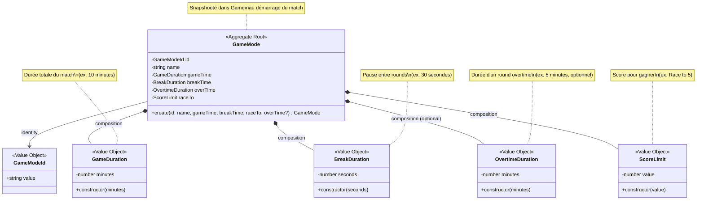
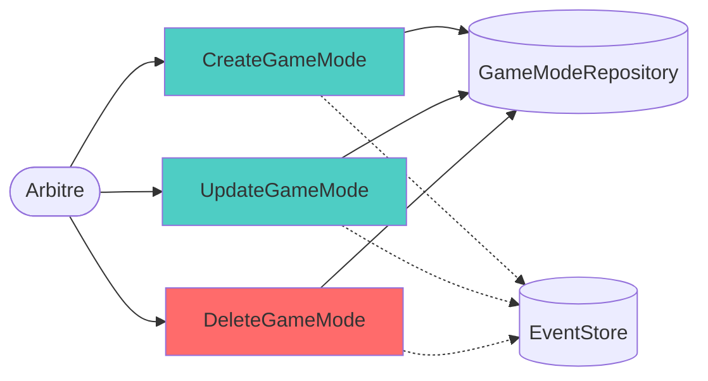
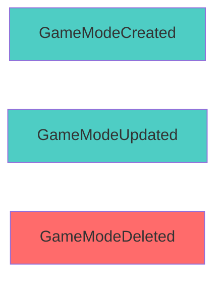
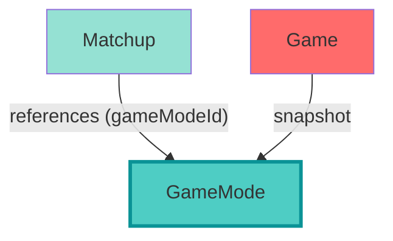
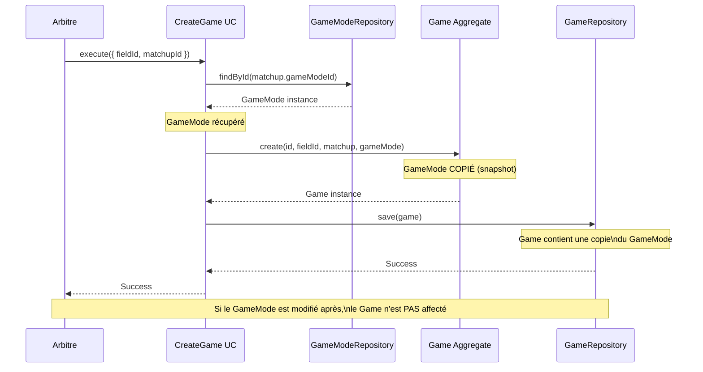

# Game Mode Management Context

## Vue d'ensemble

Le contexte **Game Mode Management** gère la configuration des règles de jeu (durées, score limite, overtime). Un GameMode définit "comment" un match doit se dérouler.

**Type:** Supporting Domain  
**Complexité:** ⭐⭐ Faible à Moyenne (configuration avec Value Objects)  
**Event Sourcing:** ✅ Implémenté (3 events)

---

## Modèle de Domaine



### Aggregate Root: GameMode

**Fichier:** `src/core/domain/GameMode.ts`

**Properties:**
- `id: GameModeId` - Identifiant unique
- `name: string` - Nom du mode (ex: "Standard", "Blitz", "Marathon")
- `gameTime: GameDuration` - Durée totale du match
- `breakTime: BreakDuration` - Durée de pause entre rounds
- `overTime: OvertimeDuration | undefined` - Durée d'overtime (optionnel)
- `raceTo: ScoreLimit` - Score limite pour gagner

**Méthodes:**
- `static create(id, name, gameTime, breakTime, raceTo, overTime?)` - Factory method

**Invariants:**
1. L'ID ne peut pas être vide
2. Le nom ne peut pas être vide
3. Tous les Value Objects doivent être valides (>= 0)

---

## Value Objects

### 1. GameDuration

**Fichier:** `src/core/domain/GameMode.ts`

```typescript
class GameDuration {
  constructor(public readonly minutes: number) {
    if (minutes < 0) throw new Error("Game duration cannot be negative");
  }
}
```

**Représente:** La durée totale du match en minutes.

**Exemples:**
- `new GameDuration(10)` → Match de 10 minutes
- `new GameDuration(15)` → Match de 15 minutes

**Validation:** minutes >= 0

---

### 2. BreakDuration

**Fichier:** `src/core/domain/GameMode.ts`

```typescript
class BreakDuration {
  constructor(public readonly seconds: number) {
    if (seconds < 0) throw new Error("Break duration cannot be negative");
  }
}
```

**Représente:** La durée de pause entre chaque round en secondes.

**Exemples:**
- `new BreakDuration(30)` → Pause de 30 secondes
- `new BreakDuration(60)` → Pause de 1 minute
- `new BreakDuration(5)` → Pause courte de 5 secondes

**Validation:** seconds >= 0

**Note:** L'UI propose des breaks courts (5s) et longs (valeur configurée).

---

### 3. OvertimeDuration

**Fichier:** `src/core/domain/GameMode.ts`

```typescript
class OvertimeDuration {
  constructor(public readonly minutes: number) {
    if (minutes < 0) throw new Error("Overtime duration cannot be negative");
  }
}
```

**Représente:** La durée d'un round d'overtime en minutes.

**Exemples:**
- `new OvertimeDuration(5)` → Overtime de 5 minutes
- `new OvertimeDuration(3)` → Overtime de 3 minutes

**Validation:** minutes >= 0

**Optionnel:** Si non défini, l'overtime utilise une valeur par défaut (5 minutes).

---

### 4. ScoreLimit

**Fichier:** `src/core/domain/GameMode.ts`

```typescript
class ScoreLimit {
  constructor(public readonly value: number) {
    if (value < 0) throw new Error("Score limit must be zero or positive");
  }
}
```

**Représente:** Le score à atteindre pour gagner le match ("Race to X").

**Exemples:**
- `new ScoreLimit(5)` → Race to 5 (premier à 5 rounds gagne)
- `new ScoreLimit(7)` → Race to 7
- `new ScoreLimit(0)` → Pas de limite de score (victoire par temps uniquement)

**Validation:** value >= 0

---

### ⚠️ Value Object Manquant: TimeoutCount

**Note:** Les specs initiales mentionnaient `TimeoutCount` (nombre de timeouts par équipe), mais ce Value Object n'existe pas dans le code actuel.

**Si implémenté:**
```typescript
class TimeoutCount {
  constructor(public readonly quantity: number) {
    if (quantity < 0) throw new Error("Timeout count cannot be negative");
  }
}
```

---

## Use Cases



### 1. CreateGameMode

**Fichier:** `src/core/useCases/CreateGameMode.ts`

**Input:**
```typescript
{
  id: string,
  name: string,
  gameTimeMinutes: number,
  breakTimeSeconds: number,
  raceTo: number,
  overtimeMinutes?: number
}
```

**Processus:**
1. Créer les Value Objects (GameDuration, BreakDuration, etc.)
2. Créer l'aggregate GameMode via factory
3. Persister via IGameModeRepository
4. Émettre `GameModeCreated` event

**Event émis:** `GameModeCreatedEvent`

**Output:** `void`

---

### 2. UpdateGameMode

**Fichier:** `src/core/useCases/UpdateGameMode.ts`

**Input:**
```typescript
{
  id: string,
  name: string,
  gameTimeMinutes: number,
  breakTimeSeconds: number,
  raceTo: number,
  overtimeMinutes?: number
}
```

**Processus:**
1. Récupérer le GameMode existant
2. Créer nouveaux Value Objects
3. Créer nouveau GameMode (immuabilité)
4. Persister via IGameModeRepository
5. Émettre `GameModeUpdated` event

**Event émis:** `GameModeUpdatedEvent`

**Output:** `void`

**⚠️ Attention:** Modifier un GameMode n'affecte PAS les matchs en cours (snapshot).

---

### 3. DeleteGameMode

**Fichier:** `src/core/useCases/DeleteGameMode.ts`

**Input:**
```typescript
{
  id: string
}
```

**Processus:**
1. Vérifier l'existence du GameMode
2. Supprimer via IGameModeRepository
3. Émettre `GameModeDeleted` event

**Event émis:** `GameModeDeletedEvent`

**Output:** `void`

**⚠️ Attention:** Pas de vérification si le GameMode est utilisé dans des Matchups.

---

## Domain Events

**Fichier:** `src/core/domain/events/GameModeEvents.ts`

### Events Implémentés



### 1. GameModeCreatedEvent

```typescript
interface GameModeCreatedEvent {
  type: 'GameModeCreated';
  aggregateId: GameModeId;
  timestamp: number;
  payload: {
    name: string;
    gameTimeMinutes: number;
    breakTimeSeconds: number;
    overtimeMinutes?: number;
    raceTo: number;
  };
}
```

**Émis par:** CreateGameMode Use Case

---

### 2. GameModeUpdatedEvent

```typescript
interface GameModeUpdatedEvent {
  type: 'GameModeUpdated';
  aggregateId: GameModeId;
  timestamp: number;
  payload: {
    name: string;
    gameTimeMinutes: number;
    breakTimeSeconds: number;
    overtimeMinutes?: number;
    raceTo: number;
  };
}
```

**Émis par:** UpdateGameMode Use Case

---

### 3. GameModeDeletedEvent

```typescript
interface GameModeDeletedEvent {
  type: 'GameModeDeleted';
  aggregateId: GameModeId;
  timestamp: number;
  payload: Record<string, never>;
}
```

**Émis par:** DeleteGameMode Use Case

---

## Repository (Port)

### Interface: IGameModeRepository

**Fichier:** `src/core/ports/IGameModeRepository.ts`

```typescript
interface IGameModeRepository {
  save(gameMode: GameMode): Promise<void>;
  findById(id: GameModeId): Promise<GameMode | null>;
  findAll(): Promise<GameMode[]>;
  delete(id: GameModeId): Promise<void>;
}
```

**Implémentation:** `src/infrastructure/database/GameModeRepository.ts`

**Technologie:** SQLite

**Table:** `game_modes` (id, name, gameTimeMinutes, breakTimeSeconds, overtimeMinutes, raceTo)

---

## Relations avec Autres Contextes



### Relations Détaillées

| Relation | Type | Cardinalité | Description |
|----------|------|-------------|-------------|
| Matchup → GameMode | Reference | N-1 | Un Matchup utilise un GameMode |
| Game → GameMode | Snapshot | N-1 | Game copie le GameMode au démarrage |

### Pattern Snapshot

**Problème:** Si le GameMode est modifié pendant un match, les règles changent.

**Solution:** Au démarrage du match (`CreateGame`), le GameMode est **copié** dans l'aggregate Game.

```typescript
// Dans CreateGame Use Case
const gameMode = await gameModeRepository.findById(matchup.gameModeId);
const game = Game.create(id, fieldId, matchup, gameMode); // ← Snapshot
```

**Bénéfice:** Le match est **immutable** par rapport aux règles. Modifier le GameMode n'affecte pas les matchs en cours.

---

## Présentation Layer

### Screens

**Dossier:** `app/gamemode/`

1. **game-modes-list.tsx** - Liste des modes de jeu
2. **create-game-mode.tsx** - Création d'un mode
3. **edit-game-mode.tsx** - Modification d'un mode
4. **select-game-mode.tsx** - Sélection d'un mode (pour Matchup)

### State Management

**Slice Zustand:** `src/presentation/state/slices/createGameModeSlice.ts`

**State:**
```typescript
{
  gameModes: GameMode[];
  selectedGameMode: GameMode | null;
  isLoading: boolean;
  error: string | null;
}
```

**Actions:**
- `loadGameModes()`
- `createGameMode(data)`
- `updateGameMode(id, data)`
- `deleteGameMode(id)`
- `selectGameMode(id)`

---

## Règles Métier

### 1. Validation des Durées

```typescript
// Règle: Toutes les durées >= 0
if (minutes < 0) throw new Error("Game duration cannot be negative");
if (seconds < 0) throw new Error("Break duration cannot be negative");
```

### 2. Overtime Optionnel

```typescript
// Règle: overTime peut être undefined
const gameMode = GameMode.create(
  id, name, gameTime, breakTime, raceTo,
  overTime // ← Optionnel
);
```

**Si undefined:** L'overtime utilisera une valeur par défaut (5 minutes) dans le Game.

### 3. Race to 0

```typescript
// Règle: raceTo peut être 0 (pas de limite de score)
if (value < 0) throw new Error("Score limit must be zero or positive");
```

**Si raceTo = 0:** Le match se termine uniquement par temps écoulé.

---

## Diagramme de Séquence - Snapshot dans Game



---

## Patterns Appliqués

### 1. Value Object Pattern

Tous les paramètres sont des Value Objects avec validation.

**Bénéfices:**
- Type-safety accrue
- Validation encapsulée
- Immuabilité garantie
- Sémantique claire (GameDuration vs number)

---

### 2. Snapshot Pattern

Le GameMode est copié dans Game au démarrage.

**Bénéfices:**
- Immutabilité des règles pendant un match
- Pas de side-effects
- Audit trail précis (on sait exactement quelles règles étaient appliquées)

---

### 3. Factory Method

`GameMode.create()` encapsule la création des Value Objects.

**Bénéfice:** Garantie de cohérence et validation.

---

## Améliorations Recommandées

### 1. Ajouter Validation de Dépendances

**Priorité:** Haute

**Problème:** DeleteGameMode ne vérifie pas si le mode est utilisé.

**Solution:**
```typescript
const matchups = await matchupRepository.findByGameModeId(gameModeId);
if (matchups.length > 0) {
  throw new Error("Cannot delete game mode used in matchups");
}
```

---

### 2. Implémenter TimeoutCount

**Priorité:** Moyenne

**Fonctionnalité:** Ajouter la gestion des timeouts par équipe.

**Changements:**
```typescript
class TimeoutCount {
  constructor(public readonly quantity: number) {
    if (quantity < 0) throw new Error("Timeout count cannot be negative");
  }
}

class GameMode {
  // ...
  public readonly timeoutsPerTeam: TimeoutCount;
}
```

---

### 3. Ajouter Presets

**Priorité:** Basse

**Fonctionnalité:** GameModes prédéfinis (Standard, Blitz, Marathon).

**Implémentation:**
```typescript
class GameMode {
  static createStandard(): GameMode {
    return GameMode.create(
      generateId(),
      "Standard",
      new GameDuration(10),
      new BreakDuration(30),
      new ScoreLimit(5),
      new OvertimeDuration(5)
    );
  }
  
  static createBlitz(): GameMode {
    return GameMode.create(
      generateId(),
      "Blitz",
      new GameDuration(5),
      new BreakDuration(15),
      new ScoreLimit(3)
    );
  }
}
```

---

### 4. Ajouter Validation Métier

**Priorité:** Basse

**Exemples de règles:**
- `breakTime < gameTime` (la pause ne peut pas être plus longue que le match)
- `raceTo > 0 || gameTime > 0` (au moins un critère de victoire)
- `overtimeMinutes < gameTimeMinutes` (overtime plus court que match normal)

---

## Exemples de GameModes

### Mode Standard
```typescript
{
  name: "Standard",
  gameTime: 10 minutes,
  breakTime: 30 seconds,
  overTime: 5 minutes,
  raceTo: 5
}
```

**Victoire:** Premier à 5 rounds OU plus de rounds à la fin des 10 minutes.

---

### Mode Blitz
```typescript
{
  name: "Blitz",
  gameTime: 5 minutes,
  breakTime: 15 seconds,
  overTime: 3 minutes,
  raceTo: 3
}
```

**Victoire:** Premier à 3 rounds OU plus de rounds à la fin des 5 minutes.

---

### Mode Marathon
```typescript
{
  name: "Marathon",
  gameTime: 20 minutes,
  breakTime: 60 seconds,
  overTime: 10 minutes,
  raceTo: 10
}
```

**Victoire:** Premier à 10 rounds OU plus de rounds à la fin des 20 minutes.

---

### Mode Time Only
```typescript
{
  name: "Time Only",
  gameTime: 15 minutes,
  breakTime: 30 seconds,
  overTime: 5 minutes,
  raceTo: 0 // Pas de limite de score
}
```

**Victoire:** Uniquement par temps écoulé (équipe avec le plus de rounds).

---

## Résumé

### Points Forts
- ✅ Event Sourcing complet (3 events)
- ✅ Value Objects bien utilisés
- ✅ Snapshot pattern pour immutabilité
- ✅ Validation robuste
- ✅ UI complète (CRUD + sélection)

### Points Faibles
- ⚠️ TimeoutCount manquant (mentionné dans specs mais non implémenté)
- ⚠️ Pas de validation de dépendances (cascade delete)
- ⚠️ Pas de presets prédéfinis
- ⚠️ Pas de validation métier inter-champs

### Complexité
**Faible à Moyenne** - Aggregate simple mais avec plusieurs Value Objects. Le snapshot pattern ajoute de la complexité conceptuelle.

---

## Statistiques

**Lignes de code (Domain):** ~60 lignes  
**Value Objects:** 4 (GameDuration, BreakDuration, OvertimeDuration, ScoreLimit)  
**Events:** 3  
**Use Cases:** 3  
**Screens:** 4  

---

## Références Code

- **Domain:** `src/core/domain/GameMode.ts`
- **Events:** `src/core/domain/events/GameModeEvents.ts`
- **Use Cases:** `src/core/useCases/CreateGameMode.ts`, `UpdateGameMode.ts`, `DeleteGameMode.ts`
- **Port:** `src/core/ports/IGameModeRepository.ts`
- **Repository:** `src/infrastructure/database/GameModeRepository.ts`
- **State:** `src/presentation/state/slices/createGameModeSlice.ts`
- **Screens:** `app/gamemode/*.tsx`
