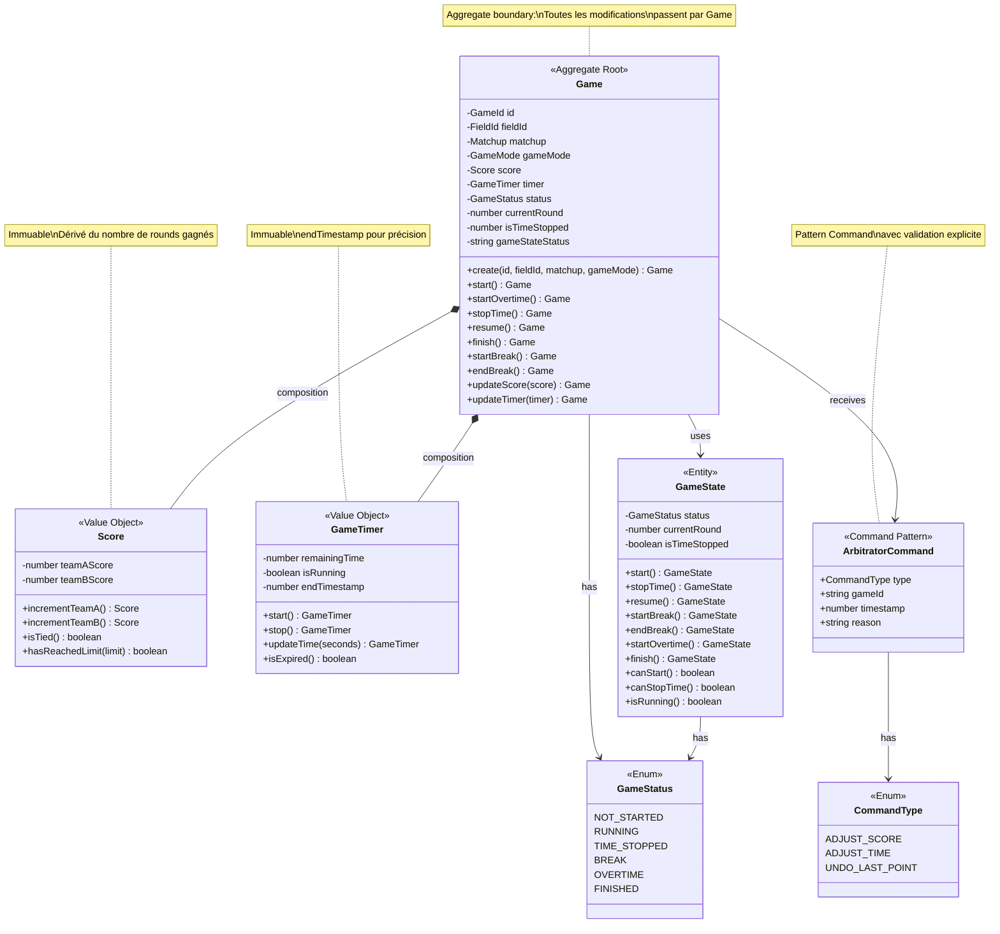
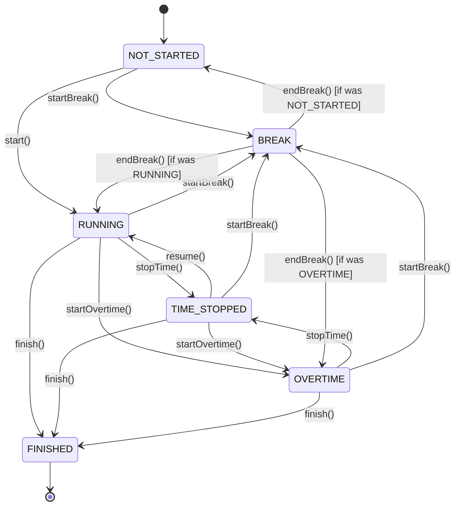
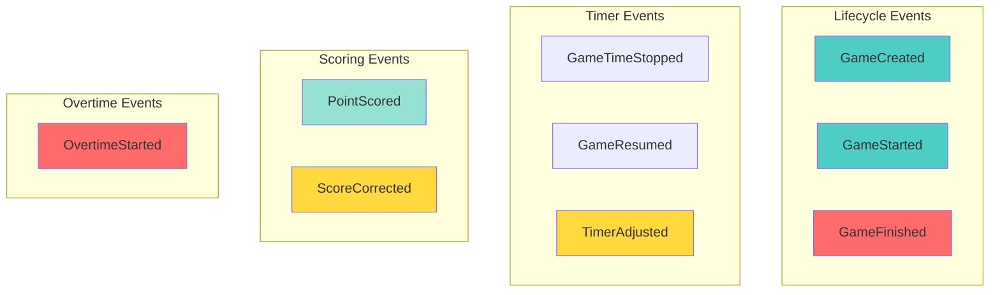
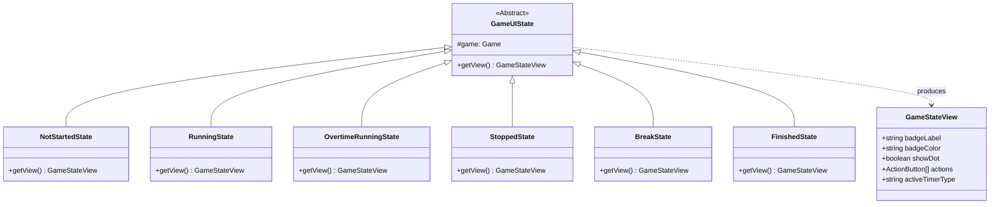
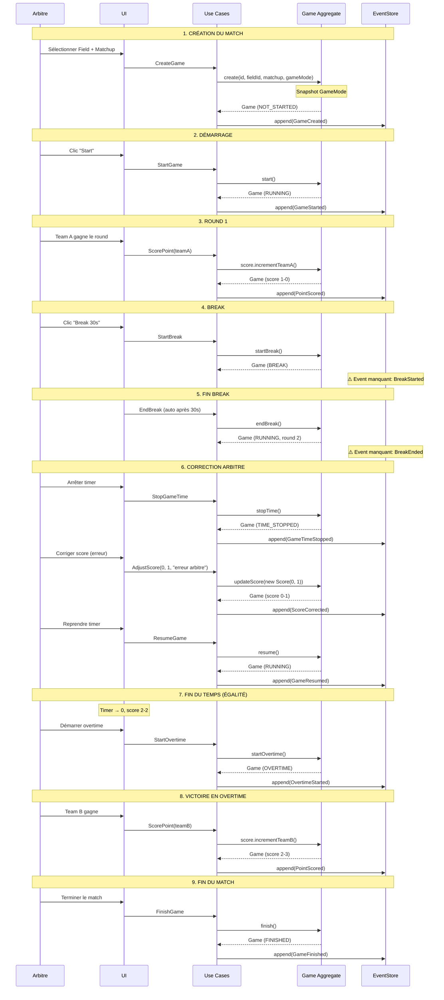

# Game Session Context (Core Domain)

## Vue d'ensemble

Le contexte **Game Session** est le **cœur métier** de l'application. Il gère l'arbitrage temps réel d'un match de paintball avec toute sa complexité : timer, score, breaks, overtime, et corrections d'arbitre.

**Type:** Core Domain ❤️  
**Complexité:** ⭐⭐⭐⭐⭐ Très élevée (logique métier critique)  
**Event Sourcing:** ✅ Implémenté (9 events + 2 manquants identifiés)

---

## Modèle de Domaine



---

## Aggregate Root: Game

**Fichier:** `src/core/domain/Game.ts`

### Properties

- `id: GameId` - Identifiant unique du match
- `fieldId: FieldId` - Terrain où se joue le match
- `matchup: Matchup` - **Snapshot** du matchup (teams + gameMode)
- `gameMode: GameMode` - **Snapshot** du mode de jeu
- `score: Score` - Score actuel (immuable)
- `timer: GameTimer` - Timer actuel (immuable)
- `status: GameStatus` - État actuel du match
- `currentRound: number` - Numéro du round en cours (1, 2, 3...)
- `isTimeStopped: number` - Flag indiquant si le timer est en pause (0 ou 1)
- `gameStateStatus: string` - État sous-jacent (pour retour après break)

### Méthodes Principales

#### Transitions d'État

```typescript
start(): Game
```
Démarre le match depuis NOT_STARTED, BREAK ou TIME_STOPPED.
- Démarre le timer
- Passe en status RUNNING
- Émet `GameStarted` (si premier démarrage)

---

```typescript
stopTime(): Game
```
Met le timer en pause (arbitre).
- Arrête le timer
- Conserve le status (RUNNING ou OVERTIME)
- Met isTimeStopped = 1
- Émet `GameTimeStopped`

---

```typescript
resume(): Game
```
Reprend le timer après pause.
- Redémarre le timer
- Restaure le status approprié
- Met isTimeStopped = 0
- Émet `GameResumed`

---

```typescript
startBreak(): Game
```
Démarre une pause entre rounds.
- Arrête le timer principal
- Passe en status BREAK
- Sauvegarde le gameStateStatus
- ⚠️ **Event manquant:** Devrait émettre `BreakStarted`

---

```typescript
endBreak(): Game
```
Termine la pause.
- Restaure le status précédent
- Incrémente currentRound (si applicable)
- ⚠️ **Event manquant:** Devrait émettre `BreakEnded`

---

```typescript
startOvertime(): Game
```
Démarre l'overtime (égalité à la fin du temps).
- Crée un nouveau timer avec durée overtime
- Passe en status OVERTIME
- Émet `OvertimeStarted`

---

```typescript
finish(): Game
```
Termine le match (validation arbitre).
- Arrête le timer
- Passe en status FINISHED
- Émet `GameFinished`

---

#### Modifications Sensibles

```typescript
updateScore(newScore: Score): Game
```
Met à jour le score (corrections arbitre).
- **Règle:** Interdit si status = RUNNING ET isTimeStopped = false
- Crée nouvelle instance Game (immuabilité)
- Émet `ScoreCorrected` (via AdjustScore Use Case)

---

```typescript
updateTimer(newTimer: GameTimer): Game
```
Ajuste le temps (corrections arbitre).
- **Règle:** Interdit si status = RUNNING ET isTimeStopped = false
- Crée nouvelle instance Game (immuabilité)
- Émet `TimerAdjusted` (via AdjustTime Use Case)

---

### Invariants Critiques

1. **Score = Rounds gagnés** (strictement dérivé)
2. **Modifications sensibles interdites si timer actif**
   ```typescript
   if (this.status === GameStatus.RUNNING || this.status === GameStatus.OVERTIME) {
     if (this.isTimeStopped !== 1) {
       throw new Error("Cannot modify while game timer is running");
     }
   }
   ```
3. **GameMode et Matchup snapshootés** (immutables après création)
4. **Transitions d'état validées** (pas de transition invalide)

---

## Value Objects

### 1. Score

**Fichier:** `src/core/domain/Game.ts`

```typescript
class Score {
  constructor(
    public readonly teamAScore: number = 0,
    public readonly teamBScore: number = 0
  ) {
    if (teamAScore < 0 || teamBScore < 0) {
      throw new Error("Score cannot be negative");
    }
  }
  
  incrementTeamA(): Score
  incrementTeamB(): Score
  isTied(): boolean
  hasReachedLimit(limit: number): boolean
}
```

**Règles:**
- Scores >= 0
- Immuable (méthodes retournent nouvelles instances)
- Score = nombre de rounds gagnés (pas de points fractionnaires)

---

### 2. GameTimer

**Fichier:** `src/core/domain/Game.ts`

```typescript
class GameTimer {
  constructor(
    public readonly remainingTime: number, // en secondes
    public readonly isRunning: boolean = false,
    public readonly endTimestamp: number | null = null
  ) {
    if (remainingTime < 0) {
      throw new Error("Remaining time cannot be negative");
    }
  }
  
  start(): GameTimer
  stop(): GameTimer
  updateTime(seconds: number): GameTimer
  isExpired(): boolean
}
```

**Caractéristiques:**
- `endTimestamp` pour calcul précis (évite le drift)
- Immuable
- Validation >= 0

**Précision du Timer:**
```typescript
// Calcul basé sur endTimestamp (pas de drift)
const calculatedRemaining = Math.max(0, Math.ceil((endTimestamp - Date.now()) / 1000));
```

---

## Entity: GameState

**Fichier:** `src/core/domain/GameState.ts`

**Responsabilité:** Gestion des transitions d'état du match.

```typescript
class GameState {
  constructor(
    public readonly status: GameStatus,
    public readonly currentRound: number,
    public readonly isTimeStopped: boolean
  ) {}
  
  // Validation des transitions
  canStart(): boolean
  canStopTime(): boolean
  canResume(): boolean
  canStartBreak(): boolean
  canStartOvertime(): boolean
  canFinish(): boolean
  
  // Transitions
  start(): GameState
  stopTime(): GameState
  resume(): GameState
  startBreak(): GameState
  endBreak(): GameState
  startOvertime(): GameState
  finish(): GameState
  
  // Queries
  isRunning(): boolean
  isInProgress(): boolean
}
```

**Note:** GameState est utilisé pour valider les transitions avant de modifier Game.

---

## Enum: GameStatus

**Fichier:** `src/core/domain/GameStatus.ts`

```typescript
enum GameStatus {
  NOT_STARTED = 'NOT_STARTED',  // Match pas encore démarré
  RUNNING = 'RUNNING',            // Match en cours, timer actif
  TIME_STOPPED = 'TIME_STOPPED',  // Timer en pause (arbitre)
  BREAK = 'BREAK',                // Pause entre rounds
  OVERTIME = 'OVERTIME',          // Prolongation (égalité)
  FINISHED = 'FINISHED'           // Match terminé
}
```

### Diagramme de Transitions



---

## ArbitratorCommand Pattern

**Fichier:** `src/core/domain/ArbitratorCommand.ts`

### CommandType Enum

```typescript
enum CommandType {
  ADJUST_SCORE = 'ADJUST_SCORE',
  ADJUST_TIME = 'ADJUST_TIME',
  UNDO_LAST_POINT = 'UNDO_LAST_POINT'
}
```

### Command Interfaces

```typescript
interface AdjustScoreCommand {
  type: CommandType.ADJUST_SCORE;
  gameId: string;
  timestamp: number;
  reason?: string;
  newScoreTeamA: number;
  newScoreTeamB: number;
}

interface AdjustTimeCommand {
  type: CommandType.ADJUST_TIME;
  gameId: string;
  timestamp: number;
  reason?: string;
  newTimeSeconds: number;
}

interface UndoLastPointCommand {
  type: CommandType.UNDO_LAST_POINT;
  gameId: string;
  timestamp: number;
  reason?: string;
}
```

### PendingCommand

```typescript
class PendingCommand {
  constructor(
    public readonly command: Command,
    public readonly createdAt: number = Date.now()
  ) {}
  
  isExpired(timeoutMs: number = 300000): boolean {
    return Date.now() - this.createdAt > timeoutMs;
  }
}
```

**Pattern:** Command Pattern avec validation explicite.

**Workflow:**
1. Arbitre initie une commande (ex: ADJUST_SCORE)
2. Commande devient "pending" (PendingCommand)
3. UI affiche bouton "Valider" / "Annuler"
4. Si validé → Use Case exécuté + Event émis
5. Si annulé ou timeout → Commande ignorée

**Bénéfice:** Évite les modifications accidentelles, audit trail complet.

---

## Use Cases

```mermaid
graph TB
    Arbitre([Arbitre])
    
    subgraph "Lifecycle"
        CreateGame[CreateGame]
        StartGame[StartGame]
        FinishGame[FinishGame]
    end
    
    subgraph "Timer Control"
        StopGameTime[StopGameTime]
        ResumeGame[ResumeGame]
    end
    
    subgraph "Scoring"
        ScorePoint[ScorePoint]
        AdjustScore[AdjustScore]
    end
    
    subgraph "Breaks"
        StartBreak[StartBreak]
        EndBreak[EndBreak]
    end
    
    subgraph "Overtime"
        StartOvertime[StartOvertime]
    end
    
    subgraph "Adjustments"
        AdjustTime[AdjustTime]
    end
    
    Arbitre --> CreateGame
    Arbitre --> StartGame
    Arbitre --> StopGameTime
    Arbitre --> ResumeGame
    Arbitre --> ScorePoint
    Arbitre --> AdjustScore
    Arbitre --> StartBreak
    Arbitre --> EndBreak
    Arbitre --> StartOvertime
    Arbitre --> AdjustTime
    Arbitre --> FinishGame
    
    style CreateGame fill:#4ecdc4
    style StartGame fill:#4ecdc4
    style ScorePoint fill:#95e1d3
    style AdjustScore fill:#ffd93d
    style AdjustTime fill:#ffd93d
    style StartOvertime fill:#ff6b6b
    style FinishGame fill:#ff6b6b
```



### 1. CreateGame

**Fichier:** `src/core/useCases/CreateGame.ts`

**Input:**
```typescript
{
  id: string,
  fieldId: string,
  matchupId: string
}
```

**Processus:**
1. Récupérer Field et Matchup
2. Récupérer GameMode (via matchup.gameModeId)
3. **Snapshot:** Copier GameMode et Matchup dans Game
4. Créer Game via factory
5. Persister via IGameRepository
6. Émettre `GameCreated` event

**Event émis:** `GameCreatedEvent`

---

### 2. StartGame

**Fichier:** `src/core/useCases/StartGame.ts`

**Processus:**
1. Récupérer Game
2. Appeler `game.start()`
3. Persister
4. Émettre `GameStarted` event (si premier démarrage)

**Event émis:** `GameStartedEvent`

---

### 3. StopGameTime

**Fichier:** `src/core/useCases/StopGameTime.ts`

**Processus:**
1. Récupérer Game
2. Appeler `game.stopTime()`
3. Persister
4. Émettre `GameTimeStopped` event

**Event émis:** `GameTimeStoppedEvent`

**Règle:** Possible uniquement si status = RUNNING ou OVERTIME

---

### 4. ResumeGame

**Fichier:** `src/core/useCases/ResumeGame.ts`

**Processus:**
1. Récupérer Game
2. Appeler `game.resume()`
3. Persister
4. Émettre `GameResumed` event

**Event émis:** `GameResumedEvent`

**Règle:** Possible uniquement si isTimeStopped = true

---

### 5. ScorePoint

**Fichier:** `src/core/useCases/ScorePoint.ts`

**Input:**
```typescript
{
  gameId: string,
  teamId: string // 'teamA' ou 'teamB'
}
```

**Processus:**
1. Récupérer Game
2. Incrémenter score (teamA ou teamB)
3. Vérifier victoire (score >= raceTo)
4. Persister
5. Émettre `PointScored` event

**Event émis:** `PointScoredEvent`

**Règle Métier:** Score = nombre de rounds gagnés (strictement)

---

### 6. AdjustScore

**Fichier:** `src/core/useCases/AdjustScore.ts`

**Input:**
```typescript
{
  gameId: string,
  newScoreTeamA: number,
  newScoreTeamB: number,
  reason: string
}
```

**Processus:**
1. Vérifier que timer est arrêté (isTimeStopped = true)
2. Récupérer Game
3. Créer nouveau Score
4. Appeler `game.updateScore(newScore)`
5. Persister
6. Émettre `ScoreCorrected` event

**Event émis:** `ScoreCorrectedEvent`

**Règle:** Interdit si timer actif (status = RUNNING ET isTimeStopped = false)

**Via:** ArbitratorCommand (ADJUST_SCORE)

---

### 7. StartBreak

**Fichier:** `src/core/useCases/StartBreak.ts`

**Input:**
```typescript
{
  gameId: string,
  duration?: number // Optionnel (5s ou valeur du GameMode)
}
```

**Processus:**
1. Récupérer Game
2. Appeler `game.startBreak()`
3. Persister
4. ⚠️ **Event manquant:** Devrait émettre `BreakStarted`

**Event émis:** Aucun (gap identifié)

**Note:** L'UI propose breaks courts (5s) et longs (gameMode.breakTime)

---

### 8. EndBreak

**Fichier:** `src/core/useCases/EndBreak.ts`

**Processus:**
1. Récupérer Game
2. Appeler `game.endBreak()`
3. Persister
4. ⚠️ **Event manquant:** Devrait émettre `BreakEnded`

**Event émis:** Aucun (gap identifié)

---

### 9. StartOvertime

**Fichier:** `src/core/useCases/StartOvertime.ts`

**Processus:**
1. Récupérer Game
2. Vérifier égalité (score.isTied())
3. Appeler `game.startOvertime()`
4. Persister
5. Émettre `OvertimeStarted` event

**Event émis:** `OvertimeStartedEvent`

**Règle:** Possible uniquement si égalité à la fin du temps

---

### 10. AdjustTime

**Fichier:** `src/core/useCases/AdjustTime.ts`

**Input:**
```typescript
{
  gameId: string,
  newTimeSeconds: number,
  reason: string
}
```

**Processus:**
1. Vérifier que timer est arrêté
2. Récupérer Game
3. Créer nouveau GameTimer
4. Appeler `game.updateTimer(newTimer)`
5. Persister
6. Émettre `TimerAdjusted` event

**Event émis:** `TimerAdjustedEvent`

**Via:** ArbitratorCommand (ADJUST_TIME)

---

### 11. FinishGame

**Fichier:** `src/core/useCases/FinishGame.ts`

**Input:**
```typescript
{
  gameId: string,
  note?: string
}
```

**Processus:**
1. Récupérer Game
2. Déterminer vainqueur
3. Appeler `game.finish()`
4. Persister
5. Émettre `GameFinished` event

**Event émis:** `GameFinishedEvent`

**Règle:** Validation manuelle de l'arbitre (évite fins accidentelles)

---

## Domain Events

**Fichier:** `src/core/domain/events/GameEvents.ts`

### Events Implémentés (9)



### 1. GameCreatedEvent

```typescript
interface GameCreatedEvent {
  type: 'GameCreated';
  aggregateId: GameId;
  timestamp: number;
  payload: {
    fieldId: string;
    matchupId: string;
    gameModeId: string;
  };
}
```

---

### 2. GameStartedEvent

```typescript
interface GameStartedEvent {
  type: 'GameStarted';
  aggregateId: GameId;
  timestamp: number;
  payload: {
    startTime: number;
  };
}
```

---

### 3. GameTimeStoppedEvent

```typescript
interface GameTimeStoppedEvent {
  type: 'GameTimeStopped';
  aggregateId: GameId;
  timestamp: number;
  payload: {
    remainingTime: number;
  };
}
```

---

### 4. GameResumedEvent

```typescript
interface GameResumedEvent {
  type: 'GameResumed';
  aggregateId: GameId;
  timestamp: number;
  payload: {
    remainingTime: number;
  };
}
```

---

### 5. PointScoredEvent

```typescript
interface PointScoredEvent {
  type: 'PointScored';
  aggregateId: GameId;
  timestamp: number;
  payload: {
    teamId: TeamId;
    newScoreTeamA: number;
    newScoreTeamB: number;
  };
}
```

---

### 6. ScoreCorrectedEvent

```typescript
interface ScoreCorrectedEvent {
  type: 'ScoreCorrected';
  aggregateId: GameId;
  timestamp: number;
  payload: {
    previousScoreTeamA: number;
    previousScoreTeamB: number;
    newScoreTeamA: number;
    newScoreTeamB: number;
    reason: string;
  };
}
```

---

### 7. TimerAdjustedEvent

```typescript
interface TimerAdjustedEvent {
  type: 'TimerAdjusted';
  aggregateId: GameId;
  timestamp: number;
  payload: {
    previousTime: number;
    newTime: number;
    reason: string;
  };
}
```

---

### 8. OvertimeStartedEvent

```typescript
interface OvertimeStartedEvent {
  type: 'OvertimeStarted';
  aggregateId: GameId;
  timestamp: number;
  payload: {
    overtimeDuration: number;
  };
}
```

---

### 9. GameFinishedEvent

```typescript
interface GameFinishedEvent {
  type: 'GameFinished';
  aggregateId: GameId;
  timestamp: number;
  payload: {
    finalScoreTeamA: number;
    finalScoreTeamB: number;
    winnerTeamId: TeamId | null;
    endReason: 'SCORE_LIMIT' | 'TIME_EXPIRED' | 'MANUAL';
    note?: string;
  };
}
```

---

### ⚠️ Events Manquants (2)

**Events à implémenter:**

```typescript
interface BreakStartedEvent {
  type: 'BreakStarted';
  aggregateId: GameId;
  timestamp: number;
  payload: {
    breakDuration: number; // en secondes
    breakType: 'SHORT' | 'LONG'; // 5s ou gameMode.breakTime
  };
}

interface BreakEndedEvent {
  type: 'BreakEnded';
  aggregateId: GameId;
  timestamp: number;
  payload: {
    nextRound: number;
  };
}
```

**Fichier à modifier:** `src/core/domain/events/GameEvents.ts`

---

## Presentation Layer

### Screens

**Dossier:** `app/game-session/`

1. **start-match.tsx** - Sélection Field/Matchup et démarrage
2. **[gameId].tsx** - Écran d'arbitrage temps réel (19743 bytes - très complexe)

### Hooks Spécialisés

#### useGameStateMachine

**Fichier:** `hooks/useGameStateMachine.ts`

**Responsabilité:** Gère la machine à états UI du match.

```typescript
function useGameStateMachine(game: Game | undefined) {
  const uiState = GameStateMachine.getUIState(game);
  const view = uiState?.getView();
  
  // Gestion de 3 timers distincts
  const gameTimer = useGameTimer(gameTimeSeconds);
  const breakTimer = useGameTimer(breakTimeSeconds);
  const overtimeTimer = useGameTimer(overtimeSeconds);
  
  // Sync avec DB
  useEffect(() => {
    if (game.status === GameStatus.OVERTIME) {
      overtimeTimer.syncWithDB(...);
    } else {
      gameTimer.syncWithDB(...);
    }
  }, [game]);
  
  return { view, activeTimer, controllers };
}
```

---

#### useGameTimer

**Fichier:** `hooks/useGameTimer.ts`

**Responsabilité:** Gestion précise d'un timer avec endTimestamp.

```typescript
function useGameTimer(initialSeconds: number) {
  const [remainingSeconds, setRemainingSeconds] = useState(initialSeconds);
  const [isRunning, setIsRunning] = useState(false);
  const [endTimestamp, setEndTimestamp] = useState<number | null>(null);
  
  // Calcul précis basé sur endTimestamp (évite drift)
  useEffect(() => {
    if (isRunning && endTimestamp) {
      const interval = setInterval(() => {
        const remaining = Math.max(0, Math.ceil((endTimestamp - Date.now()) / 1000));
        setRemainingSeconds(remaining);
        if (remaining === 0) setIsRunning(false);
      }, 1000);
      return () => clearInterval(interval);
    }
  }, [isRunning, endTimestamp]);
  
  return {
    remainingSeconds,
    isRunning,
    isFinished: remainingSeconds === 0,
    formattedTime: formatTime(remainingSeconds),
    start, stop, resume, setTime, syncWithDB
  };
}
```

**Caractéristique clé:** Utilise `endTimestamp` pour éviter le drift du timer.

---

#### useArbitratorCommand

**Fichier:** `hooks/useArbitratorCommand.ts`

**Responsabilité:** Gestion des commandes arbitre avec validation.

```typescript
function useArbitratorCommand() {
  const [pendingCommand, setPendingCommand] = useState<PendingCommand | null>(null);
  
  const initiateCommand = (command: Command) => {
    setPendingCommand(new PendingCommand(command));
  };
  
  const validateCommand = async () => {
    if (!pendingCommand) return;
    // Exécuter le Use Case correspondant
    await executeUseCase(pendingCommand.command);
    setPendingCommand(null);
  };
  
  const cancelCommand = () => {
    setPendingCommand(null);
  };
  
  return { pendingCommand, initiateCommand, validateCommand, cancelCommand };
}
```

---

### GameStateMachine (UI State Pattern)

**Fichier:** `src/presentation/state/GameStateMachine.ts`

**Responsabilité:** Mapper GameStatus → UI State avec actions disponibles.



**6 États UI:**

1. **NotStartedState** - Badge rouge, actions: Break 30s, Break 5s
2. **RunningState** - Badge vert, actions: Stop
3. **OvertimeRunningState** - Badge vert "OVERTIME", actions: Stop
4. **StoppedState** - Badge orange, actions: Break 30s, Break 5s
5. **BreakState** - Badge orange "BREAK", actions: Stop
6. **FinishedState** - Badge rouge, actions: []

---

### State Management

**Slice Zustand:** `src/presentation/state/slices/createGameSlice.ts`

**State:**
```typescript
{
  games: Game[];
  currentGame: Game | null;
  isLoading: boolean;
  error: string | null;
}
```

**Actions:**
- `loadGames()`
- `loadGame(id)`
- `createGame(data)`
- `startGame(id)`
- `stopGameTime(id)`
- `resumeGame(id)`
- `scorePoint(id, teamId)`
- `adjustScore(id, scoreA, scoreB, reason)`
- `startBreak(id, duration?)`
- `endBreak(id)`
- `startOvertime(id)`
- `adjustTime(id, seconds, reason)`
- `finishGame(id, note?)`

---

## Règles Métier Critiques

### 1. Score Dérivé

**Règle:** Le score est **strictement** le nombre de rounds gagnés.

```typescript
// ✅ Bon
score = score.incrementTeamA(); // +1 round

// ❌ Interdit
score.teamAScore += 0.5; // Pas de points fractionnaires
```

**Implication:** Pas de système de points complexe, juste comptage de rounds.

---

### 2. Modifications Sensibles

**Règle:** Interdites si timer actif.

```typescript
if (this.status === GameStatus.RUNNING || this.status === GameStatus.OVERTIME) {
  if (this.isTimeStopped !== 1) {
    throw new Error("Cannot modify while game timer is running");
  }
}
```

**Workflow:**
1. Arbitre arrête le timer (StopGameTime)
2. Arbitre modifie (AdjustScore ou AdjustTime)
3. Arbitre valide la commande
4. Arbitre reprend le timer (ResumeGame)

---

### 3. Autorité Absolue de l'Arbitre

**Règle:** L'arbitre peut tout corriger via ArbitratorCommand.

**Commandes disponibles:**
- `ADJUST_SCORE` - Corriger le score
- `ADJUST_TIME` - Ajuster le temps
- `UNDO_LAST_POINT` - Annuler le dernier point

**Pattern:** Command avec validation explicite (bouton Valider/Annuler).

---

### 4. Snapshot GameMode

**Règle:** Le GameMode est copié au démarrage du match.

```typescript
// Dans CreateGame
const gameMode = await gameModeRepository.findById(matchup.gameModeId);
const game = Game.create(id, fieldId, matchup, gameMode); // ← Copie
```

**Bénéfice:** Modifier le GameMode n'affecte pas les matchs en cours.

---

### 5. Validation Manuelle de Fin

**Règle:** Le match n'est FINISHED que si l'arbitre valide.

**Raison:** Éviter les fins accidentelles (ex: timer à 0 mais round en cours).

**Workflow:**
1. Condition de victoire atteinte (score ou temps)
2. UI propose "Terminer le match"
3. Arbitre valide → FinishGame Use Case
4. Status → FINISHED

---

### 6. Précision du Timer

**Règle:** Utiliser `endTimestamp` pour éviter le drift.

```typescript
// ❌ Mauvais (drift)
setInterval(() => remainingTime--, 1000);

// ✅ Bon (précis)
const remaining = Math.ceil((endTimestamp - Date.now()) / 1000);
```

**Bénéfice:** Timer précis même si l'app est en background.

---

## Diagramme de Séquence - Match Complet



---

## Patterns Appliqués

### 1. Aggregate Pattern

Game est l'Aggregate Root qui contrôle Score et GameTimer.

**Bénéfice:** Cohérence transactionnelle garantie.

---

### 2. Event Sourcing

Toutes les actions émettent des events persistés.

**Bénéfice:** Audit trail complet, reconstruction de l'état, replay possible.

---

### 3. Command Pattern

ArbitratorCommand avec validation explicite.

**Bénéfice:** Évite modifications accidentelles, traçabilité.

---

### 4. State Pattern

GameStateMachine pour UI states.

**Bénéfice:** Séparation UI/Domain, actions contextuelles.

---

### 5. Snapshot Pattern

GameMode et Matchup copiés au démarrage.

**Bénéfice:** Immutabilité des règles pendant le match.

---

### 6. Value Object Pattern

Score et GameTimer immuables.

**Bénéfice:** Thread-safety, validation encapsulée.

---

## Améliorations Recommandées

### 1. Implémenter BreakStarted/BreakEnded Events

**Priorité:** Haute

**Fichiers à modifier:**
- `src/core/domain/events/GameEvents.ts` (ajouter events)
- `src/core/useCases/StartBreak.ts` (émettre event)
- `src/core/useCases/EndBreak.ts` (émettre event)

---

### 2. Ajouter Validation Automatique de Victoire

**Priorité:** Moyenne

**Fonctionnalité:** Détecter automatiquement les conditions de victoire.

```typescript
// Dans ScorePoint Use Case
if (newScore.hasReachedLimit(game.gameMode.raceTo.value)) {
  // Proposer à l'arbitre de terminer le match
  return { shouldFinish: true, winner: teamId };
}
```

---

### 3. Implémenter UNDO_LAST_POINT

**Priorité:** Moyenne

**Fonctionnalité:** Annuler le dernier point marqué.

**Complexité:** Nécessite de tracker l'historique des points.

---

### 4. Ajouter Statistiques Temps Réel

**Priorité:** Basse

**Fonctionnalités:**
- Durée moyenne des rounds
- Temps de possession (si capteurs)
- Heatmap des points marqués

---

## Résumé

### Points Forts
- ✅ Event Sourcing complet (9 events)
- ✅ ArbitratorCommand pattern robuste
- ✅ 6 états bien définis (GameStatus)
- ✅ Timer précis (endTimestamp)
- ✅ Snapshot pattern pour immutabilité
- ✅ Validation stricte des invariants
- ✅ UI State Machine élégante
- ✅ Hooks spécialisés (useGameStateMachine, useGameTimer)

### Points Faibles
- ⚠️ BreakStarted/BreakEnded events manquants
- ⚠️ UNDO_LAST_POINT non implémenté
- ⚠️ Pas de validation automatique de victoire
- ⚠️ Pas de statistiques temps réel

### Complexité
**Très élevée** - C'est le Core Domain avec la logique métier la plus critique. Gestion d'état complexe, timer précis, corrections arbitre, Event Sourcing complet.

---

## Statistiques

**Lignes de code (Domain):** ~300 lignes (Game.ts)  
**Value Objects:** 2 (Score, GameTimer)  
**Entity:** 1 (GameState)  
**Enum:** 2 (GameStatus, CommandType)  
**Events:** 9 (+ 2 manquants)  
**Use Cases:** 11  
**Hooks:** 3 (useGameStateMachine, useGameTimer, useArbitratorCommand)  
**UI States:** 6 (NotStartedState, RunningState, etc.)  
**Screens:** 2 (dont 1 très complexe - 19743 bytes)  

**Ratio Complexité/Valeur:** Excellent - Toute la valeur métier de l'application.

---

## Références Code

- **Domain:** `src/core/domain/Game.ts`, `GameState.ts`, `GameStatus.ts`, `ArbitratorCommand.ts`
- **Events:** `src/core/domain/events/GameEvents.ts`
- **Use Cases:** `src/core/useCases/CreateGame.ts`, `StartGame.ts`, `StopGameTime.ts`, `ResumeGame.ts`, `ScorePoint.ts`, `AdjustScore.ts`, `StartBreak.ts`, `EndBreak.ts`, `StartOvertime.ts`, `AdjustTime.ts`, `FinishGame.ts`
- **Port:** `src/core/ports/IGameRepository.ts`
- **Repository:** `src/infrastructure/database/GameRepository.ts`
- **State:** `src/presentation/state/slices/createGameSlice.ts`, `GameStateMachine.ts`
- **Hooks:** `hooks/useGameStateMachine.ts`, `useGameTimer.ts`, `useArbitratorCommand.ts`
- **Screens:** `app/game-session/[gameId].tsx`, `start-match.tsx`
