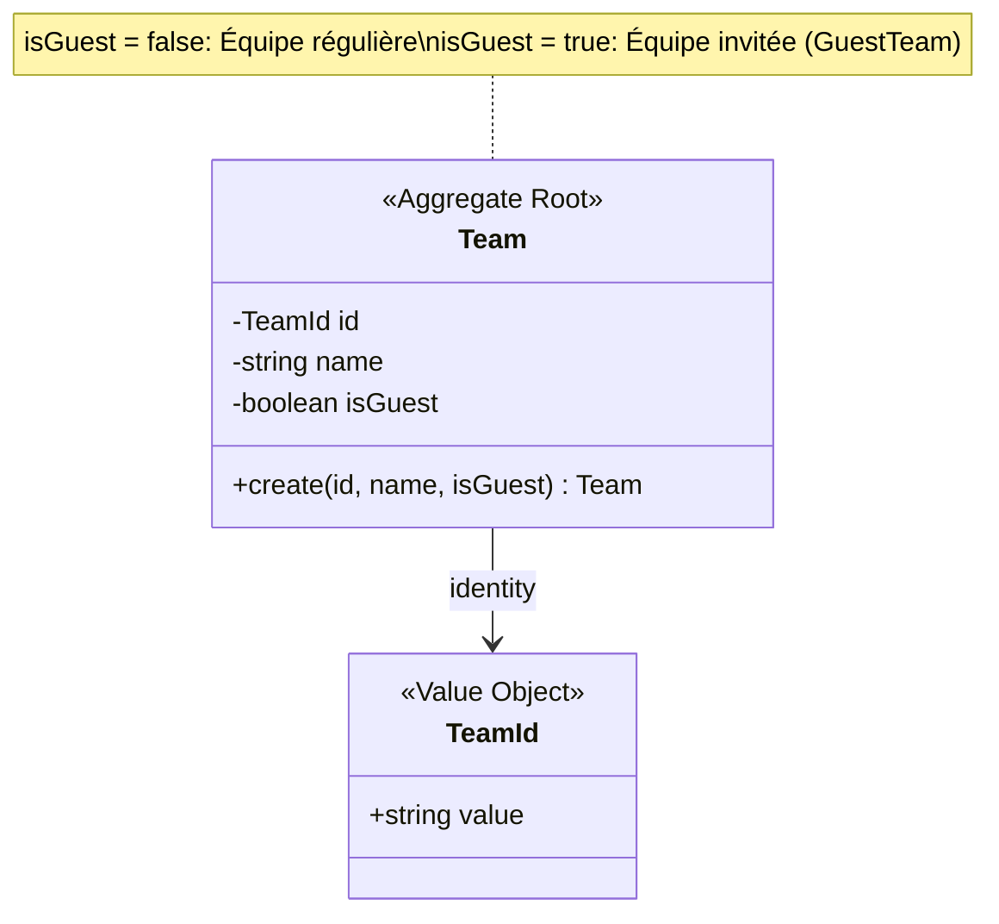
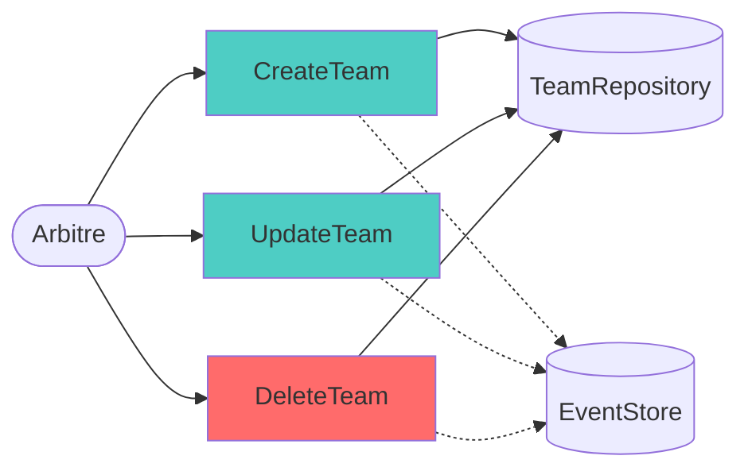
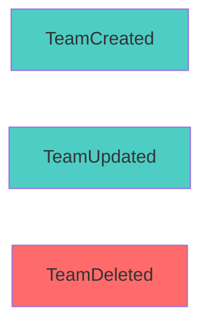
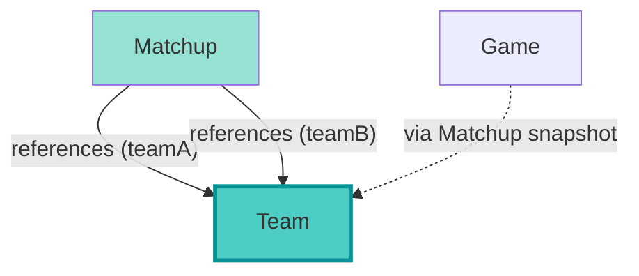
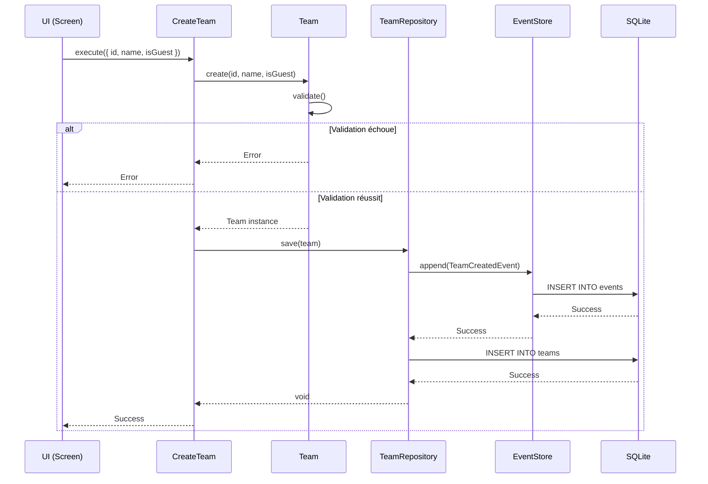

# Team Management Context

## Vue d'ensemble

Le contexte **Team Management** gère les équipes de paintball, qu'elles soient régulières (enregistrées) ou invitées (guest teams).

**Type:** Supporting Domain  
**Complexité:** ⭐ Faible (CRUD simple)  
**Event Sourcing:** ✅ Implémenté (3 events)

---

## Modèle de Domaine



### Aggregate Root: Team

**Fichier:** `src/core/domain/Team.ts`

**Properties:**
- `id: TeamId` - Identifiant unique
- `name: string` - Nom de l'équipe
- `isGuest: boolean` - Flag indiquant si c'est une équipe invitée

**Méthodes:**
- `static create(id, name, isGuest = false)` - Factory method avec validation

**Invariants:**
1. L'ID ne peut pas être vide
2. Le nom ne peut pas être vide
3. isGuest est par défaut `false`

---

## Distinction Team vs GuestTeam

### Team Régulière (isGuest = false)

**Caractéristiques:**
- Équipe enregistrée dans le système
- Peut être réutilisée dans plusieurs tournois
- Historique conservé
- Peut avoir des statistiques

**Cas d'usage:** Équipes permanentes d'un club

---

### GuestTeam (isGuest = true)

**Caractéristiques:**
- Équipe temporaire/ponctuelle
- Créée pour un tournoi spécifique
- Peut être supprimée après le tournoi
- Pas de statistiques long-terme

**Cas d'usage:** Équipes externes invitées pour un événement

---

## Use Cases



### 1. CreateTeam

**Fichier:** `src/core/useCases/CreateTeam.ts`

**Input:**
```typescript
{
  id: string,
  name: string,
  isGuest: boolean // default: false
}
```

**Processus:**
1. Valider les données
2. Créer l'aggregate Team via factory
3. Persister via ITeamRepository
4. Émettre `TeamCreated` event

**Event émis:** `TeamCreatedEvent`

**Output:** `void`

---

### 2. UpdateTeam

**Fichier:** `src/core/useCases/UpdateTeam.ts`

**Input:**
```typescript
{
  id: string,
  name: string,
  isGuest: boolean
}
```

**Processus:**
1. Récupérer la Team existante
2. Créer nouvelle Team avec nouvelles données (immuabilité)
3. Persister via ITeamRepository
4. Émettre `TeamUpdated` event

**Event émis:** `TeamUpdatedEvent`

**Output:** `void`

**Note:** Permet de changer le flag isGuest (ex: convertir une GuestTeam en Team régulière)

---

### 3. DeleteTeam

**Fichier:** `src/core/useCases/DeleteTeam.ts`

**Input:**
```typescript
{
  id: string
}
```

**Processus:**
1. Vérifier l'existence de la Team
2. Supprimer via ITeamRepository
3. Émettre `TeamDeleted` event

**Event émis:** `TeamDeletedEvent`

**Output:** `void`

**⚠️ Attention:** Pas de vérification si la Team est utilisée dans des Matchups

---

## Domain Events

**Fichier:** `src/core/domain/events/TeamEvents.ts`

### Events Implémentés



### 1. TeamCreatedEvent

```typescript
interface TeamCreatedEvent {
  type: 'TeamCreated';
  aggregateId: TeamId;
  timestamp: number;
  payload: {
    name: string;
    isGuest: boolean;
  };
}
```

**Émis par:** CreateTeam Use Case

---

### 2. TeamUpdatedEvent

```typescript
interface TeamUpdatedEvent {
  type: 'TeamUpdated';
  aggregateId: TeamId;
  timestamp: number;
  payload: {
    name: string;
    isGuest: boolean;
  };
}
```

**Émis par:** UpdateTeam Use Case

---

### 3. TeamDeletedEvent

```typescript
interface TeamDeletedEvent {
  type: 'TeamDeleted';
  aggregateId: TeamId;
  timestamp: number;
  payload: Record<string, never>;
}
```

**Émis par:** DeleteTeam Use Case

---

## Repository (Port)

### Interface: ITeamRepository

**Fichier:** `src/core/ports/ITeamRepository.ts`

```typescript
interface ITeamRepository {
  save(team: Team): Promise<void>;
  findById(id: TeamId): Promise<Team | null>;
  findAll(): Promise<Team[]>;
  delete(id: TeamId): Promise<void>;
}
```

**Implémentation:** `src/infrastructure/database/TeamRepository.ts`

**Méthodes additionnelles (potentielles):**
- `findByIsGuest(isGuest: boolean): Promise<Team[]>` - Filtrer par type
- `findByName(name: string): Promise<Team[]>` - Recherche par nom

**Technologie:** SQLite

---

## Relations avec Autres Contextes



### Relations Détaillées

| Relation | Type | Cardinalité | Description |
|----------|------|-------------|-------------|
| Matchup → Team | Reference | N-2 | Un Matchup référence 2 Teams (teamA, teamB) |
| Game → Team | Indirect | N-2 | Via Matchup snapshot dans Game |

**Note:** Team est référencée mais jamais modifiée par les autres contextes (séparation stricte).

---

## Présentation Layer

### Screens

**Dossier:** `app/team/`

1. **teams-list.tsx** - Liste de toutes les équipes
2. **create-team.tsx** - Création d'une équipe
3. **edit-team.tsx** - Modification d'une équipe
4. **select-team.tsx** - Sélection d'équipes (pour Matchup)

### Hooks

**Fichier:** `hooks/useTeamSelection.ts`

Gère la sélection de teams dans l'UI avec:
- Filtrage par nom
- Distinction visuelle Team/GuestTeam
- Validation (teamA ≠ teamB)

### State Management

**Slice Zustand:** `src/presentation/state/slices/createTeamSlice.ts`

**State:**
```typescript
{
  teams: Team[];
  selectedTeam: Team | null;
  isLoading: boolean;
  error: string | null;
}
```

**Actions:**
- `loadTeams()`
- `createTeam(data)`
- `updateTeam(id, data)`
- `deleteTeam(id)`
- `selectTeam(id)`
- `filterTeams(isGuest?: boolean)` - Filtrer par type

---

## Règles Métier

### 1. Validation du Nom

```typescript
// Règle: nom non vide
if (!name || name.trim() === "") {
  throw new Error("Team name cannot be empty");
}
```

### 2. Flag isGuest

```typescript
// Règle: isGuest par défaut false
static create(id: TeamId, name: string, isGuest: boolean = false): Team {
  // ...
}
```

**Implication:** Si non spécifié, une Team est considérée comme régulière.

---

## Diagramme de Séquence - Création de Team



---

## Patterns Appliqués

### 1. Factory Method

`Team.create()` encapsule la logique de création et validation.

**Bénéfice:** Garantie des invariants dès la création.

### 2. Immutability

Bien que simple, Team suit le pattern d'immutabilité.

**Bénéfice:** Cohérence avec les autres Aggregates, Event Sourcing facilité.

### 3. Flag Pattern

Utilisation d'un boolean `isGuest` plutôt que deux classes séparées.

**Avantages:**
- Simplicité du modèle
- Conversion facile (Team → GuestTeam)
- Pas de duplication de code

**Inconvénients:**
- Moins de type-safety
- Logique métier différente non encapsulée

---

## Améliorations Recommandées

### 1. Ajouter Validation de Dépendances

**Priorité:** Haute

**Problème:** DeleteTeam ne vérifie pas si la Team est utilisée dans des Matchups.

**Solution:**
```typescript
// Dans DeleteTeam Use Case
const matchups = await matchupRepository.findByTeamId(teamId);
if (matchups.length > 0) {
  throw new Error("Cannot delete team used in matchups");
}
```

---

### 2. Ajouter Propriétés Optionnelles

**Priorité:** Basse

**Suggestions:**
- `color: string` - Couleur de l'équipe (UI)
- `logo: string` - URL du logo
- `players: Player[]` - Liste des joueurs (nouveau contexte)
- `statistics: TeamStats` - Statistiques (victoires, défaites, etc.)

---

### 3. Séparer Team et GuestTeam

**Priorité:** Basse (refactoring majeur)

**Alternative:** Créer deux Aggregates distincts avec comportements différents.

**Avantages:**
- Type-safety accrue
- Logique métier séparée
- Règles de validation différentes

**Inconvénients:**
- Duplication de code
- Complexité accrue
- Migration de données nécessaire

---

### 4. Ajouter Recherche et Filtres

**Priorité:** Moyenne

**Fonctionnalités:**
- Recherche par nom (fuzzy search)
- Filtrage par isGuest
- Tri alphabétique
- Pagination (si beaucoup d'équipes)

---

## Cas d'Usage Typiques

### Scénario 1: Création d'une Team Régulière

```typescript
// UI: create-team.tsx
const teamData = {
  id: generateId(),
  name: "Red Dragons",
  isGuest: false
};

await createTeamUseCase.execute(teamData);
```

**Résultat:** Team enregistrée, disponible pour tous les tournois.

---

### Scénario 2: Création d'une GuestTeam

```typescript
// UI: create-team.tsx (pour un tournoi spécifique)
const guestTeamData = {
  id: generateId(),
  name: "Visitors Team A",
  isGuest: true
};

await createTeamUseCase.execute(guestTeamData);
```

**Résultat:** GuestTeam créée, peut être supprimée après le tournoi.

---

### Scénario 3: Conversion GuestTeam → Team

```typescript
// UI: edit-team.tsx
const updatedData = {
  id: existingGuestTeam.id,
  name: existingGuestTeam.name,
  isGuest: false // Conversion
};

await updateTeamUseCase.execute(updatedData);
```

**Résultat:** L'équipe invitée devient permanente.

---

## Résumé

### Points Forts
- ✅ Event Sourcing complet (3 events)
- ✅ Modèle simple et clair
- ✅ Validation robuste
- ✅ Flag isGuest flexible
- ✅ UI complète (CRUD + sélection)

### Points Faibles
- ⚠️ Pas de validation de dépendances (cascade delete)
- ⚠️ Propriétés limitées (pas de couleur, logo, joueurs)
- ⚠️ Pas de recherche/filtrage avancé dans le Repository

### Complexité
**Faible** - Aggregate très simple avec CRUD basique. La distinction Team/GuestTeam est gérée par un simple flag.

---

## Statistiques

**Lignes de code (Domain):** ~20 lignes  
**Events:** 3  
**Use Cases:** 3  
**Screens:** 4  

**Ratio Complexité/Valeur:** Excellent - Beaucoup de valeur métier pour peu de code.

---

## Références Code

- **Domain:** `src/core/domain/Team.ts`
- **Events:** `src/core/domain/events/TeamEvents.ts`
- **Use Cases:** `src/core/useCases/CreateTeam.ts`, `UpdateTeam.ts`, `DeleteTeam.ts`
- **Port:** `src/core/ports/ITeamRepository.ts`
- **Repository:** `src/infrastructure/database/TeamRepository.ts`
- **State:** `src/presentation/state/slices/createTeamSlice.ts`
- **Hooks:** `hooks/useTeamSelection.ts`
- **Screens:** `app/team/*.tsx`
