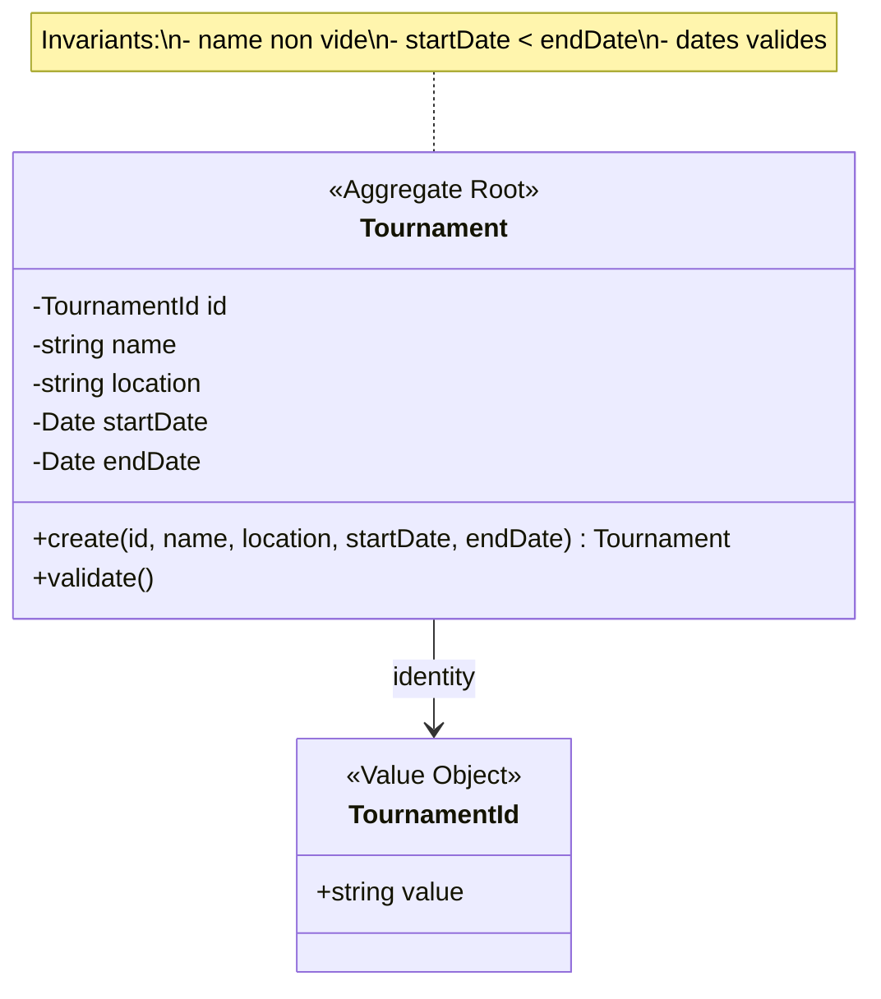
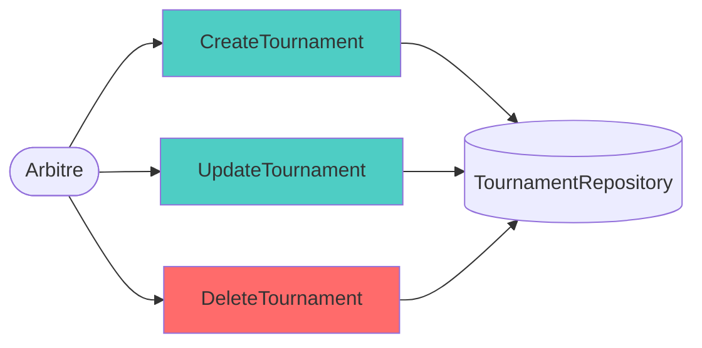
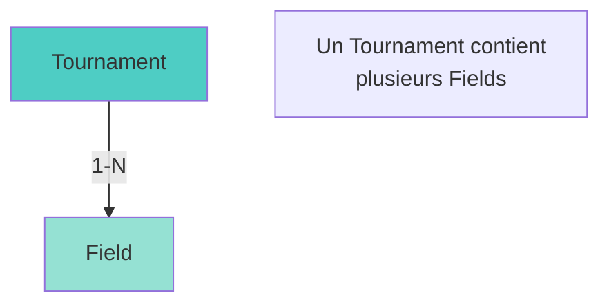
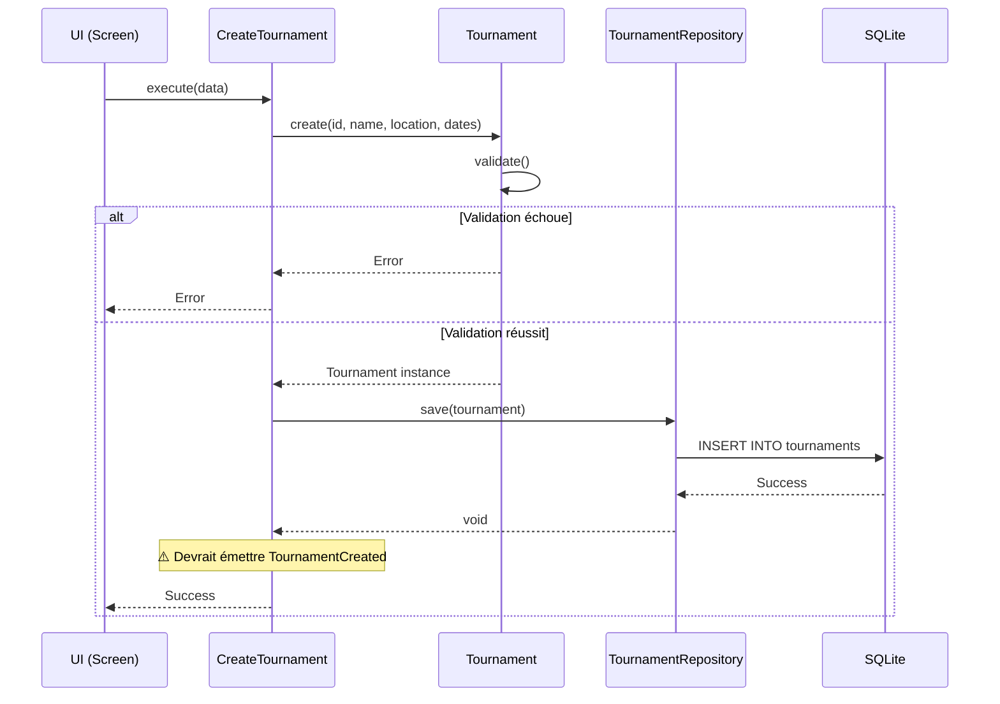

# Tournament Management Context

## Vue d'ensemble

Le contexte **Tournament Management** gère l'organisation des tournois de paintball avec leurs informations de base (nom, lieu, dates).

**Type:** Supporting Domain  
**Complexité:** ⭐ Faible (CRUD simple)  
**Event Sourcing:** ❌ Non implémenté (gap identifié)

---

## Modèle de Domaine



### Aggregate Root: Tournament

**Fichier:** `src/core/domain/Tournament.ts`

**Properties:**
- `id: TournamentId` - Identifiant unique
- `name: string` - Nom du tournoi
- `location: string` - Lieu du tournoi
- `startDate: Date` - Date de début
- `endDate: Date` - Date de fin

**Méthodes:**
- `static create(...)` - Factory method avec validation

**Invariants:**
1. L'ID ne peut pas être vide
2. Le nom ne peut pas être vide
3. Les dates doivent être valides (non NaN)
4. `endDate >= startDate`

---

## Use Cases



### 1. CreateTournament

**Fichier:** `src/core/useCases/CreateTournament.ts`

**Input:**
```typescript
{
  id: string,
  name: string,
  location: string,
  startDate: Date,
  endDate: Date
}
```

**Processus:**
1. Valider les données d'entrée
2. Créer l'aggregate Tournament via factory
3. Persister via ITournamentRepository
4. ⚠️ **Event manquant:** Devrait émettre `TournamentCreated`

**Output:** `void`

---

### 2. UpdateTournament

**Fichier:** `src/core/useCases/UpdateTournament.ts`

**Input:**
```typescript
{
  id: string,
  name: string,
  location: string,
  startDate: Date,
  endDate: Date
}
```

**Processus:**
1. Récupérer le Tournament existant
2. Valider les nouvelles données
3. Créer un nouveau Tournament (immutabilité)
4. Persister via ITournamentRepository
5. ⚠️ **Event manquant:** Devrait émettre `TournamentUpdated`

**Output:** `void`

---

### 3. DeleteTournament

**Fichier:** `src/core/useCases/DeleteTournament.ts`

**Input:**
```typescript
{
  id: string
}
```

**Processus:**
1. Vérifier l'existence du Tournament
2. Supprimer via ITournamentRepository
3. ⚠️ **Event manquant:** Devrait émettre `TournamentDeleted`

**Output:** `void`

**⚠️ Attention:** Pas de vérification de dépendances (Fields associés)

---

## Domain Events

### ⚠️ Events Manquants (Gap Identifié)

Aucun Domain Event n'est actuellement implémenté pour ce contexte, alors que 4 Use Cases existent.

**Events à implémenter:**

```typescript
// TournamentCreated
interface TournamentCreatedEvent {
  type: 'TournamentCreated';
  aggregateId: TournamentId;
  timestamp: number;
  payload: {
    name: string;
    location: string;
    startDate: number; // timestamp
    endDate: number;   // timestamp
  };
}

// TournamentUpdated
interface TournamentUpdatedEvent {
  type: 'TournamentUpdated';
  aggregateId: TournamentId;
  timestamp: number;
  payload: {
    name: string;
    location: string;
    startDate: number;
    endDate: number;
  };
}

// TournamentDeleted
interface TournamentDeletedEvent {
  type: 'TournamentDeleted';
  aggregateId: TournamentId;
  timestamp: number;
  payload: Record<string, never>;
}
```

**Fichier à créer:** `src/core/domain/events/TournamentEvents.ts`

---

## Repository (Port)

### Interface: ITournamentRepository

**Fichier:** `src/core/ports/ITournamentRepository.ts`

```typescript
interface ITournamentRepository {
  save(tournament: Tournament): Promise<void>;
  findById(id: TournamentId): Promise<Tournament | null>;
  findAll(): Promise<Tournament[]>;
  delete(id: TournamentId): Promise<void>;
}
```

**Implémentation:** `src/infrastructure/database/TournamentRepository.ts`

**Technologie:** SQLite

---

## Relations avec Autres Contextes



### Relation avec Field Management

- **Type:** Agrégation (1-N)
- **Direction:** Tournament → Field
- **Implémentation:** Field contient `tournamentId: string`
- **Contrainte:** Un Field doit appartenir à un Tournament

---

## Présentation Layer

### Screens

**Dossier:** `app/tournament/`

1. **tournaments-list.tsx** - Liste des tournois
2. **create-tournament.tsx** - Création d'un tournoi
3. **edit-tournament.tsx** - Modification d'un tournoi
4. **[id].tsx** - Détails d'un tournoi (avec liste des Fields)

### State Management

**Slice Zustand:** `src/presentation/state/slices/createTournamentSlice.ts`

**State:**
```typescript
{
  tournaments: Tournament[];
  selectedTournament: Tournament | null;
  isLoading: boolean;
  error: string | null;
}
```

**Actions:**
- `loadTournaments()`
- `createTournament(data)`
- `updateTournament(id, data)`
- `deleteTournament(id)`
- `selectTournament(id)`

---

## Règles Métier

### Validation des Dates

```typescript
// Règle: endDate >= startDate
if (endDate < startDate) {
  throw new Error("Tournament end date cannot be before start date");
}
```

### Validation du Nom

```typescript
// Règle: nom non vide
if (!name || name.trim() === "") {
  throw new Error("Tournament name cannot be empty");
}
```

### Validation des Dates (format)

```typescript
// Règle: dates valides
if (!startDate || isNaN(startDate.getTime())) {
  throw new Error("Tournament must have a valid start date");
}
```

---

## Améliorations Recommandées

### 1. Implémenter Event Sourcing

**Priorité:** Haute

**Actions:**
1. Créer `TournamentEvents.ts` avec les 3 events
2. Modifier les Use Cases pour émettre les events
3. Persister les events via EventStore

**Bénéfice:** Cohérence avec les autres contextes, audit trail complet

---

### 2. Ajouter Validation de Dépendances

**Priorité:** Moyenne

**Problème actuel:** DeleteTournament ne vérifie pas si des Fields existent

**Solution:**
```typescript
// Dans DeleteTournament
const fields = await fieldRepository.findByTournamentId(tournamentId);
if (fields.length > 0) {
  throw new Error("Cannot delete tournament with existing fields");
}
```

---

### 3. Ajouter des Propriétés Optionnelles

**Priorité:** Basse

**Suggestions:**
- `description: string` - Description du tournoi
- `organizer: string` - Organisateur
- `status: TournamentStatus` - UPCOMING, ONGOING, COMPLETED
- `maxTeams: number` - Nombre max d'équipes

---

## Diagramme de Séquence - Création de Tournament



---

## Résumé

### Points Forts
- ✅ Modèle simple et clair
- ✅ Validation robuste des invariants
- ✅ Repository pattern bien implémenté
- ✅ UI complète (CRUD)

### Points Faibles
- ❌ Event Sourcing non implémenté
- ❌ Pas de vérification de dépendances (cascade delete)
- ❌ Propriétés limitées (pas de description, status, etc.)

### Complexité
**Faible** - Ce contexte est un simple CRUD avec validation basique. Il sert principalement de conteneur pour les Fields.

---

## Références Code

- **Domain:** `src/core/domain/Tournament.ts`
- **Use Cases:** `src/core/useCases/CreateTournament.ts`, `UpdateTournament.ts`, `DeleteTournament.ts`
- **Port:** `src/core/ports/ITournamentRepository.ts`
- **Repository:** `src/infrastructure/database/TournamentRepository.ts`
- **State:** `src/presentation/state/slices/createTournamentSlice.ts`
- **Screens:** `app/tournament/*.tsx`
