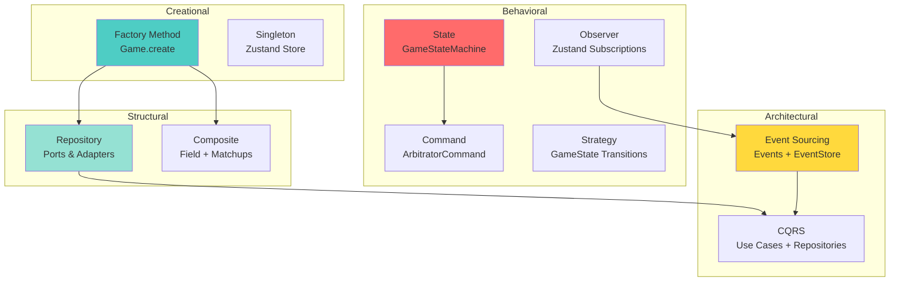

# Design Patterns - Paintball Result Stats

Ce document décrit les design patterns utilisés dans l'application Paintball Result Stats, en accord avec la classification de [Refactoring Guru](https://refactoring.guru/design-patterns).

**Version:** 1.0  
**Dernière mise à jour:** Mars 2026

---

## Introduction

L'application utilise **10 design patterns** principaux, répartis en 3 catégories :
- **Creational Patterns** (2) - Création d'objets
- **Structural Patterns** (2) - Structure et composition
- **Behavioral Patterns** (4) - Comportement et responsabilités
- **Architectural Patterns** (2) - Architecture globale

Ces patterns sont combinés pour créer une architecture robuste basée sur Domain-Driven Design (DDD) et Event Sourcing.

---

## Creational Patterns

### 1. Factory Method

**Référence:** [Factory Method - Refactoring Guru](https://refactoring.guru/design-patterns/factory-method)

#### Définition

Pattern de création qui fournit une interface pour créer des objets, mais permet aux sous-classes de modifier le type d'objets créés. Dans notre cas, nous utilisons des méthodes statiques `create()` pour encapsuler la logique de création.

#### Pourquoi utilisé

- Encapsulation de la logique de création complexe
- Validation centralisée des invariants métier
- Constructeur privé pour forcer l'utilisation de la factory
- Garantie que les objets sont toujours dans un état valide

#### Où dans le code

Tous les aggregates du Domain Layer :
- `src/core/domain/Game.ts`
- `src/core/domain/Field.ts`
- `src/core/domain/Team.ts`
- `src/core/domain/GameMode.ts`
- `src/core/domain/Tournament.ts`

#### Exemple de code

```typescript
// src/core/domain/Game.ts
export class Game {
  // Constructeur privé - empêche new Game()
  private constructor(
    public readonly id: GameId,
    public readonly fieldId: FieldId,
    public readonly matchup: Matchup,
    public readonly gameMode: GameMode,
    public readonly score: Score,
    public readonly timer: GameTimer,
    public readonly status: GameStatus,
    public readonly currentRound: number,
    public readonly isTimeStopped: number,
    public readonly gameStateStatus: string
  ) {}

  // Factory Method - seule façon de créer un Game
  static create(
    id: GameId,
    fieldId: FieldId,
    matchup: Matchup,
    gameMode: GameMode
  ): Game {
    // Validation
    if (!id || id.trim() === "") {
      throw new Error("Game ID cannot be empty");
    }

    // Initialisation avec valeurs par défaut
    const initialScore = new Score(0, 0);
    const initialTimer = new GameTimer(gameMode.gameTime.minutes * 60);

    // Création
    return new Game(
      id,
      fieldId,
      matchup,
      gameMode,
      initialScore,
      initialTimer,
      GameStatus.NOT_STARTED,
      1, // currentRound
      0, // isTimeStopped
      GameStatus.NOT_STARTED // gameStateStatus
    );
  }
}
```

#### Bénéfices

- Invariants garantis dès la création
- Impossible de créer un objet invalide
- Logique de création centralisée et testable
- Facilite l'évolution (ajout de paramètres, validation)

---

### 2. Singleton

**Référence:** [Singleton - Refactoring Guru](https://refactoring.guru/design-patterns/singleton)

#### Définition

Pattern qui garantit qu'une classe n'a qu'une seule instance et fournit un point d'accès global à cette instance.

#### Pourquoi utilisé

- Store global unique pour l'état de l'application
- Évite la duplication d'état
- Point d'accès centralisé pour tous les composants React

#### Où dans le code

- `src/presentation/state/useCoreStore.ts` - Store Zustand global

#### Exemple de code

```typescript
// src/presentation/state/useCoreStore.ts
import { create } from 'zustand';

// Store singleton créé une seule fois
const useCoreStore = create<CoreStore>()(
  (...args) => ({
    // Combine tous les slices
    ...createTournamentSlice(...args),
    ...createFieldSlice(...args),
    ...createTeamSlice(...args),
    ...createGameModeSlice(...args),
    ...createGameSlice(...args),
    ...createSharedSlice(...args),
  })
);

export default useCoreStore;

// Utilisation dans les composants
function GameScreen() {
  // Accès au store singleton
  const currentGame = useCoreStore(state => state.currentGame);
  const scorePoint = useCoreStore(state => state.scorePoint);
  
  return (
    <Button onPress={() => scorePoint(gameId, 'teamA')}>
      Score Team A
    </Button>
  );
}
```

#### Bénéfices

- État centralisé et cohérent
- Pas de duplication de données
- Facilite le debugging (un seul endroit à inspecter)
- Performance (pas de re-création du store)

---

## Structural Patterns

### 3. Repository Pattern (Adapter)

**Référence:** [Adapter - Refactoring Guru](https://refactoring.guru/design-patterns/adapter)

#### Définition

Le Repository Pattern est une implémentation du pattern Adapter qui fournit une abstraction pour l'accès aux données. Il sépare la logique métier de la logique de persistance via des interfaces (Ports) et des implémentations (Adapters).

#### Pourquoi utilisé

- Abstraction de la persistance (SQLite)
- Domain Layer indépendant de l'infrastructure
- Facilite les tests (mocks faciles)
- Respecte Clean Architecture (Hexagonal)

#### Où dans le code

**Ports (Interfaces):**
- `src/core/ports/IGameRepository.ts`
- `src/core/ports/IFieldRepository.ts`
- `src/core/ports/ITeamRepository.ts`
- `src/core/ports/IGameModeRepository.ts`
- `src/core/ports/ITournamentRepository.ts`
- `src/core/ports/IEventStore.ts`

**Adapters (Implémentations):**
- `src/infrastructure/database/GameRepository.ts`
- `src/infrastructure/database/FieldRepository.ts`
- `src/infrastructure/database/TeamRepository.ts`
- `src/infrastructure/database/GameModeRepository.ts`
- `src/infrastructure/database/TournamentRepository.ts`
- `src/infrastructure/eventStore/EventStore.ts`

#### Exemple de code

```typescript
// Port (Domain Layer) - Interface
// src/core/ports/IGameRepository.ts
export interface IGameRepository {
  save(game: Game): Promise<void>;
  findById(id: GameId): Promise<Game | null>;
  findAll(): Promise<Game[]>;
  delete(id: GameId): Promise<void>;
}

// Adapter (Infrastructure Layer) - Implémentation
// src/infrastructure/database/GameRepository.ts
export class GameRepository implements IGameRepository {
  constructor(private db: SQLiteDatabase) {}

  async save(game: Game): Promise<void> {
    const row = this.toRow(game);
    await this.db.run(
      `UPDATE games SET 
        scoreTeamA = ?, 
        scoreTeamB = ?, 
        status = ?,
        remainingTime = ?
      WHERE id = ?`,
      [row.scoreTeamA, row.scoreTeamB, row.status, row.remainingTime, row.id]
    );
  }

  async findById(id: GameId): Promise<Game | null> {
    const row = await this.db.get(
      'SELECT * FROM games WHERE id = ?',
      [id]
    );
    return row ? this.toEntity(row) : null;
  }

  // Conversion DB row → Domain entity
  private toEntity(row: any): Game {
    // Reconstruction du Game aggregate
    return Game.create(/* ... */);
  }

  // Conversion Domain entity → DB row
  private toRow(game: Game): any {
    return {
      id: game.id,
      scoreTeamA: game.score.teamAScore,
      scoreTeamB: game.score.teamBScore,
      status: game.status,
      remainingTime: game.timer.remainingTime
    };
  }
}

// Utilisation dans Use Case
export class ScorePointUseCase {
  constructor(
    private gameRepository: IGameRepository // Dépend de l'interface
  ) {}

  async execute(input: ScorePointInput): Promise<void> {
    const game = await this.gameRepository.findById(input.gameId);
    const updatedGame = /* ... */;
    await this.gameRepository.save(updatedGame);
  }
}
```

#### Bénéfices

- Domain Layer pur (pas de dépendance SQLite)
- Tests faciles (mocks de l'interface)
- Changement de DB possible sans toucher au Domain
- Séparation claire des responsabilités

---

### 4. Composite

**Référence:** [Composite - Refactoring Guru](https://refactoring.guru/design-patterns/composite)

#### Définition

Pattern qui permet de composer des objets en structures arborescentes pour représenter des hiérarchies partie-tout. Il permet de traiter uniformément les objets individuels et les compositions d'objets.

#### Pourquoi utilisé

- Aggregate Root (Field) contient une collection d'entités (Matchups)
- Cohérence transactionnelle (boundary de l'aggregate)
- Manipulation uniforme de Field et ses Matchups

#### Où dans le code

- `src/core/domain/Field.ts` - Field aggregate avec collection de Matchups

#### Exemple de code

```typescript
// src/core/domain/Field.ts
export class Matchup {
  private constructor(
    public readonly id: MatchupId,
    public readonly teamA: TeamId,
    public readonly teamB: TeamId,
    public readonly order: number,
    public readonly gameModeId: GameModeId
  ) {}

  static create(/* ... */): Matchup { /* ... */ }
}

export class Field {
  // Aggregate Root contient collection d'entités
  private constructor(
    public readonly id: FieldId,
    public readonly tournamentId: string,
    public readonly name: string,
    public readonly matchups: Matchup[] // Composition
  ) {}

  static create(
    id: FieldId,
    tournamentId: string,
    name: string,
    matchups: Matchup[] = []
  ): Field {
    return new Field(id, tournamentId, name, matchups);
  }

  // Opérations sur la collection
  addMatchup(matchup: Matchup): Field {
    const newMatchups = [...this.matchups, matchup];
    return new Field(this.id, this.tournamentId, this.name, newMatchups);
  }

  removeMatchup(matchupId: MatchupId): Field {
    const newMatchups = this.matchups.filter(m => m.id !== matchupId);
    return new Field(this.id, this.tournamentId, this.name, newMatchups);
  }

  updateMatchup(matchup: Matchup): Field {
    const newMatchups = this.matchups.map(m =>
      m.id === matchup.id ? matchup : m
    );
    return new Field(this.id, this.tournamentId, this.name, newMatchups);
  }
}
```

#### Bénéfices

- Boundary de l'aggregate clairement définie
- Cohérence transactionnelle garantie
- Matchup ne peut exister sans Field
- Manipulation uniforme de la collection

---

## Behavioral Patterns

### 5. State Pattern

**Référence:** [State - Refactoring Guru](https://refactoring.guru/design-patterns/state)

#### Définition

Pattern qui permet à un objet de modifier son comportement lorsque son état interne change. L'objet semblera avoir changé de classe.

#### Pourquoi utilisé

- Comportement UI différent selon l'état du match
- Actions disponibles contextuelles (selon l'état)
- Transitions d'état explicites et validées
- Séparation claire des responsabilités par état

#### Où dans le code

- `src/presentation/state/GameStateMachine.ts` - Machine à états UI
- 6 états: NotStartedState, RunningState, OvertimeRunningState, StoppedState, BreakState, FinishedState

#### Exemple de code

```typescript
// src/presentation/state/GameStateMachine.ts

// Interface commune pour tous les états
export abstract class GameUIState {
  protected game: Game;

  constructor(game: Game) {
    this.game = game;
  }

  abstract getView(): GameStateView;
}

// État concret: Match en cours
export class RunningState extends GameUIState {
  getView(): GameStateView {
    return {
      badgeLabel: "RUNNING",
      badgeColor: "#34C759", // Vert
      showDot: true,
      actions: [
        {
          label: "Stop",
          actionId: "STOP_MATCH",
          styleType: "secondary"
        }
      ],
      activeTimerType: "game"
    };
  }
}

// État concret: Timer en pause
export class StoppedState extends GameUIState {
  getView(): GameStateView {
    return {
      badgeLabel: "STOPPED",
      badgeColor: "#FF9500", // Orange
      showDot: false,
      actions: [
        {
          label: "Break 30s",
          actionId: "START_BREAK",
          styleType: "primary",
          subType: "LONG"
        },
        {
          label: "Break 5s",
          actionId: "START_BREAK",
          styleType: "secondary",
          subType: "SHORT"
        }
      ],
      activeTimerType: "game"
    };
  }
}

// Factory pour créer le bon état
export class GameStateMachine {
  static getUIState(game: Game | undefined): GameUIState | null {
    if (!game) return null;

    // Sélection de l'état selon le status du Game
    if (game.status === GameStatus.NOT_STARTED) {
      return new NotStartedState(game);
    }
    if (game.status === GameStatus.RUNNING && game.isTimeStopped === 0) {
      return new RunningState(game);
    }
    if (game.status === GameStatus.OVERTIME && game.isTimeStopped === 0) {
      return new OvertimeRunningState(game);
    }
    if (game.isTimeStopped === 1) {
      return new StoppedState(game);
    }
    if (game.status === GameStatus.BREAK) {
      return new BreakState(game);
    }
    if (game.status === GameStatus.FINISHED) {
      return new FinishedState(game);
    }

    return null;
  }
}

// Utilisation dans un hook
export function useGameStateMachine(game: Game | undefined) {
  const uiState = useMemo(() => GameStateMachine.getUIState(game), [game]);
  const view = uiState ? uiState.getView() : null;
  
  return { view };
}
```

#### Bénéfices

- Comportement spécifique encapsulé par état
- Facilite l'ajout de nouveaux états
- Code plus lisible (pas de gros switch/if)
- Actions contextuelles automatiques

---

### 6. Command Pattern

**Référence:** [Command - Refactoring Guru](https://refactoring.guru/design-patterns/command)

#### Définition

Pattern qui transforme une requête en un objet autonome contenant toutes les informations sur la requête. Cette transformation permet de paramétrer des méthodes avec différentes requêtes, de retarder ou mettre en file d'attente l'exécution d'une requête, et de supporter les opérations annulables.

#### Pourquoi utilisé

- Validation explicite des corrections arbitre
- Traçabilité complète (qui, quoi, quand, pourquoi)
- Possibilité d'annulation avant exécution
- Évite les modifications accidentelles
- Audit trail complet

#### Où dans le code

- `src/core/domain/ArbitratorCommand.ts` - Définition des commandes
- `hooks/useArbitratorCommand.ts` - Gestion du workflow de validation

#### Exemple de code

```typescript
// src/core/domain/ArbitratorCommand.ts

// Types de commandes
export enum CommandType {
  ADJUST_SCORE = 'ADJUST_SCORE',
  ADJUST_TIME = 'ADJUST_TIME',
  UNDO_LAST_POINT = 'UNDO_LAST_POINT'
}

// Interface de base
export interface ArbitratorCommand {
  type: CommandType;
  gameId: string;
  timestamp: number;
  reason?: string;
}

// Commande concrète: Ajuster le score
export interface AdjustScoreCommand extends ArbitratorCommand {
  type: CommandType.ADJUST_SCORE;
  newScoreTeamA: number;
  newScoreTeamB: number;
  reason: string;
}

// Commande concrète: Ajuster le temps
export interface AdjustTimeCommand extends ArbitratorCommand {
  type: CommandType.ADJUST_TIME;
  newTimeSeconds: number;
  reason: string;
}

// Commande en attente de validation
export class PendingCommand {
  constructor(
    public readonly command: ArbitratorCommand,
    public readonly createdAt: number = Date.now()
  ) {}

  isExpired(timeoutMs: number = 300000): boolean {
    return Date.now() - this.createdAt > timeoutMs;
  }
}

// Utilisation dans un hook
export function useArbitratorCommand() {
  const [pendingCommand, setPendingCommand] = useState<PendingCommand | null>(null);

  // Étape 1: Initier une commande
  const initiateCommand = (command: ArbitratorCommand) => {
    setPendingCommand(new PendingCommand(command));
    // UI affiche maintenant un dialogue de validation
  };

  // Étape 2: Valider la commande
  const validateCommand = async () => {
    if (!pendingCommand) return;

    // Exécuter le Use Case correspondant
    if (pendingCommand.command.type === CommandType.ADJUST_SCORE) {
      const cmd = pendingCommand.command as AdjustScoreCommand;
      await adjustScoreUseCase.execute({
        gameId: cmd.gameId,
        newScoreTeamA: cmd.newScoreTeamA,
        newScoreTeamB: cmd.newScoreTeamB,
        reason: cmd.reason
      });
    }

    setPendingCommand(null);
  };

  // Étape 3: Annuler la commande
  const cancelCommand = () => {
    setPendingCommand(null);
  };

  return { pendingCommand, initiateCommand, validateCommand, cancelCommand };
}

// Workflow dans l'UI
function GameScreen() {
  const { pendingCommand, initiateCommand, validateCommand, cancelCommand } = useArbitratorCommand();

  const handleAdjustScore = () => {
    // Créer la commande
    const command: AdjustScoreCommand = {
      type: CommandType.ADJUST_SCORE,
      gameId: game.id,
      timestamp: Date.now(),
      newScoreTeamA: 3,
      newScoreTeamB: 1,
      reason: "erreur arbitre"
    };

    // Initier (pas encore exécuté)
    initiateCommand(command);
  };

  return (
    <>
      <Button onPress={handleAdjustScore}>Corriger Score</Button>

      {pendingCommand && (
        <Dialog>
          <Text>Corriger score 2-1 → 3-1 ?</Text>
          <Text>Raison: {pendingCommand.command.reason}</Text>
          <Button onPress={validateCommand}>Valider</Button>
          <Button onPress={cancelCommand}>Annuler</Button>
        </Dialog>
      )}
    </>
  );
}
```

#### Bénéfices

- Validation explicite (évite erreurs)
- Traçabilité (timestamp, reason)
- Annulation possible
- Audit trail complet
- Séparation intention/exécution

---

### 7. Observer Pattern

**Référence:** [Observer - Refactoring Guru](https://refactoring.guru/design-patterns/observer)

#### Définition

Pattern qui définit une dépendance un-à-plusieurs entre objets, de sorte que lorsqu'un objet change d'état, tous ses dépendants sont notifiés et mis à jour automatiquement.

#### Pourquoi utilisé

- Réactivité de l'UI (React)
- Synchronisation automatique état ↔ UI
- Découplage entre Store et Composants
- Performance (re-render sélectif)

#### Où dans le code

- `src/presentation/state/useCoreStore.ts` - Store Zustand avec subscriptions
- Tous les composants React qui utilisent le store

#### Exemple de code

```typescript
// Store Zustand (Subject)
const useCoreStore = create<CoreStore>()((set, get) => ({
  currentGame: null,
  
  // Action qui modifie l'état
  scorePoint: async (gameId: string, teamId: 'teamA' | 'teamB') => {
    set({ isLoading: true });
    
    await scorePointUseCase.execute({ gameId, teamId });
    const game = await gameRepository.findById(gameId);
    
    // Notifie tous les observers
    set({ currentGame: game, isLoading: false });
  }
}));

// Composant React (Observer 1)
function ScoreBoard() {
  // S'abonne uniquement au currentGame
  const currentGame = useCoreStore(state => state.currentGame);
  
  // Re-render automatique quand currentGame change
  return (
    <View>
      <Text>Score: {currentGame?.score.teamAScore} - {currentGame?.score.teamBScore}</Text>
    </View>
  );
}

// Composant React (Observer 2)
function TimerDisplay() {
  // S'abonne uniquement au timer du currentGame
  const timer = useCoreStore(state => state.currentGame?.timer);
  
  // Re-render automatique quand timer change
  return (
    <Text>{formatTime(timer?.remainingTime || 0)}</Text>
  );
}

// Composant React (Observer 3)
function ActionButtons() {
  // S'abonne à l'action (pas à l'état)
  const scorePoint = useCoreStore(state => state.scorePoint);
  const gameId = useCoreStore(state => state.currentGame?.id);
  
  // Ne re-render PAS quand le score change (pas abonné)
  return (
    <Button onPress={() => scorePoint(gameId, 'teamA')}>
      Score Team A
    </Button>
  );
}
```

#### Bénéfices

- UI toujours synchronisée avec l'état
- Re-render sélectif (performance)
- Découplage Store ↔ Composants
- Code déclaratif et lisible

---

### 8. Strategy Pattern

**Référence:** [Strategy - Refactoring Guru](https://refactoring.guru/design-patterns/strategy)

#### Définition

Pattern qui définit une famille d'algorithmes, encapsule chacun d'eux et les rend interchangeables. Strategy permet à l'algorithme de varier indépendamment des clients qui l'utilisent.

#### Pourquoi utilisé

- Logique de transition d'état différente selon l'état actuel
- Validation des transitions encapsulée
- Facilite l'ajout de nouvelles règles de transition

#### Où dans le code

- `src/core/domain/GameState.ts` - Validation des transitions

#### Exemple de code

```typescript
// src/core/domain/GameState.ts
export class GameState {
  constructor(
    public readonly status: GameStatus,
    public readonly currentRound: number,
    public readonly isTimeStopped: boolean
  ) {}

  // Stratégie: Peut-on démarrer ?
  canStart(): boolean {
    return (
      this.status === GameStatus.NOT_STARTED ||
      this.status === GameStatus.BREAK ||
      (this.status === GameStatus.TIME_STOPPED && this.isTimeStopped)
    );
  }

  // Stratégie: Peut-on arrêter le timer ?
  canStopTime(): boolean {
    return (
      (this.status === GameStatus.RUNNING || this.status === GameStatus.OVERTIME) &&
      !this.isTimeStopped
    );
  }

  // Stratégie: Peut-on reprendre ?
  canResume(): boolean {
    return this.isTimeStopped;
  }

  // Stratégie: Peut-on démarrer un break ?
  canStartBreak(): boolean {
    return (
      this.status === GameStatus.NOT_STARTED ||
      this.status === GameStatus.RUNNING ||
      this.status === GameStatus.TIME_STOPPED ||
      this.status === GameStatus.OVERTIME
    );
  }

  // Transition avec validation
  start(): GameState {
    if (!this.canStart()) {
      throw new Error(`Cannot start from status ${this.status}`);
    }
    return new GameState(GameStatus.RUNNING, this.currentRound, false);
  }

  stopTime(): GameState {
    if (!this.canStopTime()) {
      throw new Error(`Cannot stop time from status ${this.status}`);
    }
    return new GameState(this.status, this.currentRound, true);
  }

  resume(): GameState {
    if (!this.canResume()) {
      throw new Error(`Cannot resume - timer not stopped`);
    }
    return new GameState(this.status, this.currentRound, false);
  }
}

// Utilisation dans Game aggregate
export class Game {
  start(): Game {
    const newState = this.gameState.start(); // Validation via Strategy
    // ... reste de la logique
  }

  stopTime(): Game {
    const newState = this.gameState.stopTime(); // Validation via Strategy
    // ... reste de la logique
  }
}
```

#### Bénéfices

- Logique de validation encapsulée
- Facilite l'ajout de nouvelles règles
- Code plus testable
- Transitions explicites et sûres

---

## Architectural Patterns

### 9. Event Sourcing

**Référence:** [Event Sourcing - Martin Fowler](https://martinfowler.com/eaaDev/EventSourcing.html)

#### Définition

Pattern architectural où tous les changements d'état de l'application sont stockés comme une séquence d'événements. Au lieu de stocker uniquement l'état actuel, on stocke tous les événements qui ont conduit à cet état.

#### Pourquoi utilisé

- Audit trail complet (qui a fait quoi et quand)
- Reconstruction de l'état à n'importe quel moment
- Historique complet des matchs
- Traçabilité des corrections arbitre
- Replay possible pour debugging

#### Où dans le code

**Domain Events:**
- `src/core/domain/events/GameEvents.ts` (9 events)
- `src/core/domain/events/FieldEvents.ts` (5 events)
- `src/core/domain/events/TeamEvents.ts` (3 events)
- `src/core/domain/events/GameModeEvents.ts` (3 events)

**Event Store:**
- `src/infrastructure/eventStore/EventStore.ts`

**Use Cases:**
- Tous les Use Cases émettent des events après modification

#### Exemple de code

```typescript
// Domain Event
// src/core/domain/events/GameEvents.ts
export interface PointScoredEvent {
  type: 'PointScored';
  aggregateId: GameId;
  timestamp: number;
  payload: {
    teamId: TeamId;
    newScoreTeamA: number;
    newScoreTeamB: number;
  };
}

// Event Store
// src/infrastructure/eventStore/EventStore.ts
export class EventStore implements IEventStore {
  constructor(private db: SQLiteDatabase) {}

  async append(event: DomainEvent): Promise<void> {
    await this.db.run(
      `INSERT INTO events (aggregateId, type, timestamp, payload)
       VALUES (?, ?, ?, ?)`,
      [
        event.aggregateId,
        event.type,
        event.timestamp,
        JSON.stringify(event.payload)
      ]
    );
  }

  async getEvents(aggregateId: string): Promise<DomainEvent[]> {
    const rows = await this.db.all(
      'SELECT * FROM events WHERE aggregateId = ? ORDER BY timestamp ASC',
      [aggregateId]
    );
    return rows.map(row => ({
      type: row.type,
      aggregateId: row.aggregateId,
      timestamp: row.timestamp,
      payload: JSON.parse(row.payload)
    }));
  }
}

// Use Case émet un event
// src/core/useCases/ScorePoint.ts
export class ScorePointUseCase {
  constructor(
    private gameRepository: IGameRepository,
    private eventStore: IEventStore
  ) {}

  async execute(input: ScorePointInput): Promise<void> {
    // 1. Charger l'état actuel
    const game = await this.gameRepository.findById(input.gameId);

    // 2. Modifier l'état (Domain logic)
    const newScore = input.teamId === 'teamA'
      ? game.score.incrementTeamA()
      : game.score.incrementTeamB();
    const updatedGame = game.updateScore(newScore);

    // 3. Persister l'état actuel
    await this.gameRepository.save(updatedGame);

    // 4. Émettre l'event (Event Sourcing)
    await this.eventStore.append({
      type: 'PointScored',
      aggregateId: game.id,
      timestamp: Date.now(),
      payload: {
        teamId: input.teamId,
        newScoreTeamA: updatedGame.score.teamAScore,
        newScoreTeamB: updatedGame.score.teamBScore
      }
    });
  }
}

// Reconstruction d'état via events (optionnel)
async function reconstructGame(gameId: string): Promise<Game> {
  const events = await eventStore.getEvents(gameId);
  
  let game = null;
  for (const event of events) {
    if (event.type === 'GameCreated') {
      game = Game.create(/* ... */);
    } else if (event.type === 'PointScored') {
      const newScore = /* ... */;
      game = game.updateScore(newScore);
    }
    // ... autres events
  }
  
  return game;
}
```

#### Bénéfices

- Audit trail complet et immuable
- Reconstruction d'état à tout moment
- Debugging facilité (replay events)
- Historique complet des matchs
- Conformité RGPD (traçabilité)

---

### 10. CQRS (Command Query Responsibility Segregation)

**Référence:** [CQRS - Martin Fowler](https://martinfowler.com/bliki/CQRS.html)

#### Définition

Pattern qui sépare les opérations de lecture (Query) et d'écriture (Command) en utilisant des modèles différents. Dans notre implémentation légère, les Use Cases sont les Commands et les Repositories fournissent les Queries.

#### Pourquoi utilisé

- Séparation claire des responsabilités
- Optimisation séparée (lecture vs écriture)
- Clarté du code (intention explicite)
- Facilite l'évolution (ajout de queries sans toucher aux commands)

#### Où dans le code

**Commands (Write):**
- `src/core/useCases/*.ts` - Tous les Use Cases

**Queries (Read):**
- `src/core/ports/I*Repository.ts` - Méthodes `findById`, `findAll`

#### Exemple de code

```typescript
// COMMAND SIDE (Write)
// src/core/useCases/ScorePoint.ts
export class ScorePointUseCase {
  constructor(
    private gameRepository: IGameRepository,
    private eventStore: IEventStore
  ) {}

  // Command: Modifie l'état
  async execute(input: ScorePointInput): Promise<void> {
    const game = await this.gameRepository.findById(input.gameId);
    const updatedGame = /* ... modification ... */;
    
    // Write: Persiste
    await this.gameRepository.save(updatedGame);
    
    // Write: Émet event
    await this.eventStore.append(event);
  }
}

// QUERY SIDE (Read)
// src/core/ports/IGameRepository.ts
export interface IGameRepository {
  // Queries: Lecture seule
  findById(id: GameId): Promise<Game | null>;
  findAll(): Promise<Game[]>;
  findByFieldId(fieldId: FieldId): Promise<Game[]>;
  
  // Commands: Écriture
  save(game: Game): Promise<void>;
  delete(id: GameId): Promise<void>;
}

// Utilisation dans Zustand (séparation claire)
const useCoreStore = create<CoreStore>()((set, get) => ({
  games: [],
  currentGame: null,
  
  // QUERY: Charger les données
  loadGames: async () => {
    set({ isLoading: true });
    const games = await gameRepository.findAll(); // Query
    set({ games, isLoading: false });
  },
  
  loadGame: async (id: string) => {
    set({ isLoading: true });
    const game = await gameRepository.findById(id); // Query
    set({ currentGame: game, isLoading: false });
  },
  
  // COMMAND: Modifier les données
  scorePoint: async (gameId: string, teamId: 'teamA' | 'teamB') => {
    await scorePointUseCase.execute({ gameId, teamId }); // Command
    
    // Re-query pour synchroniser
    const game = await gameRepository.findById(gameId);
    set({ currentGame: game });
  },
  
  // COMMAND: Créer
  createGame: async (data: CreateGameInput) => {
    await createGameUseCase.execute(data); // Command
    
    // Re-query
    const games = await gameRepository.findAll();
    set({ games });
  }
}));
```

#### Bénéfices

- Séparation claire lecture/écriture
- Optimisation séparée possible
- Code plus lisible (intention explicite)
- Facilite l'évolution (queries complexes sans toucher aux commands)

---

## Patterns Combinés

Les patterns ne sont pas utilisés isolément, mais se combinent pour créer une architecture cohérente :

### Factory Method + Repository

```typescript
// Factory crée l'objet
const game = Game.create(id, fieldId, matchup, gameMode);

// Repository le persiste
await gameRepository.save(game);
```

**Bénéfice:** Création validée + Persistance abstraite

---

### State + Command

```typescript
// State détermine les actions disponibles
const uiState = GameStateMachine.getUIState(game);
const actions = uiState.getView().actions;

// Command exécute l'action avec validation
if (action.actionId === 'ADJUST_SCORE') {
  initiateCommand(adjustScoreCommand);
}
```

**Bénéfice:** Actions contextuelles + Validation explicite

---

### Observer + Event Sourcing

```typescript
// Event Sourcing persiste l'event
await eventStore.append(pointScoredEvent);

// Observer notifie l'UI
set({ currentGame: updatedGame }); // Zustand notifie tous les observers
```

**Bénéfice:** Historique complet + UI réactive

---

### Repository + CQRS

```typescript
// CQRS: Command via Use Case
await scorePointUseCase.execute({ gameId, teamId });

// CQRS: Query via Repository
const game = await gameRepository.findById(gameId);

// Repository abstrait la persistance
// Peut être SQLite, PostgreSQL, MongoDB, etc.
```

**Bénéfice:** Séparation responsabilités + Abstraction persistance

---

## Diagramme Récapitulatif



---

## Références

### Refactoring Guru

- [Factory Method](https://refactoring.guru/design-patterns/factory-method)
- [Singleton](https://refactoring.guru/design-patterns/singleton)
- [Adapter](https://refactoring.guru/design-patterns/adapter)
- [Composite](https://refactoring.guru/design-patterns/composite)
- [State](https://refactoring.guru/design-patterns/state)
- [Command](https://refactoring.guru/design-patterns/command)
- [Observer](https://refactoring.guru/design-patterns/observer)
- [Strategy](https://refactoring.guru/design-patterns/strategy)

### Martin Fowler

- [Event Sourcing](https://martinfowler.com/eaaDev/EventSourcing.html)
- [CQRS](https://martinfowler.com/bliki/CQRS.html)
- [Repository Pattern](https://martinfowler.com/eaaCatalog/repository.html)

### Documentation Interne

- [Documentation Architecture](docs/architecture/README.md)
- [DDD - Context Map](docs/architecture/ddd/context-map.md)
- [C4 - Code Diagram](docs/architecture/c4/c4-code.md)

### Livres Recommandés

- **Design Patterns: Elements of Reusable Object-Oriented Software** - Gang of Four
- **Domain-Driven Design** - Eric Evans
- **Implementing Domain-Driven Design** - Vaughn Vernon
- **Clean Architecture** - Robert C. Martin

---

## Conclusion

L'application Paintball Result Stats utilise **10 design patterns** principaux qui se combinent pour créer une architecture robuste, maintenable et évolutive.

**Points clés:**
- **Factory Method** garantit des objets toujours valides
- **Repository** abstrait la persistance (Clean Architecture)
- **State** gère la complexité des états UI
- **Command** sécurise les corrections arbitre
- **Event Sourcing** fournit un audit trail complet
- **CQRS** sépare clairement lecture et écriture

Ces patterns ne sont pas théoriques mais **réellement implémentés** et utilisés quotidiennement dans le code de production.
